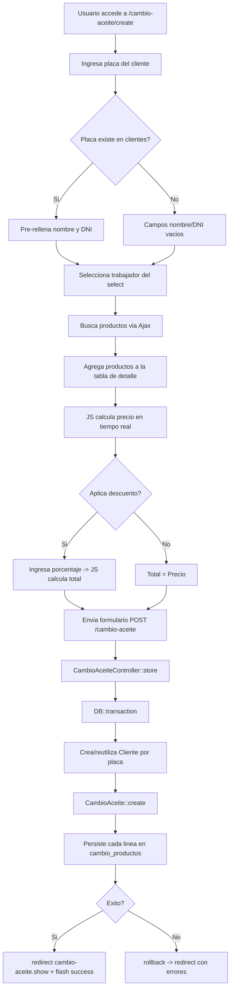

# Documento de Diseno Tecnico - cambio-aceite

## Vision General

El modulo de Cambio de Aceite permite registrar el servicio de cambio de aceite en el taller mecanico. El flujo completo abarca: identificar al cliente por su placa (con upsert igual que en ingresos), asignar un unico trabajador responsable, seleccionar los productos utilizados con busqueda Ajax dinamica, calcular el precio total en tiempo real, aplicar un descuento opcional, y confirmar el registro con persistencia atomica en base de datos.

El modulo involucra dos entidades principales: `cambio_aceites` (cabecera del registro) y `cambio_productos` (pivote N:N entre cambio_aceites y productos). Las relaciones son: CambioAceite -> Cliente (N:1), CambioAceite -> Trabajador (N:1), CambioAceite -> User (N:1), CambioAceite <-> Productos (N:N a traves de `cambio_productos`). El diseno visual y los patrones de codigo siguen exactamente los modulos ya implementados (`ingresos`, `ventas`).

### Entidades involucradas

| Entidad | Tabla | Rol |
|---|---|---|
| `CambioAceite` | `cambio_aceites` | Cabecera del registro |
| `CambioProducto` | `cambio_productos` | Pivote N:N CambioAceite <-> Producto |
| `Cliente` | `clientes` | Propietario del vehiculo (nullable nombre/dni) |
| `Trabajador` | `trabajadores` | Mecanico responsable (unico por registro) |
| `Producto` | `productos` | Producto utilizado en el cambio de aceite |
| `User` | `users` | Usuario autenticado que registra el cambio |

### Decisiones de diseno clave

- **Busqueda Ajax de productos**: Igual que ventas, se usa un endpoint dedicado `GET /cambio-aceite/buscar-productos` que devuelve JSON, registrado antes del resource para evitar conflictos con Route Model Binding.
- **Trabajador unico (N:1)**: A diferencia de ingresos (N:N), este modulo asigna exactamente un trabajador por registro mediante un `<select>` obligatorio.
- **Pivote enriquecido en `cambio_productos`**: Los campos `precio` y `total` se anadiran mediante migracion de ajuste, almacenando el precio unitario y subtotal al momento del registro.
- **Precio inalterable vs Total editable**: El campo `precio` es la suma de (cantidad x precio_unitario) calculada en JS y enviada como readonly. El campo `total` es editable y puede incluir descuento.
- **Transaccion unica para store y update**: Toda la logica de persistencia se envuelve en `DB::transaction()`.
- **Upsert de cliente por placa**: Igual que ingresos, se usa `Cliente::firstOrCreate(['placa' => $placa], [...])`.
- **CRUD completo**: A diferencia de ventas (sin edit/update), este modulo incluye edicion con `sync()` de productos.

---

## Arquitectura

El modulo sigue la arquitectura MVC estandar de Laravel con un endpoint Ajax adicional:

```
HTTP Request
    |
    v
routes/web.php
(middleware: auth)
    |
    |-- GET  /cambio-aceite                        -> CambioAceiteController@index
    |-- GET  /cambio-aceite/create                 -> CambioAceiteController@create
    |-- POST /cambio-aceite                        -> CambioAceiteController@store
    |-- GET  /cambio-aceite/buscar-productos       -> CambioAceiteController@buscarProductos [Ajax JSON]
    |-- GET  /cambio-aceite/{cambioAceite}         -> CambioAceiteController@show
    |-- GET  /cambio-aceite/{cambioAceite}/edit    -> CambioAceiteController@edit
    |-- PUT  /cambio-aceite/{cambioAceite}         -> CambioAceiteController@update
    |-- DELETE /cambio-aceite/{cambioAceite}       -> CambioAceiteController@destroy
    |-- GET  /cambio-aceite/{cambioAceite}/ticket  -> CambioAceiteController@ticket
    |
    v
CambioAceiteController
(app/Http/Controllers/CambioAceiteController.php)
    |
    |-- CambioAceite Model  -----> tabla cambio_aceites
    |-- CambioProducto Model ----> tabla cambio_productos
    |-- Cliente Model -----------> tabla clientes (upsert por placa)
    |-- Trabajador Model --------> tabla trabajadores
    |-- Producto Model ----------> tabla productos
```

### Diagrama de flujo principal



---

## Componentes e Interfaces

### 1. Migracion de ajuste — tabla `cambio_aceites`

**Archivo:** `database/migrations/YYYY_MM_DD_HHMMSS_add_precio_total_descripcion_user_id_to_cambio_aceites_table.php`

Anade los campos `precio`, `total`, `descripcion` y `user_id` a la tabla existente:

```php
public function up(): void
{
    Schema::table('cambio_aceites', function (Blueprint $table) {
        $table->decimal('precio', 10, 2)->default(0)->after('fecha');
        $table->decimal('total', 10, 2)->default(0)->after('precio');
        $table->text('descripcion')->nullable()->after('total');
        $table->foreignId('user_id')->after('descripcion')->constrained('users');
    });
}

public function down(): void
{
    Schema::table('cambio_aceites', function (Blueprint $table) {
        $table->dropForeign(['user_id']);
        $table->dropColumn(['precio', 'total', 'descripcion', 'user_id']);
    });
}
```

### 2. Migracion de ajuste — tabla `cambio_productos`

**Archivo:** `database/migrations/YYYY_MM_DD_HHMMSS_add_precio_total_to_cambio_productos_table.php`

Anade los campos `precio` y `total` a la tabla existente:

```php
public function up(): void
{
    Schema::table('cambio_productos', function (Blueprint $table) {
        $table->decimal('precio', 10, 2)->after('cantidad');
        $table->decimal('total', 10, 2)->after('precio');
    });
}

public function down(): void
{
    Schema::table('cambio_productos', function (Blueprint $table) {
        $table->dropColumn(['precio', 'total']);
    });
}
```

### 3. Modelo CambioAceite

**Archivo:** `app/Models/CambioAceite.php`

Actualiza el modelo existente con los nuevos campos y relaciones:

```php
namespace App\Models;

use Illuminate\Database\Eloquent\Model;
use Illuminate\Database\Eloquent\Relations\BelongsTo;
use Illuminate\Database\Eloquent\Relations\BelongsToMany;

class CambioAceite extends Model
{
    protected $table = 'cambio_aceites';

    protected $fillable = [
        'cliente_id',
        'trabajador_id',
        'fecha',
        'precio',
        'total',
        'descripcion',
        'user_id',
    ];

    protected $casts = [
        'fecha'  => 'date',
        'precio' => 'decimal:2',
        'total'  => 'decimal:2',
    ];

    public function cliente(): BelongsTo
    {
        return $this->belongsTo(Cliente::class);
    }

    public function trabajador(): BelongsTo
    {
        return $this->belongsTo(Trabajador::class);
    }

    public function user(): BelongsTo
    {
        return $this->belongsTo(User::class);
    }

    public function productos(): BelongsToMany
    {
        return $this->belongsToMany(Producto::class, 'cambio_productos')
                    ->withPivot('cantidad', 'precio', 'total')
                    ->withTimestamps();
    }
}
```

### 4. Modelo CambioProducto

**Archivo:** `app/Models/CambioProducto.php`

Actualiza el modelo existente con los nuevos campos:

```php
namespace App\Models;

use Illuminate\Database\Eloquent\Model;
use Illuminate\Database\Eloquent\Relations\BelongsTo;

class CambioProducto extends Model
{
    protected $fillable = [
        'cambio_aceite_id',
        'producto_id',
        'cantidad',
        'precio',
        'total',
    ];

    protected $casts = [
        'cantidad' => 'integer',
        'precio'   => 'decimal:2',
        'total'    => 'decimal:2',
    ];

    public function cambioAceite(): BelongsTo
    {
        return $this->belongsTo(CambioAceite::class);
    }

    public function producto(): BelongsTo
    {
        return $this->belongsTo(Producto::class);
    }
}
```

### 5. CambioAceiteController

**Archivo:** `app/Http/Controllers/CambioAceiteController.php`

```php
class CambioAceiteController extends Controller
{
    public function index(): View
    public function create(): View
    public function store(Request $request): RedirectResponse
    public function buscarProductos(Request $request): JsonResponse
    public function show(CambioAceite $cambioAceite): View
    public function edit(CambioAceite $cambioAceite): View
    public function update(Request $request, CambioAceite $cambioAceite): RedirectResponse
    public function destroy(CambioAceite $cambioAceite): RedirectResponse
    public function ticket(CambioAceite $cambioAceite): View
}
```

#### 5.1 `index()`

```php
public function index(): View
{
    $cambioAceites = CambioAceite::with(['cliente', 'trabajador'])
                                  ->latest()
                                  ->paginate(15);

    return view('cambio-aceite.index', compact('cambioAceites'));
}
```

#### 5.2 `create()`

```php
public function create(): View
{
    $trabajadores = Trabajador::where('estado', true)->get();

    return view('cambio-aceite.create', compact('trabajadores'));
}
```

#### 5.3 `buscarProductos(Request $request)`

Ruta Ajax. Debe registrarse **antes** del resource en `routes/web.php`:

```php
public function buscarProductos(Request $request): JsonResponse
{
    $q = $request->get('q', '');

    $productos = Producto::where('activo', true)
        ->where('nombre', 'like', '%' . $q . '%')
        ->select('id', 'nombre', 'precio_venta', 'stock')
        ->limit(10)
        ->get();

    return response()->json($productos);
}
```

#### 5.4 `store(Request $request)`

```php
public function store(Request $request): RedirectResponse
{
    $request->validate([
        'placa'                    => ['required', 'string', 'max:7'],
        'nombre'                   => ['nullable', 'string', 'max:100'],
        'dni'                      => ['nullable', 'string', 'max:8'],
        'trabajador_id'            => ['required', 'integer', 'exists:trabajadores,id'],
        'fecha'                    => ['required', 'date'],
        'descripcion'              => ['nullable', 'string', 'max:1000'],
        'precio'                   => ['required', 'numeric', 'min:0'],
        'total'                    => ['required', 'numeric', 'gt:0'],
        'productos'                => ['required', 'array', 'min:1'],
        'productos.*.producto_id'  => ['required', 'integer', 'exists:productos,id'],
        'productos.*.cantidad'     => ['required', 'integer', 'min:1'],
        'productos.*.precio'       => ['required', 'numeric', 'gt:0'],
        'productos.*.total'        => ['required', 'numeric', 'min:0'],
    ], [
        'productos.required' => 'Debe agregar al menos un producto al cambio de aceite.',
        'productos.min'      => 'Debe agregar al menos un producto al cambio de aceite.',
        'trabajador_id.required' => 'Debe asignar un trabajador al cambio de aceite.',
    ]);

    $cambioAceite = null;
    try {
        DB::transaction(function () use ($request, &$cambioAceite) {
            $cliente = Cliente::firstOrCreate(
                ['placa' => $request->placa],
                [
                    'nombre' => $request->nombre,
                    'dni'    => $request->dni,
                ]
            );

            $cambioAceite = CambioAceite::create([
                'cliente_id'    => $cliente->id,
                'trabajador_id' => $request->trabajador_id,
                'fecha'         => $request->fecha,
                'precio'        => $request->precio,
                'total'         => $request->total,
                'descripcion'   => $request->descripcion,
                'user_id'       => auth()->id(),
            ]);

            foreach ($request->productos as $item) {
                CambioProducto::create([
                    'cambio_aceite_id' => $cambioAceite->id,
                    'producto_id'      => $item['producto_id'],
                    'cantidad'         => $item['cantidad'],
                    'precio'           => $item['precio'],
                    'total'            => $item['total'],
                ]);
            }
        });

        return redirect()->route('cambio-aceite.show', $cambioAceite)
            ->with('success', 'Cambio de aceite registrado correctamente.');
    } catch (\Throwable $e) {
        return back()->withInput()
            ->with('error', 'No se pudo registrar el cambio de aceite. Intente nuevamente.');
    }
}
```

#### 5.5 `show(CambioAceite $cambioAceite)`

```php
public function show(CambioAceite $cambioAceite): View
{
    $cambioAceite->load(['cliente', 'trabajador', 'user', 'productos']);

    return view('cambio-aceite.show', compact('cambioAceite'));
}
```

#### 5.6 `edit(CambioAceite $cambioAceite)`

```php
public function edit(CambioAceite $cambioAceite): View
{
    $cambioAceite->load(['cliente', 'trabajador', 'productos']);
    $trabajadores = Trabajador::where('estado', true)->get();

    return view('cambio-aceite.edit', compact('cambioAceite', 'trabajadores'));
}
```

#### 5.7 `update(Request $request, CambioAceite $cambioAceite)`

```php
public function update(Request $request, CambioAceite $cambioAceite): RedirectResponse
{
    $request->validate([/* mismas reglas que store */]);

    try {
        DB::transaction(function () use ($request, $cambioAceite) {
            $cliente = Cliente::firstOrCreate(
                ['placa' => $request->placa],
                ['nombre' => $request->nombre, 'dni' => $request->dni]
            );

            $cambioAceite->update([
                'cliente_id'    => $cliente->id,
                'trabajador_id' => $request->trabajador_id,
                'fecha'         => $request->fecha,
                'precio'        => $request->precio,
                'total'         => $request->total,
                'descripcion'   => $request->descripcion,
            ]);

            // Sincronizar productos con sync() usando datos del pivote
            $syncData = [];
            foreach ($request->productos as $item) {
                $syncData[$item['producto_id']] = [
                    'cantidad' => $item['cantidad'],
                    'precio'   => $item['precio'],
                    'total'    => $item['total'],
                ];
            }
            $cambioAceite->productos()->sync($syncData);
        });

        return redirect()->route('cambio-aceite.show', $cambioAceite)
            ->with('success', 'Cambio de aceite actualizado correctamente.');
    } catch (\Throwable $e) {
        return back()->withInput()
            ->with('error', 'No se pudo actualizar el cambio de aceite. Intente nuevamente.');
    }
}
```

> **Nota sobre sync() con pivote enriquecido**: El metodo `sync()` de Eloquent acepta un array asociativo `[producto_id => [campo_pivote => valor]]`, lo que permite sincronizar los productos y sus datos de pivote en una sola operacion. Los registros de `cambio_productos` que no esten en el nuevo array seran eliminados automaticamente.

#### 5.8 `destroy(CambioAceite $cambioAceite)`

```php
public function destroy(CambioAceite $cambioAceite): RedirectResponse
{
    try {
        $cambioAceite->delete(); // cascade elimina cambio_productos

        return redirect()->route('cambio-aceite.index')
            ->with('success', 'Cambio de aceite eliminado correctamente.');
    } catch (\Throwable $e) {
        return redirect()->route('cambio-aceite.index')
            ->with('error', 'No se pudo eliminar el cambio de aceite. Intente nuevamente.');
    }
}
```

#### 5.9 `ticket(CambioAceite $cambioAceite)`

```php
public function ticket(CambioAceite $cambioAceite): View
{
    $cambioAceite->load(['cliente', 'trabajador', 'user', 'productos']);

    return view('cambio-aceite.ticket', compact('cambioAceite'));
}
```

### 6. Reglas de validacion (store y update)

```php
$rules = [
    'placa'                    => ['required', 'string', 'max:7'],
    'nombre'                   => ['nullable', 'string', 'max:100'],
    'dni'                      => ['nullable', 'string', 'max:8'],
    'trabajador_id'            => ['required', 'integer', 'exists:trabajadores,id'],
    'fecha'                    => ['required', 'date'],
    'descripcion'              => ['nullable', 'string', 'max:1000'],
    'precio'                   => ['required', 'numeric', 'min:0'],
    'total'                    => ['required', 'numeric', 'gt:0'],
    'productos'                => ['required', 'array', 'min:1'],
    'productos.*.producto_id'  => ['required', 'integer', 'exists:productos,id'],
    'productos.*.cantidad'     => ['required', 'integer', 'min:1'],
    'productos.*.precio'       => ['required', 'numeric', 'gt:0'],
    'productos.*.total'        => ['required', 'numeric', 'min:0'],
];

$messages = [
    'productos.required'     => 'Debe agregar al menos un producto al cambio de aceite.',
    'productos.min'          => 'Debe agregar al menos un producto al cambio de aceite.',
    'trabajador_id.required' => 'Debe asignar un trabajador al cambio de aceite.',
];
```

### 7. Rutas

**Archivo:** `routes/web.php`

La ruta Ajax debe registrarse **antes** del resource para evitar que `/cambio-aceite/buscar-productos` sea interpretada como `{cambioAceite} = buscar-productos`:

```php
use App\Http\Controllers\CambioAceiteController;

Route::middleware('auth')->group(function () {
    // Ruta Ajax -- debe ir ANTES del resource
    Route::get('/cambio-aceite/buscar-productos', [CambioAceiteController::class, 'buscarProductos'])
         ->name('cambio-aceite.buscar-productos');

    Route::resource('cambio-aceite', CambioAceiteController::class);

    Route::get('/cambio-aceite/{cambioAceite}/ticket', [CambioAceiteController::class, 'ticket'])
         ->name('cambio-aceite.ticket');
});
```

Rutas generadas:

| Metodo | URI | Nombre | Accion |
|--------|-----|--------|--------|
| GET | `/cambio-aceite` | `cambio-aceite.index` | `index` |
| GET | `/cambio-aceite/create` | `cambio-aceite.create` | `create` |
| POST | `/cambio-aceite` | `cambio-aceite.store` | `store` |
| GET | `/cambio-aceite/buscar-productos` | `cambio-aceite.buscar-productos` | `buscarProductos` |
| GET | `/cambio-aceite/{cambioAceite}` | `cambio-aceite.show` | `show` |
| GET | `/cambio-aceite/{cambioAceite}/edit` | `cambio-aceite.edit` | `edit` |
| PUT/PATCH | `/cambio-aceite/{cambioAceite}` | `cambio-aceite.update` | `update` |
| DELETE | `/cambio-aceite/{cambioAceite}` | `cambio-aceite.destroy` | `destroy` |
| GET | `/cambio-aceite/{cambioAceite}/ticket` | `cambio-aceite.ticket` | `ticket` |

### 8. Vistas Blade

| Vista | Datos recibidos |
|---|---|
| `cambio-aceite.index` | `$cambioAceites` (LengthAwarePaginator con relaciones cliente, trabajador) |
| `cambio-aceite.create` | `$trabajadores` |
| `cambio-aceite.edit` | `$cambioAceite` (con relaciones), `$trabajadores` |
| `cambio-aceite.show` | `$cambioAceite` (con todas las relaciones) |
| `cambio-aceite.ticket` | `$cambioAceite` (con todas las relaciones) |

#### 8.1 `cambio-aceite/index.blade.php`

- Extiende `layouts.app`
- Flash messages de exito/error
- Encabezado: titulo "Cambio de Aceite" + boton "Nuevo cambio de aceite" -> `cambio-aceite.create`
- Estado vacio: "No hay cambios de aceite registrados."
- Tabla con columnas: Fecha, Cliente (placa o nombre), Trabajador, Precio, Total, Acciones
- Boton "Ver detalle": `bg-gray-100 text-gray-700` -> `cambio-aceite.show`
- Boton "Ticket": `bg-blue-100 text-blue-700` -> `cambio-aceite.ticket`
- Boton "Editar": `bg-gray-100 text-gray-700` -> `cambio-aceite.edit`
- Boton "Eliminar": `bg-red-100 text-red-700` con `confirm()` -> `DELETE cambio-aceite.destroy`
- Paginacion: `{{ $cambioAceites->links() }}`

#### 8.2 `cambio-aceite/create.blade.php`

- Extiende `layouts.app`
- Encabezado: "Nuevo Cambio de Aceite" + boton "Volver" -> `cambio-aceite.index`
- Contenedor: `bg-white rounded-lg border border-gray-200 p-6`
- **Seccion cliente**: campo placa (obligatorio), nombre (opcional), DNI (opcional), fecha (obligatorio, default hoy)
- **Seccion trabajador**: `<select>` con trabajadores activos (obligatorio)
- **Seccion descripcion**: textarea opcional
- **Seccion busqueda de productos**: campo de texto con `id="buscar-producto"`, resultados en `div#resultados-busqueda`
- **Tabla de detalle**: `table#tabla-detalle` con columnas Producto, Cantidad, Precio Unit., Subtotal, Eliminar
- **Seccion totales**: precio (readonly), toggle descuento por porcentaje, campo porcentaje (oculto por defecto), campo total (editable)
- **Boton "Registrar cambio de aceite"**: `bg-blue-600 text-white`
- Inputs hidden para enviar datos de la tabla: `productos[i][producto_id]`, `productos[i][cantidad]`, `productos[i][precio]`, `productos[i][total]`, mas `precio` y `total`
- Errores de validacion con `border-red-400 bg-red-50` y `text-xs text-red-600`

#### 8.3 `cambio-aceite/edit.blade.php`

- Igual que create pero con datos pre-cargados del CambioAceite
- Pre-selecciona el trabajador asignado
- Pre-carga los productos con sus cantidades y precios en la tabla de detalle
- Usa `PUT` method spoofing con `@method('PUT')`

#### 8.4 `cambio-aceite/show.blade.php`

- Extiende `layouts.app`
- Encabezado: fecha del registro + botones "Volver al listado", "Editar", "Generar ticket"
- Tarjeta de datos: fecha (d/m/Y), cliente (placa y nombre si existe), trabajador, descripcion (si existe), usuario que registro
- Tabla de productos: Nombre, Cantidad, Precio unitario, Subtotal por linea
- Seccion totales: precio (inalterable), descuento (si `total != precio`), total

#### 8.5 `cambio-aceite/ticket.blade.php`

- Extiende `layouts.app` (o layout minimo para impresion)
- Ancho maximo 400px centrado
- Encabezado: nombre del taller (`config('app.name')`)
- Datos: fecha (d/m/Y), cliente (placa, nombre si existe, DNI si existe), trabajador responsable
- Tabla de productos: Nombre, Cant., P.Unit., Subtotal
- Totales: precio, descuento (si aplica), total
- Descripcion (si existe)
- Boton "Imprimir" -> `window.print()`
- `@media print`: oculta nav, sidebar, boton imprimir

### 9. JavaScript del formulario de creacion/edicion

**Implementacion vanilla JS** embebida en `cambio-aceite/create.blade.php` y `cambio-aceite/edit.blade.php` dentro de `<script>`:

```javascript
// Estado en memoria
let items = []; // [{producto_id, nombre, cantidad, precio, total}]

// Busqueda Ajax con debounce (igual que ventas)
const inputBuscar = document.getElementById('buscar-producto');
let debounceTimer;

inputBuscar.addEventListener('input', function () {
    clearTimeout(debounceTimer);
    const q = this.value.trim();
    if (q.length < 2) { ocultarResultados(); return; }
    debounceTimer = setTimeout(() => buscarProductos(q), 300);
});

async function buscarProductos(q) {
    const res  = await fetch(`/cambio-aceite/buscar-productos?q=${encodeURIComponent(q)}`);
    const data = await res.json();
    mostrarResultados(data);
}

// Agregar producto a la tabla
function agregarProducto(producto) {
    const existente = items.find(i => i.producto_id === producto.id);
    if (existente) {
        existente.cantidad++;
        existente.total = +(existente.cantidad * existente.precio).toFixed(2);
    } else {
        items.push({
            producto_id: producto.id,
            nombre:      producto.nombre,
            cantidad:    1,
            precio:      +parseFloat(producto.precio_venta).toFixed(2),
            total:       +parseFloat(producto.precio_venta).toFixed(2),
        });
    }
    renderTabla();
    recalcularTotales();
    ocultarResultados();
    inputBuscar.value = '';
}

// Recalcular precio (inalterable) y total
function recalcularTotales() {
    const precio = items.reduce((acc, i) => acc + i.total, 0);
    document.getElementById('precio').value = precio.toFixed(2);

    const usarPorcentaje = document.getElementById('toggle-descuento').checked;
    if (usarPorcentaje) {
        const pct   = Math.min(parseFloat(document.getElementById('porcentaje').value) || 0, 100);
        const total = +(precio * (1 - pct / 100)).toFixed(2);
        document.getElementById('total').value = total.toFixed(2);
    } else {
        document.getElementById('total').value = precio.toFixed(2);
    }

    sincronizarHiddens();
}

// Toggle descuento por porcentaje
document.getElementById('toggle-descuento').addEventListener('change', function () {
    document.getElementById('campo-porcentaje').classList.toggle('hidden', !this.checked);
    recalcularTotales();
});

// Validacion de porcentaje
document.getElementById('porcentaje').addEventListener('input', function () {
    if (parseFloat(this.value) > 100) {
        this.value = 100;
        document.getElementById('error-porcentaje').classList.remove('hidden');
    } else {
        document.getElementById('error-porcentaje').classList.add('hidden');
    }
    recalcularTotales();
});
```

### 10. Integracion en el layout

**Archivo:** `resources/views/layouts/app.blade.php`

Se anade la variable `$cambioAceiteActive` en el bloque `@php`:

```php
@php
    $cambioAceiteActive = request()->routeIs('cambio-aceite.*');
    // ... variables existentes ...
@endphp
```

Se anade un enlace directo "Cambio de Aceite" en el sidebar de escritorio:

```html
<a href="{{ route('cambio-aceite.index') }}"
   class="flex items-center gap-3 px-3 py-2 rounded-lg text-sm font-medium transition-colors
          {{ $cambioAceiteActive ? 'bg-gray-100 text-gray-900 font-semibold' : 'text-gray-600 hover:bg-gray-100 hover:text-gray-900' }}">
    <svg class="w-5 h-5" fill="none" stroke="currentColor" viewBox="0 0 24 24">
        <path stroke-linecap="round" stroke-linejoin="round" stroke-width="2"
              d="M19.428 15.428a2 2 0 00-1.022-.547l-2.387-.477a6 6 0 00-3.86.517l-.318.158a6 6 0 01-3.86.517L6.05 15.21a2 2 0 00-1.806.547M8 4h8l-1 1v5.172a2 2 0 00.586 1.414l5 5c1.26 1.26.367 3.414-1.415 3.414H4.828c-1.782 0-2.674-2.154-1.414-3.414l5-5A2 2 0 009 10.172V5L8 4z"/>
    </svg>
    Cambio de Aceite
</a>
```

El mismo enlace se anade en el bottom nav movil con clase activa `text-blue-600` cuando `$cambioAceiteActive` es verdadero.

---