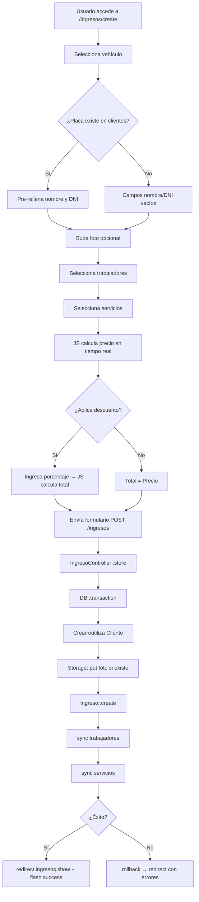

# Documento de Diseño Técnico — ingresos-module

## Visión General

El módulo de Ingresos permite registrar la entrada de un vehículo al taller mecánico. El flujo completo abarca: identificar al cliente por su placa (creándolo si no existe), capturar una foto opcional del vehículo, asignar uno o varios trabajadores responsables, seleccionar los servicios a realizar con cálculo de precio en tiempo real, aplicar un descuento opcional, y confirmar el registro con persistencia atómica en base de datos.

El módulo sigue exactamente los patrones visuales y de código de los módulos existentes (`ventas`, `clientes`, `vehículos`, `servicios`, `trabajadores`, `productos`), usando Laravel + Blade + Tailwind CSS sobre SQLite.

### Entidades involucradas

| Entidad | Tabla | Rol |
|---|---|---|
| `Ingreso` | `ingresos` | Cabecera del registro |
| `IngresoTrabajador` | `ingreso_trabajadores` | Pivote N:N Ingreso ↔ Trabajador |
| `DetalleServicio` | `detalle_servicios` | Pivote N:N Ingreso ↔ Servicio |
| `Cliente` | `clientes` | Propietario del vehículo (nullable nombre/dni) |
| `Vehiculo` | `vehiculos` | Vehículo que ingresa al taller |
| `Servicio` | `servicios` | Servicio a realizar |
| `Trabajador` | `trabajadores` | Mecánico responsable |
| `User` | `users` | Usuario autenticado que registra el ingreso |

---

## Arquitectura

El módulo sigue la arquitectura MVC estándar de Laravel:

```
routes/web.php
    └── middleware('auth')
        ├── Route::resource('ingresos', IngresoController::class)
        └── Route::get('ingresos/{ingreso}/ticket', [IngresoController::class, 'ticket'])

IngresoController
    ├── index()   → ingresos.index
    ├── create()  → ingresos.create
    ├── store()   → DB::transaction → redirect ingresos.show
    ├── show()    → ingresos.show
    ├── edit()    → ingresos.edit
    ├── update()  → DB::transaction → redirect ingresos.show
    ├── destroy() → Storage::delete + DB::delete → redirect ingresos.index
    └── ticket()  → ingresos.ticket

Modelos
    ├── Ingreso (actualizado: precio, total, user_id en $fillable y $casts)
    └── Cliente (actualizado: nombre y dni nullable en $casts)

Migraciones de ajuste
    ├── make_clientes_nombre_dni_nullable
    └── add_precio_total_user_id_to_ingresos_table

Vistas Blade
    ├── ingresos/index.blade.php
    ├── ingresos/create.blade.php
    ├── ingresos/edit.blade.php
    ├── ingresos/show.blade.php
    └── ingresos/ticket.blade.php
```

### Diagrama de flujo principal



---

## Componentes e Interfaces

### IngresoController

```php
class IngresoController extends Controller
{
    public function index(): View
    public function create(): View
    public function store(Request $request): RedirectResponse
    public function show(Ingreso $ingreso): View
    public function edit(Ingreso $ingreso): View
    public function update(Request $request, Ingreso $ingreso): RedirectResponse
    public function destroy(Ingreso $ingreso): RedirectResponse
    public function ticket(Ingreso $ingreso): View
}
```

**Responsabilidades por método:**

- `index()`: Carga `Ingreso::with(['cliente', 'vehiculo', 'trabajadores'])->latest()->paginate(15)` y retorna la vista.
- `create()`: Carga `Vehiculo::all()`, `Trabajador::where('estado', true)->get()`, `Servicio::all()` y retorna la vista.
- `store()`: Valida, ejecuta `DB::transaction` con upsert de cliente, `Storage::put` de foto, `Ingreso::create`, `sync` de trabajadores y servicios.
- `show()`: Carga el ingreso con todas sus relaciones mediante eager loading y retorna la vista.
- `edit()`: Igual que `create()` pero con el ingreso pre-cargado.
- `update()`: Valida, ejecuta `DB::transaction` con actualización del ingreso, manejo de foto (eliminar anterior si se sube nueva), `sync` de trabajadores y servicios.
- `destroy()`: Elimina foto del storage si existe, luego elimina el ingreso (cascade elimina pivotes).
- `ticket()`: Carga el ingreso con todas sus relaciones y retorna la vista de ticket.

### Reglas de validación (store y update)

```php
$rules = [
    'vehiculo_id'   => ['required', 'integer', 'exists:vehiculos,id'],
    'placa'         => ['required', 'string', 'max:7'],
    'nombre'        => ['nullable', 'string', 'max:100'],
    'dni'           => ['nullable', 'string', 'max:8'],
    'fecha'         => ['required', 'date'],
    'foto'          => ['nullable', 'image', 'mimes:jpeg,png,webp', 'max:5120'],
    'trabajadores'  => ['required', 'array', 'min:1'],
    'trabajadores.*'=> ['integer', 'exists:trabajadores,id'],
    'servicios'     => ['nullable', 'array'],
    'servicios.*'   => ['integer', 'exists:servicios,id'],
    'precio'        => ['required', 'numeric', 'min:0'],
    'total'         => ['required', 'numeric', 'gt:0'],
];

$messages = [
    'trabajadores.required' => 'Debe asignar al menos un trabajador al ingreso.',
    'trabajadores.min'      => 'Debe asignar al menos un trabajador al ingreso.',
    'foto.image'            => 'El archivo debe ser una imagen válida.',
    'foto.max'              => 'La imagen no puede superar 5 MB.',
];
```

### Lógica de upsert de cliente

```php
// En store() y update()
$cliente = Cliente::firstOrCreate(
    ['placa' => $request->placa],
    [
        'nombre' => $request->nombre,
        'dni'    => $request->dni,
    ]
);
```

### Manejo de foto

```php
// Almacenar
$ruta = Storage::put('public/ingresos', $request->file('foto'));
// Eliminar anterior en update
if ($ingreso->foto) {
    Storage::delete($ingreso->foto);
}
// Eliminar en destroy
if ($ingreso->foto) {
    Storage::delete($ingreso->foto);
}
```

### Vistas Blade

| Vista | Datos recibidos |
|---|---|
| `ingresos.index` | `$ingresos` (LengthAwarePaginator con relaciones cliente, vehiculo, trabajadores) |
| `ingresos.create` | `$vehiculos`, `$trabajadores`, `$servicios` |
| `ingresos.edit` | `$ingreso` (con relaciones), `$vehiculos`, `$trabajadores`, `$servicios` |
| `ingresos.show` | `$ingreso` (con todas las relaciones) |
| `ingresos.ticket` | `$ingreso` (con todas las relaciones) |

### JavaScript del formulario (create/edit)

El formulario incluye un bloque `<script>` inline (siguiendo el patrón de `ventas/create.blade.php`) que gestiona:

1. **Selección de vehículo**: Al cambiar el `<select>` de vehículo, actualiza la variable `precioBase` y recalcula.
2. **Checkboxes de servicios**: Al marcar/desmarcar, actualiza el array `serviciosSeleccionados` y recalcula.
3. **Función `recalcularPrecio()`**: `precio = precioBase + suma(serviciosSeleccionados.map(s => s.precio))`.
4. **Toggle de descuento**: Muestra/oculta el campo de porcentaje.
5. **Campo de porcentaje**: Valida que no supere 100, calcula `total = precio * (1 - pct/100)`.
6. **Campo `total` editable**: Permite edición manual directa.
7. **Vista previa de foto**: Listener en el `<input type="file">` que usa `FileReader` para mostrar preview.

---

## Modelos de Datos

### Esquema de la tabla `ingresos` (estado final)

```sql
CREATE TABLE ingresos (
    id          INTEGER PRIMARY KEY AUTOINCREMENT,
    cliente_id  INTEGER NOT NULL REFERENCES clientes(id) ON DELETE CASCADE,
    vehiculo_id INTEGER NOT NULL REFERENCES vehiculos(id) ON DELETE CASCADE,
    user_id     INTEGER NOT NULL REFERENCES users(id),
    fecha       DATE    NOT NULL,
    precio      DECIMAL(10,2) NOT NULL DEFAULT 0,
    total       DECIMAL(10,2) NOT NULL DEFAULT 0,
    foto        VARCHAR(255)  NULL,
    created_at  DATETIME,
    updated_at  DATETIME,
    INDEX (fecha)
);
```

### Esquema de la tabla `clientes` (estado final)

```sql
CREATE TABLE clientes (
    id         INTEGER PRIMARY KEY AUTOINCREMENT,
    dni        VARCHAR(8)  NULL,          -- nullable (era NOT NULL UNIQUE)
    nombre     VARCHAR(100) NULL,         -- nullable (era NOT NULL)
    placa      VARCHAR(7)  NOT NULL,
    created_at DATETIME,
    updated_at DATETIME
);
```

> **Nota sobre UNIQUE en `dni`**: SQLite permite múltiples NULLs en columnas UNIQUE. La migración de ajuste elimina el índice UNIQUE existente sobre `dni` y lo reemplaza por un índice parcial (o simplemente lo elimina), ya que el campo pasa a ser opcional.

### Tabla `ingreso_trabajadores` (sin cambios)

```sql
CREATE TABLE ingreso_trabajadores (
    id           INTEGER PRIMARY KEY AUTOINCREMENT,
    ingreso_id   INTEGER NOT NULL REFERENCES ingresos(id) ON DELETE CASCADE,
    trabajador_id INTEGER NOT NULL REFERENCES trabajadores(id) ON DELETE CASCADE,
    created_at   DATETIME,
    updated_at   DATETIME,
    UNIQUE (ingreso_id, trabajador_id)
);
```

### Tabla `detalle_servicios` (sin cambios)

```sql
CREATE TABLE detalle_servicios (
    id          INTEGER PRIMARY KEY AUTOINCREMENT,
    ingreso_id  INTEGER NOT NULL REFERENCES ingresos(id) ON DELETE CASCADE,
    servicio_id INTEGER NOT NULL REFERENCES servicios(id) ON DELETE CASCADE,
    created_at  DATETIME,
    updated_at  DATETIME,
    UNIQUE (ingreso_id, servicio_id)
);
```

### Modelo `Ingreso` (actualizado)

```php
class Ingreso extends Model
{
    protected $fillable = [
        'cliente_id', 'vehiculo_id', 'fecha',
        'precio', 'total', 'foto', 'user_id',
    ];

    protected $casts = [
        'fecha'  => 'date',
        'precio' => 'decimal:2',
        'total'  => 'decimal:2',
    ];

    public function cliente(): BelongsTo   { return $this->belongsTo(Cliente::class); }
    public function vehiculo(): BelongsTo  { return $this->belongsTo(Vehiculo::class); }
    public function user(): BelongsTo      { return $this->belongsTo(User::class); }
    public function trabajadores(): BelongsToMany {
        return $this->belongsToMany(Trabajador::class, 'ingreso_trabajadores')->withTimestamps();
    }
    public function servicios(): BelongsToMany {
        return $this->belongsToMany(Servicio::class, 'detalle_servicios')->withTimestamps();
    }
}
```

### Modelo `Cliente` (actualizado)

```php
class Cliente extends Model
{
    protected $fillable = ['dni', 'nombre', 'placa'];

    protected $casts = [
        'dni'    => 'string',   // nullable en BD
        'nombre' => 'string',   // nullable en BD
    ];

    public function ingresos(): HasMany { return $this->hasMany(Ingreso::class); }
    // ... relaciones existentes sin cambios
}
```

### Migraciones de ajuste

**Migración 1: `make_clientes_nombre_dni_nullable`**

```php
public function up(): void
{
    Schema::table('clientes', function (Blueprint $table) {
        $table->dropUnique(['dni']);          // elimina índice UNIQUE existente
        $table->string('nombre', 100)->nullable()->change();
        $table->string('dni', 8)->nullable()->change();
    });
}

public function down(): void
{
    Schema::table('clientes', function (Blueprint $table) {
        $table->string('nombre', 100)->nullable(false)->change();
        $table->string('dni', 8)->nullable(false)->change();
        $table->unique('dni');
    });
}
```

**Migración 2: `add_precio_total_user_id_to_ingresos_table`**

```php
public function up(): void
{
    Schema::table('ingresos', function (Blueprint $table) {
        $table->decimal('precio', 10, 2)->default(0)->after('fecha');
        $table->decimal('total', 10, 2)->default(0)->after('precio');
        $table->foreignId('user_id')->after('total')->constrained('users');
    });
}

public function down(): void
{
    Schema::table('ingresos', function (Blueprint $table) {
        $table->dropForeign(['user_id']);
        $table->dropColumn(['precio', 'total', 'user_id']);
    });
}
```

### Rutas

```php
// routes/web.php
Route::middleware(['auth'])->group(function () {
    // ... rutas existentes ...
    Route::resource('ingresos', IngresoController::class);
    Route::get('ingresos/{ingreso}/ticket', [IngresoController::class, 'ticket'])
         ->name('ingresos.ticket');
});
```

---

## Propiedades de Corrección

*Una propiedad es una característica o comportamiento que debe mantenerse verdadero en todas las ejecuciones válidas del sistema — esencialmente, una declaración formal sobre lo que el sistema debe hacer. Las propiedades sirven como puente entre las especificaciones legibles por humanos y las garantías de corrección verificables por máquinas.*

### Propiedad 1: Cálculo de precio como suma inalterable

*Para cualquier* vehículo con precio base `P` y cualquier subconjunto (incluyendo el vacío) de servicios con precios `[s₁, s₂, ..., sₙ]`, el campo `precio` calculado debe ser exactamente `P + s₁ + s₂ + ... + sₙ`.

**Valida: Requisitos 9.2, 9.3, 9.10**

### Propiedad 2: Cálculo de total con descuento por porcentaje

*Para cualquier* precio `P > 0` y cualquier porcentaje de descuento `D` en el rango `[0, 100]`, el total calculado debe ser `P × (1 − D / 100)`, con precisión de 2 decimales.

**Valida: Requisitos 9.7**

### Propiedad 3: Round-trip de persistencia del ingreso

*Para cualquier* ingreso válido creado con un cliente, vehículo, conjunto no vacío de trabajadores y conjunto (posiblemente vacío) de servicios, al recuperar el ingreso de la base de datos debe contener exactamente los mismos valores de `cliente_id`, `vehiculo_id`, `precio`, `total`, `user_id`, y las mismas colecciones de trabajadores y servicios.

**Valida: Requisitos 10.1, 10.2, 10.3**

### Propiedad 4: Atomicidad de la transacción

*Para cualquier* intento de creación de ingreso donde la persistencia de las relaciones (trabajadores o servicios) falla, no debe existir ningún registro nuevo en la tabla `ingresos` ni en las tablas pivote `ingreso_trabajadores` y `detalle_servicios`.

**Valida: Requisito 10.4**

### Propiedad 5: Upsert de cliente por placa

*Para cualquier* placa `P`, si ya existe un cliente con esa placa en la base de datos, crear un ingreso con la placa `P` debe reutilizar el `cliente_id` existente (el conteo de clientes con placa `P` no debe aumentar). Si no existe ningún cliente con placa `P`, debe crearse exactamente un nuevo cliente.

**Valida: Requisitos 10.10, 10.11**

### Propiedad 6: Sincronización de relaciones en edición

*Para cualquier* ingreso existente y cualquier nuevo conjunto de trabajadores `T'` y servicios `S'`, después de ejecutar `update()`, las relaciones `trabajadores` y `servicios` del ingreso deben contener exactamente los elementos de `T'` y `S'` respectivamente (ni más ni menos).

**Valida: Requisito 11.5**

### Propiedad 7: Paginación correcta del listado

*Para cualquier* cantidad `N` de ingresos en la base de datos, la primera página del listado debe contener `min(N, 15)` registros, y los registros deben estar ordenados por `created_at` descendente.

**Valida: Requisito 5.1**

---

## Manejo de Errores

### Errores de validación del formulario

Los errores de validación de Laravel se muestran inline usando el patrón estándar del proyecto:

```blade
<input class="{{ $errors->has('campo') ? 'border-red-400 bg-red-50' : 'border-gray-300' }}" ...>
@error('campo')
    <p class="mt-1 text-xs text-red-600">{{ $message }}</p>
@enderror
```

Los datos del formulario se preservan con `old()` para no perder la entrada del usuario tras un error de validación.

### Errores de subida de foto

- Archivo no es imagen o supera 5 MB → error de validación estándar de Laravel (`image`, `mimes`, `max`).
- Fallo en `Storage::put()` → la excepción se propaga y la transacción hace rollback.

### Errores en la transacción de base de datos

```php
try {
    DB::transaction(function () use ($request, &$ingreso) {
        // ... persistencia ...
    });
    return redirect()->route('ingresos.show', $ingreso)
        ->with('success', 'Ingreso registrado correctamente.');
} catch (\Throwable $e) {
    return back()->withInput()
        ->with('error', 'No se pudo registrar el ingreso. Intente nuevamente.');
}
```

### Errores en eliminación

```php
try {
    if ($ingreso->foto) {
        Storage::delete($ingreso->foto);
    }
    $ingreso->delete();
    return redirect()->route('ingresos.index')
        ->with('success', 'Ingreso eliminado correctamente.');
} catch (\Throwable $e) {
    return redirect()->route('ingresos.index')
        ->with('error', 'No se pudo eliminar el ingreso. Intente nuevamente.');
}
```

### Validación de porcentaje de descuento en el cliente (JavaScript)

```javascript
porcentajeInput.addEventListener('input', function () {
    const errorEl = document.getElementById('error-porcentaje');
    if (parseFloat(this.value) > 100) {
        this.value = 100;
        errorEl.classList.remove('hidden');
    } else {
        errorEl.classList.add('hidden');
    }
    recalcularPrecio();
});
```

### Consistencia de foto en edición

Si el usuario sube una nueva foto pero la transacción falla, la foto nueva ya fue almacenada en disco. Para evitar archivos huérfanos, la eliminación de la foto anterior y el almacenamiento de la nueva se realizan **dentro** de la transacción usando un enfoque de dos pasos: almacenar la nueva primero, luego eliminar la anterior solo si el `Ingreso::update()` tiene éxito.

---

## Estrategia de Testing

### Enfoque dual

El módulo usa dos tipos de tests complementarios:

1. **Tests unitarios / de feature**: Verifican comportamientos específicos, casos de borde y flujos de UI.
2. **Tests basados en propiedades (PBT)**: Verifican propiedades universales que deben mantenerse para cualquier entrada válida.

### Librería de PBT

Se usa **[fast-check](https://github.com/dubzzz/fast-check)** para los tests de JavaScript (lógica de cálculo del formulario) y **[PHPUnit + Faker](https://fakerphp.org/)** con generación aleatoria para los tests de PHP. Alternativamente, para PHP puro se puede usar **[eris](https://github.com/giorgiosironi/eris)** como librería de property-based testing.

Cada test de propiedad se ejecuta con un mínimo de **100 iteraciones**.

### Tests de propiedades

Cada propiedad del diseño se implementa como un test de propiedad independiente:

**Propiedad 1 — Cálculo de precio:**
```
// Tag: Feature: ingresos-module, Propiedad 1: precio = precioBase + suma(servicios)
// Genera: precio base aleatorio [0, 9999.99], subconjunto aleatorio de servicios
// Verifica: calcularPrecio(precioBase, servicios) === precioBase + servicios.reduce(sum)
```

**Propiedad 2 — Cálculo de total con descuento:**
```
// Tag: Feature: ingresos-module, Propiedad 2: total = precio * (1 - D/100)
// Genera: precio aleatorio [0.01, 9999.99], porcentaje aleatorio [0, 100]
// Verifica: calcularTotal(precio, porcentaje) === round(precio * (1 - porcentaje/100), 2)
```

**Propiedad 3 — Round-trip de persistencia:**
```
// Tag: Feature: ingresos-module, Propiedad 3: round-trip persistencia
// Genera: ingreso válido con datos aleatorios (Faker)
// Verifica: Ingreso::find($id) contiene los mismos datos y relaciones
```

**Propiedad 4 — Atomicidad de transacción:**
```
// Tag: Feature: ingresos-module, Propiedad 4: atomicidad transacción
// Genera: ingreso válido, simula fallo en sync de trabajadores
// Verifica: count(Ingreso::all()) no aumenta, count(IngresoTrabajador::all()) no aumenta
```

**Propiedad 5 — Upsert de cliente:**
```
// Tag: Feature: ingresos-module, Propiedad 5: upsert cliente por placa
// Genera: placa aleatoria, con/sin cliente preexistente
// Verifica: Cliente::where('placa', $placa)->count() === 1 después de store()
```

**Propiedad 6 — Sincronización de relaciones:**
```
// Tag: Feature: ingresos-module, Propiedad 6: sync relaciones en edición
// Genera: ingreso existente, nuevo conjunto aleatorio de trabajadores/servicios
// Verifica: $ingreso->trabajadores->pluck('id') === collect($nuevosTrabajadores)->sort()
```

**Propiedad 7 — Paginación:**
```
// Tag: Feature: ingresos-module, Propiedad 7: paginación correcta
// Genera: N ingresos aleatorios (N entre 0 y 50)
// Verifica: primera página contiene min(N, 15) registros ordenados por created_at desc
```

### Tests unitarios / de feature

- **Listado vacío**: Verifica que se muestra "No hay ingresos registrados." cuando no hay datos.
- **Columnas del listado**: Verifica que la vista contiene las columnas Fecha, Cliente, Vehículo, Trabajadores, Precio, Total, Acciones.
- **Vista de detalle con descuento**: Verifica que cuando `total < precio`, se muestra la sección de descuento con el monto correcto.
- **Vista de detalle sin descuento**: Verifica que cuando `total === precio`, no se muestra la sección de descuento.
- **Ticket con foto**: Verifica que la foto se muestra en el ticket cuando `foto` no es null.
- **Ticket sin foto**: Verifica que no se muestra la sección de foto cuando `foto` es null.
- **Acceso no autenticado**: Verifica que las rutas redirigen al login cuando no hay sesión activa.
- **Validación de trabajadores requeridos**: Verifica el mensaje de error cuando no se selecciona ningún trabajador.
- **Validación de foto inválida**: Verifica el rechazo de archivos no imagen o mayores a 5 MB.
- **Eliminación con foto**: Verifica que el archivo se elimina del storage al eliminar el ingreso.

### Tests de integración / smoke

- Verificar que las migraciones de ajuste se ejecutan y revierten sin errores.
- Verificar que el esquema final de `clientes` e `ingresos` coincide con el diseño.
- Verificar que las rutas del módulo están registradas y protegidas por middleware `auth`.
- Verificar que el enlace "Ingresos" aparece en el sidebar del layout.
