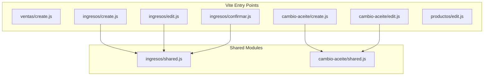

# Documento de Diseño Técnico: Modularización de JavaScript

## Visión General

Este documento describe el diseño técnico para extraer el JavaScript embebido en 7 vistas Blade y reorganizarlo en módulos ES dedicados dentro de `resources/js/`, procesados por Vite.

El proyecto usa **Laravel 11** con **Vite** como bundler (configurado en `vite.config.js`) y **Tailwind CSS v4**. El entry point actual es `resources/js/app.js`, que ya contiene la lógica de navegación global. La migración no debe alterar ese archivo ni su comportamiento.

### Objetivos

- Eliminar todos los bloques `<script>` con lógica de comportamiento de las vistas Blade.
- Organizar el JS en módulos por carpeta de módulo de negocio.
- Identificar y extraer lógica compartida a archivos `shared.js`.
- Registrar cada módulo como entry point en Vite.
- Preservar el 100% de la funcionalidad existente.

---

## Arquitectura

### Estructura de archivos resultante

```
resources/js/
├── app.js                          # Entry point global (sin cambios)
├── bootstrap.js                    # Sin cambios
├── ventas/
│   └── create.js                   # Lógica de ventas/create
├── ingresos/
│   ├── shared.js                   # Lógica compartida entre create, edit y confirmar
│   ├── create.js                   # Lógica específica de ingresos/create
│   ├── edit.js                     # Lógica específica de ingresos/edit
│   └── confirmar.js                # Lógica específica de ingresos/confirmar
├── cambio-aceite/
│   ├── shared.js                   # Lógica compartida entre create y edit
│   ├── create.js                   # Lógica específica de cambio-aceite/create
│   └── edit.js                     # Lógica específica de cambio-aceite/edit
└── productos/
    └── edit.js                     # Lógica de productos/edit
```

### Configuración de Vite

Cada archivo JS de vista se registra como entry point independiente en `vite.config.js`:

```js
laravel({
    input: [
        'resources/css/app.css',
        'resources/js/app.js',
        // Ventas
        'resources/js/ventas/create.js',
        // Ingresos
        'resources/js/ingresos/create.js',
        'resources/js/ingresos/edit.js',
        'resources/js/ingresos/confirmar.js',
        // Cambio de aceite
        'resources/js/cambio-aceite/create.js',
        'resources/js/cambio-aceite/edit.js',
        // Productos
        'resources/js/productos/edit.js',
    ],
    refresh: true,
}),
```

Los archivos `shared.js` **no** se registran como entry points porque son importados por los módulos de vista, no cargados directamente en el HTML.

### Diagrama de dependencias



---

## Componentes e Interfaces

### Patrón de inicialización de datos PHP → JS

Cuando un módulo JS necesita datos del servidor (ej. lista de servicios existentes en `ingresos/edit`), la vista Blade expone esos datos como variables globales **antes** de cargar el módulo:

```blade
{{-- Bloque de inicialización de datos (único <script> permitido en la vista) --}}
<script>
    window.serviciosExistentes = @json($ingreso->servicios);
    window.ingresoMetodoPago   = @json($ingreso->metodo_pago ?? 'efectivo');
    window.ingresoMontos       = @json([
        'efectivo' => $ingreso->monto_efectivo,
        'yape'     => $ingreso->monto_yape,
        'izipay'   => $ingreso->monto_izipay,
    ]);
</script>
@vite('resources/js/ingresos/edit.js')
```

El módulo JS lee esas variables al inicializarse:

```js
// ingresos/edit.js
const serviciosExistentes = window.serviciosExistentes ?? [];
```

### Patrón de módulo de vista

Cada módulo de vista sigue esta estructura:

```js
// Importaciones de lógica compartida (si aplica)
import { initBusqueda, renderTabla, ... } from './shared.js';

// Lectura de datos iniciales desde window (si aplica)
const datosIniciales = window.misDatos ?? [];

// Inicialización al cargar el DOM
document.addEventListener('DOMContentLoaded', () => {
    // Configurar event listeners
    // Inicializar estado
    // Renderizar estado inicial
});
```

### Patrón de módulo compartido

Los archivos `shared.js` exportan funciones puras o fábricas de comportamiento:

```js
// ingresos/shared.js
export function initBusquedaServicios({ inputId, resultadosId, onAgregar }) { ... }
export function renderTablaServicios(items, tbodyId, onEliminar) { ... }
export function sincronizarHiddens(items, formId) { ... }
export function initFotoPreview(inputId, previewId, currentId = null) { ... }
export function initMetodoPago({ options, radios, bloqueMixto, inputTotal, inputAncla, toggleDescManual }) { ... }
```

---

## Modelos de Datos

### Item de servicio (módulo ingresos)

```js
// Estructura interna del array `items` en vistas de ingresos
{
    servicio_id: Number,   // ID del servicio
    nombre:      String,   // Nombre para mostrar en tabla
    precio:      Number,   // Precio unitario (float, 2 decimales)
}
```

### Item de producto (módulos ventas y cambio-aceite)

```js
// Estructura interna del array `items` en ventas/create
{
    producto_id:     Number,
    nombre:          String,
    cantidad:        Number,   // Entero >= 1
    precio_unitario: Number,   // Precio unitario (float)
    subtotal:        Number,   // cantidad * precio_unitario
}

// Estructura interna del array `items` en cambio-aceite
{
    producto_id: Number,
    nombre:      String,
    cantidad:    Number,
    precio:      Number,   // Precio unitario
    total:       Number,   // cantidad * precio
}
```

### Estado de método de pago

```js
// Valores posibles del campo metodo_pago
type MetodoPago = 'efectivo' | 'yape' | 'izipay' | 'mixto';

// Montos para pago mixto
{
    monto_efectivo: Number,
    monto_yape:     Number,
    monto_izipay:   Number,
}
```

---

## Análisis de Lógica Compartida

### Módulo `ingresos` — lógica compartida entre create, edit y confirmar

Tras analizar los tres archivos, se identifican las siguientes funciones **idénticas o funcionalmente equivalentes**:

| Función | create | edit | confirmar | Diferencia |
|---|---|---|---|---|
| `buscarServicios(q)` | ✓ | ✓ | ✓ | Ninguna |
| `mostrarResultados(servicios)` | ✓ | ✓ | ✓ | Ninguna |
| `ocultarResultados()` | ✓ | ✓ | ✓ | Ninguna |
| `agregarServicio(servicio)` | ✓ | ✓ | ✓ | Ninguna |
| `renderTabla()` | ✓ | ✓ | ✓ | Ninguna |
| `eliminarItem(idx)` | ✓ | ✓ | ✓ | Ninguna |
| `sincronizarHiddens()` | ✓ | ✓ | ✓ | Ninguna |
| `initFotoPreview()` | ✓ | ✓ | ✓ | edit/confirmar ocultan foto actual |
| `initMetodoPago()` | — | ✓ | ✓ | Igual entre edit y confirmar |
| `validarMixto()` | — | ✓ | ✓ | Igual |
| `recalcularTotales()` | Parcial | ✓ | ✓ | create usa `actualizarPrecioDisplay` |

**Decisión**: Extraer a `ingresos/shared.js` todas las funciones comunes parametrizando las diferencias menores (ej. si hay foto actual que ocultar).

### Módulo `cambio-aceite` — lógica compartida entre create y edit

| Función | create | edit | Diferencia |
|---|---|---|---|
| `buscarProductos(q)` | ✓ | ✓ | Ninguna |
| `mostrarResultados(productos)` | ✓ | ✓ | Ninguna |
| `ocultarResultados()` | ✓ | ✓ | Ninguna |
| `agregarProducto(producto)` | ✓ | ✓ | Ninguna |
| `renderTabla()` | ✓ | ✓ | Ninguna |
| `actualizarCantidad(idx, val)` | ✓ | ✓ | Ninguna |
| `eliminarItem(idx)` | ✓ | ✓ | Ninguna |
| `recalcularTotales()` | ✓ | ✓ | Ninguna |
| `sincronizarHiddens()` | ✓ | ✓ | Ninguna |
| `initMetodoPago()` | ✓ | ✓ | Igual |
| `validarMixto()` | ✓ | ✓ | Igual |
| `initFotoPreview()` | ✓ | ✓ | edit muestra foto actual |

**Decisión**: Extraer todo a `cambio-aceite/shared.js`.

### Módulo `ventas` — sin lógica compartida

Solo tiene una vista (`create.blade.php`). No se crea `shared.js`.

### Módulo `productos` — sin lógica compartida

Solo tiene una vista (`edit.blade.php`) con un script mínimo (preview de imagen). No se crea `shared.js`.

---

## Inventario de Vistas y Responsabilidades

| Módulo | Vista | JS_Module | Responsabilidad del script |
|---|---|---|---|
| ventas | create.blade.php | ventas/create.js | Búsqueda Ajax de productos con debounce, tabla de detalle con cantidades editables, cálculo de subtotal/total/descuentos, validación de pago mixto, sincronización de hidden inputs |
| ingresos | create.blade.php | ingresos/create.js | Búsqueda Ajax de servicios con debounce, tabla de servicios, indicador de precio estimado, preview de foto |
| ingresos | edit.blade.php | ingresos/edit.js | Igual que create + pre-carga de servicios existentes desde servidor, cálculo de precio/total/descuentos, método de pago con mixto |
| ingresos | confirmar.blade.php | ingresos/confirmar.js | Igual que edit + acciones de confirmar/actualizar/eliminar ingreso |
| cambio-aceite | create.blade.php | cambio-aceite/create.js | Búsqueda Ajax de productos, tabla de detalle con cantidades, cálculo precio/total/descuentos, método de pago con mixto, preview de foto |
| cambio-aceite | edit.blade.php | cambio-aceite/edit.js | Igual que create + pre-carga de productos existentes desde servidor |
| productos | edit.blade.php | productos/edit.js | Preview de imagen al seleccionar archivo |

---

## Propiedades de Corrección

*Una propiedad es una característica o comportamiento que debe mantenerse verdadero en todas las ejecuciones válidas del sistema — esencialmente, una declaración formal sobre lo que el software debe hacer. Las propiedades sirven como puente entre las especificaciones legibles por humanos y las garantías de corrección verificables por máquinas.*

Esta feature involucra principalmente lógica de cálculo pura (totales, descuentos) y transformación de datos (renderizado de tablas). Estas funciones son candidatas adecuadas para property-based testing porque su comportamiento varía significativamente con los inputs y 100 iteraciones revelan más bugs que 2-3 ejemplos.

### Propiedad 1: Cálculo de total sin descuento es la suma de subtotales

*Para cualquier* array no vacío de items con precios y cantidades válidas, el total calculado sin descuento debe ser igual a la suma de los subtotales de todos los items.

**Validates: Requirements 7.3**

### Propiedad 2: Cálculo de total con descuento por porcentaje

*Para cualquier* array de items y cualquier porcentaje `p` en el rango [0, 100], el total con descuento debe ser igual a `suma_subtotales * (1 - p / 100)`, redondeado a 2 decimales.

**Validates: Requirements 7.3**

### Propiedad 3: Renderizado de tabla produce exactamente N filas

*Para cualquier* array de N items (N >= 1), la función `renderTabla()` debe producir exactamente N elementos `<tr>` en el tbody. Para N = 0, debe producir exactamente 1 fila con el mensaje de "sin items".

**Validates: Requirements 7.6**

### Propiedad 4: Sincronización de hidden inputs refleja el estado actual

*Para cualquier* array de items, después de llamar a `sincronizarHiddens()`, el formulario debe contener exactamente tantos hidden inputs con el prefijo `items[N]` como items hay en el array, sin duplicados ni residuos de llamadas anteriores.

**Validates: Requirements 7.3, 7.6**

---

## Manejo de Errores

### Errores de red en búsqueda Ajax

Las funciones `buscarServicios(q)` y `buscarProductos(q)` usan `fetch` sin manejo de errores en el código actual. Durante la migración se mantiene el comportamiento existente (sin cambios en manejo de errores) para no alterar la funcionalidad. Si el fetch falla, el dropdown simplemente no se muestra.

### Variables globales no definidas

Los módulos JS que leen de `window.*` deben usar el operador `??` para proveer valores por defecto seguros:

```js
const items = window.serviciosExistentes ?? [];
```

Esto previene errores si la vista no define la variable (ej. en un contexto de prueba).

### Validación de porcentaje

La validación `porcentaje > 100 → clamp a 100` se preserva exactamente como está en el código original.

### Validación de pago mixto

La alerta de suma no coincidente se preserva. La lógica de `validarMixto()` se extrae a `shared.js` sin modificaciones.

---

## Estrategia de Testing

### Evaluación de PBT

Esta feature es un refactoring de organización de código. La lógica de negocio (cálculos, renderizado) ya existe y se mueve sin cambios. PBT es apropiado para las funciones de cálculo puro que se extraen a módulos, ya que:

- Son funciones puras con inputs/outputs claros.
- El espacio de inputs es grande (arrays de items con precios arbitrarios, porcentajes).
- 100 iteraciones revelan edge cases (precios con muchos decimales, arrays vacíos, porcentaje = 0 o 100).

PBT **no** es apropiado para:
- La búsqueda Ajax (depende de red/servidor).
- El renderizado de UI (depende del DOM).
- La configuración de Vite (infraestructura).

### Librería de PBT

Se usará **[fast-check](https://fast-check.dev/)** para JavaScript/Node.js, que es la librería estándar de PBT para el ecosistema JS.

```bash
npm install --save-dev fast-check
```

### Tests de propiedades

Cada propiedad se implementa con un único test de property-based testing con mínimo 100 iteraciones:

```js
// Feature: js-modularization, Property 1: total sin descuento = suma de subtotales
import fc from 'fast-check';
import { calcularTotal } from '../resources/js/ventas/create.js';

test('total sin descuento es la suma de subtotales', () => {
    fc.assert(
        fc.property(
            fc.array(fc.record({
                subtotal: fc.float({ min: 0.01, max: 9999.99, noNaN: true }),
            }), { minLength: 1 }),
            (items) => {
                const suma = items.reduce((acc, i) => acc + i.subtotal, 0);
                const total = calcularTotal(items, 0);
                return Math.abs(total - suma) < 0.001;
            }
        ),
        { numRuns: 100 }
    );
});
```

### Tests de ejemplo (unit tests)

Para criterios clasificados como EXAMPLE:

- Verificar que `vite.config.js` contiene todos los entry points esperados.
- Verificar que las vistas blade no contienen funciones JS ni event listeners inline.
- Verificar que `shared.js` exporta las funciones esperadas con `export`.
- Verificar que los módulos que usan `shared.js` tienen `import` desde `./shared.js`.
- Verificar que las vistas con datos PHP tienen el bloque `window.*` antes de `@vite`.
- Verificar que `productos/edit.js` y `ventas/create.js` no tienen `shared.js` asociado.

### Tests de integración

- Ejecutar `npm run build` y verificar que todos los entry points generan archivos en `public/build/`.
- Verificar manualmente los flujos de búsqueda Ajax en cada formulario.

### Enfoque de testing dual

| Tipo | Herramienta | Qué cubre |
|---|---|---|
| Property-based | fast-check (≥100 iteraciones) | Cálculo de totales, descuentos, renderizado de tabla, sincronización de hiddens |
| Unit (ejemplo) | Vitest | Estructura de archivos, configuración de Vite, patrones de export/import |
| Integración | npm run build + manual | Compilación de Vite, flujos de usuario completos |

### Configuración de tests

Los tests de propiedad requieren que las funciones de cálculo sean exportables. Durante la implementación, las funciones puras de cálculo se exportan explícitamente para permitir su testing:

```js
// ventas/create.js
export function calcularTotal(items, porcentaje) { ... }
export function renderTablaHTML(items) { ... }
export function sincronizarHiddens(items, form, className, fields) { ... }
```

Tag format para cada test: `// Feature: js-modularization, Property N: <descripción>`
