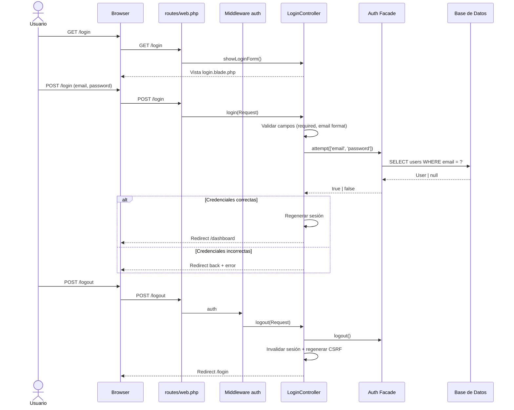
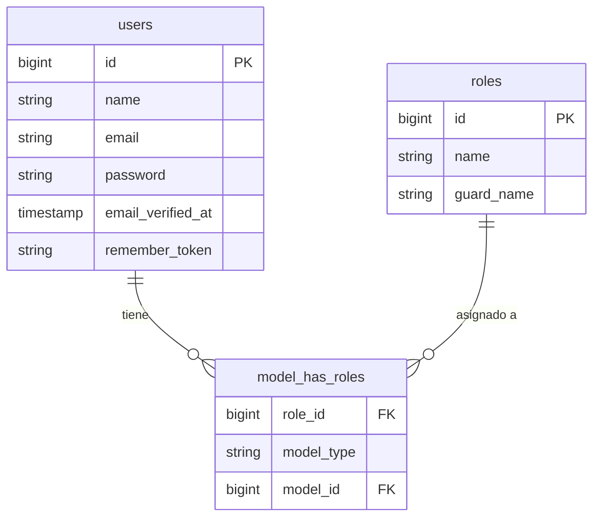

# Diseño Técnico: Panel de Login

## Visión General

Este documento describe el diseño técnico del panel de login para el sistema de gestión de taller. La funcionalidad cubre autenticación de usuarios mediante email y contraseña, gestión de dos roles (Administrador y Asistente) usando Spatie Laravel Permission v6, protección de rutas con el middleware `auth` de Laravel, y cierre de sesión seguro.

El sistema se construye sobre Laravel 12 con el guard `web` por defecto. No se utiliza ningún paquete de scaffolding de autenticación (Breeze, Jetstream, etc.); toda la lógica se implementa manualmente para mantener el control total sobre las vistas Blade y el flujo de autenticación.

---

## Arquitectura

El flujo de autenticación sigue el patrón MVC estándar de Laravel:



### Decisiones de diseño

- **Sin Breeze/Jetstream**: Se implementa un `LoginController` propio para mantener consistencia con el estilo del proyecto y evitar dependencias de scaffolding que generarían archivos innecesarios.
- **Layout dedicado para auth**: Se crea `layouts.auth` sin sidebar ni navegación inferior, apropiado para páginas de autenticación. El layout `layouts.app` existente incluye sidebar y bottom nav que no deben aparecer en el login.
- **`Auth::attempt()` con `remember: false`**: No se implementa "recordarme" en esta versión; la sesión expira al cerrar el navegador.
- **Redirección post-login a `/dashboard`**: Todos los roles aterrizan en el mismo dashboard. La diferenciación de acceso por rol se implementará en fases posteriores del sistema.
- **Idempotencia del seeder**: Se usa `firstOrCreate` para roles y `updateOrCreate` para el usuario administrador, garantizando que el seeder sea seguro de ejecutar múltiples veces.

---

## Componentes e Interfaces

### 1. `LoginController`

**Ubicación:** `app/Http/Controllers/Auth/LoginController.php`

Responsabilidades:
- Mostrar el formulario de login (`showLoginForm`)
- Procesar las credenciales y autenticar al usuario (`login`)
- Cerrar la sesión del usuario (`logout`)
- Redirigir al dashboard si el usuario ya está autenticado (via middleware `guest`)

```php
class LoginController extends Controller
{
    public function showLoginForm(): View|RedirectResponse
    public function login(Request $request): RedirectResponse
    public function logout(Request $request): RedirectResponse
}
```

**Validación en `login()`:**
| Campo    | Reglas                        |
|----------|-------------------------------|
| email    | `required`, `string`, `email` |
| password | `required`, `string`          |

**Mensaje de error de credenciales:** `"Las credenciales proporcionadas no coinciden con nuestros registros."` — se retorna como error con clave `email` para mostrarlo junto al campo correspondiente.

### 2. `AuthSeeder`

**Ubicación:** `database/seeders/AuthSeeder.php`

Responsabilidades:
- Crear el rol `Administrador` (guard `web`) si no existe
- Crear el rol `Asistente` (guard `web`) si no existe
- Crear el usuario `admin@sistema.com` si no existe y asignarle el rol `Administrador`

Usa `Role::firstOrCreate()` y `User::firstOrCreate()` para garantizar idempotencia.

### 3. Modelo `User` (modificación)

**Ubicación:** `app/Models/User.php`

Se añade el trait `HasRoles` de Spatie Laravel Permission:

```php
use Spatie\Permission\Traits\HasRoles;

class User extends Authenticatable
{
    use HasFactory, Notifiable, HasRoles;
    // ...
}
```

### 4. Vistas Blade

| Vista | Ruta | Descripción |
|-------|------|-------------|
| `layouts/auth.blade.php` | `resources/views/layouts/auth.blade.php` | Layout sin sidebar para páginas de autenticación |
| `auth/login.blade.php` | `resources/views/auth/login.blade.php` | Formulario de login |

**`layouts/auth.blade.php`**: Layout minimalista centrado, sin sidebar ni bottom nav. Incluye Vite para CSS/JS. Apropiado para pantallas de autenticación.

**`auth/login.blade.php`**: Extiende `layouts.auth`. Contiene:
- Campo `email` (tipo `email`, etiqueta "Correo electrónico")
- Campo `password` (tipo `password`, etiqueta "Contraseña")
- Botón de envío "Iniciar sesión"
- Sección de errores de validación junto a cada campo
- Token CSRF (`@csrf`)

### 5. Rutas

**Ubicación:** `routes/web.php`

```php
// Rutas de autenticación (solo para invitados)
Route::middleware('guest')->group(function () {
    Route::get('/login', [LoginController::class, 'showLoginForm'])->name('login');
    Route::post('/login', [LoginController::class, 'login']);
});

// Logout (requiere autenticación)
Route::post('/logout', [LoginController::class, 'logout'])
    ->middleware('auth')
    ->name('logout');

// Dashboard protegido
Route::get('/dashboard', function () {
    return view('dashboard');
})->middleware('auth')->name('dashboard');
```

El middleware `guest` redirige automáticamente a `/dashboard` si el usuario ya está autenticado (comportamiento por defecto de Laravel). El middleware `auth` redirige a `/login` si el usuario no está autenticado.

### 6. Configuración del middleware `auth`

Laravel 12 usa `bootstrap/app.php` para configurar el middleware. La ruta de redirección para usuarios no autenticados ya apunta a `route('login')` por defecto en `app/Http/Middleware/Authenticate.php` (o su equivalente en Laravel 12 via `withMiddleware` en `bootstrap/app.php`).

---

## Modelos de Datos

### Tabla `users` (existente)

| Columna             | Tipo                  | Descripción                        |
|---------------------|-----------------------|------------------------------------|
| `id`                | `bigint unsigned`     | Clave primaria                     |
| `name`              | `varchar(255)`        | Nombre del usuario                 |
| `email`             | `varchar(255) unique` | Email (usado como credencial)      |
| `email_verified_at` | `timestamp nullable`  | Verificación de email              |
| `password`          | `varchar(255)`        | Hash bcrypt de la contraseña       |
| `remember_token`    | `varchar(100)`        | Token para "recordarme"            |
| `created_at`        | `timestamp`           |                                    |
| `updated_at`        | `timestamp`           |                                    |

### Tablas de Spatie (existentes, creadas por migración)

| Tabla                   | Descripción                                      |
|-------------------------|--------------------------------------------------|
| `roles`                 | Roles del sistema (`Administrador`, `Asistente`) |
| `permissions`           | Permisos (vacíos en esta versión)                |
| `model_has_roles`       | Relación polimórfica User ↔ Role                 |
| `model_has_permissions` | Relación polimórfica User ↔ Permission           |
| `role_has_permissions`  | Relación Role ↔ Permission                       |

### Datos iniciales (AuthSeeder)

| Entidad | Datos |
|---------|-------|
| Rol     | `name: 'Administrador'`, `guard_name: 'web'` |
| Rol     | `name: 'Asistente'`, `guard_name: 'web'` |
| Usuario | `name: 'Administrador'`, `email: 'admin@sistema.com'`, `password: bcrypt('password')`, rol: `Administrador` |

> La contraseña inicial del administrador debe cambiarse tras el primer acceso. Se recomienda parametrizarla via variable de entorno en producción.

### Diagrama de relaciones



---

## Propiedades de Corrección

*Una propiedad es una característica o comportamiento que debe mantenerse verdadero en todas las ejecuciones válidas de un sistema — esencialmente, una declaración formal sobre lo que el sistema debe hacer. Las propiedades sirven como puente entre las especificaciones legibles por humanos y las garantías de corrección verificables por máquina.*

### Propiedad 1: Autenticación exitosa para credenciales válidas

*Para cualquier* usuario registrado en la base de datos con un email y contraseña válidos, llamar a `Auth::attempt(['email' => $email, 'password' => $password])` debe retornar `true`.

**Valida: Requisito 2.1**

---

### Propiedad 2: Credenciales inválidas producen el mensaje de error correcto

*Para cualquier* combinación de email/contraseña que no corresponda a un usuario válido en la base de datos (ya sea porque el email no existe o porque la contraseña es incorrecta), el sistema debe retornar al formulario de login con el mensaje de error `"Las credenciales proporcionadas no coinciden con nuestros registros."` asociado al campo `email`.

**Valida: Requisitos 2.4, 2.5**

---

### Propiedad 3: Errores de validación se muestran junto al campo correspondiente

*Para cualquier* envío del formulario de login con datos inválidos (campo vacío o formato de email incorrecto), el HTML de respuesta debe contener el mensaje de error de validación en la sección correspondiente al campo que falló.

**Valida: Requisitos 2.6, 2.7, 2.8, 2.9**

---

### Propiedad 4: Acceso no autenticado a rutas protegidas redirige a /login

*Para cualquier* solicitud HTTP a una ruta protegida por el middleware `auth` realizada sin una sesión autenticada activa, el sistema debe responder con una redirección HTTP 302 hacia `/login`.

**Valida: Requisitos 3.4, 5.1, 5.4**

---

### Propiedad 5: El AuthSeeder es idempotente

*Para cualquier* número N ≥ 1 de ejecuciones del `AuthSeeder`, el estado resultante en la base de datos (número de roles, número de usuarios administradores, asignaciones de roles) debe ser idéntico al estado producido por una única ejecución.

**Valida: Requisito 4.4**

---

## Manejo de Errores

### Errores de validación del formulario

| Escenario | Comportamiento |
|-----------|----------------|
| Campo `email` vacío | Error de validación: "El campo correo electrónico es obligatorio." |
| Campo `password` vacío | Error de validación: "El campo contraseña es obligatorio." |
| `email` con formato inválido | Error de validación: "El campo correo electrónico debe ser una dirección de correo válida." |
| Credenciales incorrectas | Error en campo `email`: "Las credenciales proporcionadas no coinciden con nuestros registros." |

Los errores de validación se retornan con `redirect()->back()->withErrors()->withInput()`. El campo `password` nunca se repopula en el formulario por seguridad (no se incluye en `withInput()` para ese campo, o se excluye explícitamente).

### Acceso no autorizado

| Escenario | Comportamiento |
|-----------|----------------|
| Usuario no autenticado accede a ruta protegida | Middleware `auth` redirige a `/login` (comportamiento por defecto de Laravel) |
| Sesión expirada | Mismo comportamiento que no autenticado |
| Usuario autenticado accede a `/login` | Middleware `guest` redirige a `/dashboard` |

### Errores del seeder

| Escenario | Comportamiento |
|-----------|----------------|
| Seeder ejecutado múltiples veces | `firstOrCreate` / `updateOrCreate` previenen duplicados silenciosamente |
| Tablas de Spatie no migradas | Error de base de datos en tiempo de ejecución — se debe ejecutar `php artisan migrate` primero |

### Seguridad

- **CSRF**: Todas las rutas POST (`/login`, `/logout`) requieren token CSRF válido. Laravel rechaza solicitudes sin token con error 419.
- **Enumeración de usuarios**: El mensaje de error de credenciales es genérico e idéntico tanto para email inexistente como para contraseña incorrecta, evitando revelar si un email está registrado.
- **Contraseña en logs**: El campo `password` debe estar en la lista `$dontFlash` de la sesión (comportamiento por defecto de Laravel).

---

## Estrategia de Pruebas

### Enfoque dual

Se utilizan dos tipos de pruebas complementarias:

1. **Pruebas de ejemplo** (PHPUnit / Laravel HTTP Tests): verifican comportamientos específicos y concretos.
2. **Pruebas basadas en propiedades** (PBT con [eris/eris](https://github.com/giorgiosironi/eris) o implementación manual con generadores): verifican propiedades universales sobre rangos de entradas.

Para este proyecto en PHP/Laravel, se recomienda usar **[eris/eris](https://github.com/giorgiosironi/eris)** como librería de property-based testing, o alternativamente implementar generadores simples con `faker` dentro de los tests de PHPUnit. Cada prueba de propiedad debe ejecutarse con un mínimo de **100 iteraciones**.

### Pruebas de ejemplo (Feature Tests)

Ubicación: `tests/Feature/Auth/`

| Test | Criterio validado |
|------|-------------------|
| `GET /login` retorna 200 y vista login | 1.5 |
| Vista login contiene campo email con etiqueta correcta | 1.1 |
| Vista login contiene campo password con etiqueta correcta | 1.2 |
| Vista login contiene botón "Iniciar sesión" | 1.3 |
| Usuario autenticado en `GET /login` redirige a dashboard | 1.6 |
| `POST /login` con credenciales válidas redirige a `/dashboard` | 2.2, 2.3 |
| `POST /login` con credenciales válidas crea sesión autenticada | 2.2 |
| `POST /logout` invalida la sesión | 3.1 |
| `POST /logout` redirige a `/login` | 3.3 |
| Usuario con rol Asistente accede al dashboard | 4.7 |
| Usuario con rol Administrador accede al dashboard | 4.6 |
| `GET /dashboard` autenticado retorna 200 | 5.3 |

### Pruebas basadas en propiedades (Property Tests)

Ubicación: `tests/Feature/Auth/` (con sufijo `PropertyTest`)

Cada prueba referencia su propiedad de diseño con el tag:
`Feature: login-panel, Property {N}: {texto de la propiedad}`

| Prueba de propiedad | Propiedad | Iteraciones mínimas |
|---------------------|-----------|---------------------|
| Para cualquier usuario generado aleatoriamente, `Auth::attempt()` con sus credenciales retorna `true` | Propiedad 1 | 100 |
| Para cualquier email no registrado o contraseña incorrecta, POST /login retorna el mensaje de error correcto | Propiedad 2 | 100 |
| Para cualquier combinación de campos inválidos, los errores aparecen en el HTML junto al campo | Propiedad 3 | 100 |
| Para cualquier ruta protegida, acceso sin autenticación redirige a /login | Propiedad 4 | 100 |
| Ejecutar AuthSeeder N veces produce el mismo estado que ejecutarlo 1 vez | Propiedad 5 | 20 (operación de DB) |

### Pruebas de humo (Smoke Tests)

| Test | Criterio validado |
|------|-------------------|
| Rol `Administrador` existe tras ejecutar AuthSeeder | 4.1 |
| Rol `Asistente` existe tras ejecutar AuthSeeder | 4.2 |
| Usuario `admin@sistema.com` existe con rol `Administrador` | 4.3 |
| Modelo `User` usa el trait `HasRoles` | 4.5 |
| Ruta `/dashboard` tiene middleware `auth` | 5.2 |

### Cobertura de casos límite

Los generadores de las pruebas de propiedad deben incluir:
- Emails con caracteres especiales válidos (e.g., `user+tag@domain.co.uk`)
- Contraseñas con caracteres especiales, unicode, longitudes extremas
- Strings que no son emails: sin `@`, múltiples `@`, solo espacios, cadenas vacías
- Múltiples usuarios en la base de datos para verificar que no hay colisiones
