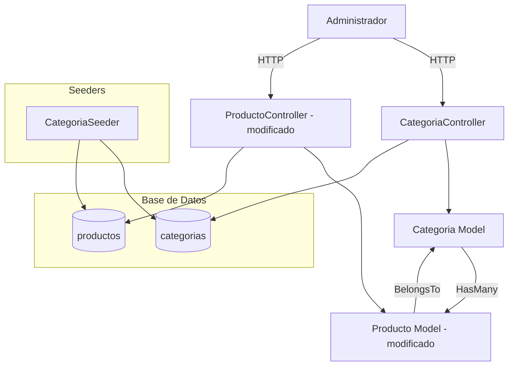
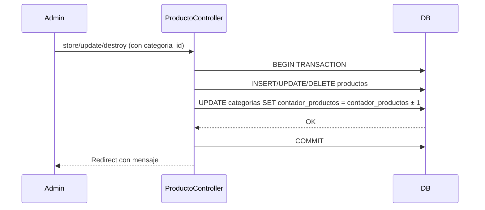
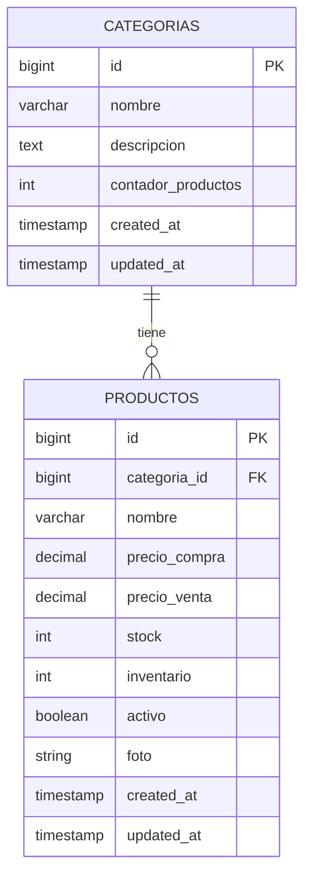

# Diseño Técnico: Módulo de Categorías de Productos

## Visión General

El módulo de categorías de productos extiende el sistema existente de gestión de productos (Laravel + Blade/Vite + Tailwind CSS) para permitir clasificar los productos en categorías automotrices. La funcionalidad central incluye un CRUD completo de categorías, la asignación opcional de categoría a cada producto, y un contador de productos por categoría que se mantiene sincronizado automáticamente mediante transacciones de base de datos.

El diseño sigue los patrones ya establecidos en el proyecto: controladores de recursos Laravel, vistas Blade con Tailwind CSS, migraciones incrementales, y seeders independientes. No se introduce ninguna dependencia nueva.

---

## Arquitectura

El módulo se integra en la arquitectura MVC existente sin modificar la estructura de carpetas ni los patrones de código actuales.



**Flujo de actualización del contador:**



---

## Componentes e Interfaces

### Nuevos componentes

| Componente | Tipo | Responsabilidad |
|---|---|---|
| `Categoria` | Model | Representa una categoría; define relaciones y fillable |
| `CategoriaController` | Controller | CRUD de categorías (index, create, store, edit, update, destroy) |
| `categorias/index.blade.php` | View | Listado de categorías con contador |
| `categorias/create.blade.php` | View | Formulario de creación |
| `categorias/edit.blade.php` | View | Formulario de edición |
| `CategoriaSeeder` | Seeder | Crea 8 categorías y asigna productos existentes |
| `create_categorias_table` | Migration | Tabla `categorias` |
| `add_categoria_id_to_productos` | Migration | Columna `categoria_id` nullable en `productos` |

### Componentes modificados

| Componente | Cambio |
|---|---|
| `Producto` model | Añadir `categoria_id` a `$fillable`, relación `belongsTo(Categoria)` |
| `ProductoController` | Pasar categorías a create/edit, gestionar `categoria_id` en store/update/destroy con transacciones |
| `productos/create.blade.php` | Selector `<select>` de categoría (opcional) |
| `productos/edit.blade.php` | Selector `<select>` de categoría (opcional) |
| `productos/index.blade.php` | Columna "Categoría" en la tabla |
| `layouts/app.blade.php` | Enlace "Categorías" dentro del dropdown "Gestión de productos" |
| `routes/web.php` | Registrar `Route::resource('categorias', ...)` bajo middleware `Administrador` |
| `DatabaseSeeder` | Llamar a `CategoriaSeeder` antes de `ProductoSeeder` |

### Interfaz del CategoriaController

```php
// Rutas generadas por Route::resource('categorias', CategoriaController::class)->except(['show'])
GET    /categorias           → index()
GET    /categorias/create    → create()
POST   /categorias           → store(Request)
GET    /categorias/{categoria}/edit → edit(Categoria)
PUT    /categorias/{categoria}      → update(Request, Categoria)
DELETE /categorias/{categoria}      → destroy(Categoria)
```

### Reglas de validación

**CategoriaController (store y update):**
```
nombre      → required | string | max:150 | unique:categorias,nombre[,{id}]
descripcion → nullable | string | max:500
```

**ProductoController (store y update) — campo añadido:**
```
categoria_id → nullable | integer | exists:categorias,id
```

---

## Modelos de Datos

### Tabla `categorias` (nueva)

```sql
CREATE TABLE categorias (
    id                  BIGINT UNSIGNED AUTO_INCREMENT PRIMARY KEY,
    nombre              VARCHAR(150) NOT NULL,
    descripcion         TEXT NULL,
    contador_productos  INT UNSIGNED NOT NULL DEFAULT 0,
    created_at          TIMESTAMP NULL,
    updated_at          TIMESTAMP NULL,

    UNIQUE KEY categorias_nombre_unique (nombre)
);
```

### Tabla `productos` (modificada)

Se añade una columna mediante migración incremental:

```sql
ALTER TABLE productos
    ADD COLUMN categoria_id BIGINT UNSIGNED NULL AFTER inventario,
    ADD CONSTRAINT fk_productos_categoria
        FOREIGN KEY (categoria_id) REFERENCES categorias(id)
        ON DELETE SET NULL;
```

> **Decisión de diseño:** `ON DELETE SET NULL` en lugar de `RESTRICT`. Si una categoría se elimina (lo cual ya está bloqueado por el requisito 4.2 cuando tiene productos), la FK no impide la operación a nivel de BD, pero la lógica del controlador lo previene antes. Esto evita errores de FK inesperados durante el desarrollo y el seeding.

### Modelo `Categoria`

```php
class Categoria extends Model
{
    protected $fillable = ['nombre', 'descripcion', 'contador_productos'];

    protected $casts = [
        'contador_productos' => 'integer',
    ];

    public function productos(): HasMany
    {
        return $this->hasMany(Producto::class);
    }
}
```

### Modelo `Producto` (cambios)

```php
// Añadir a $fillable:
'categoria_id',

// Añadir cast:
'categoria_id' => 'integer',

// Añadir relación:
public function categoria(): BelongsTo
{
    return $this->belongsTo(Categoria::class);
}
```

### Diagrama entidad-relación (fragmento relevante)



---

## Propiedades de Corrección

*Una propiedad es una característica o comportamiento que debe mantenerse verdadero en todas las ejecuciones válidas del sistema — esencialmente, una declaración formal sobre lo que el sistema debe hacer. Las propiedades sirven como puente entre las especificaciones legibles por humanos y las garantías de corrección verificables por máquina.*

### Evaluación de aplicabilidad de PBT

Este módulo es principalmente CRUD con lógica de negocio en el contador de productos. La lógica del contador (incremento/decremento atómico) sí tiene propiedades universales verificables. Las vistas Blade y la configuración de rutas no son candidatas a PBT.

**Reflexión de propiedades (consolidación):**
- Los criterios 5.4, 5.6 y 6.1 describen el mismo invariante desde distintos ángulos: el contador siempre iguala el COUNT real. Se consolidan en la Propiedad 1.
- El criterio 5.5 (cambio de categoría) se expresa mejor como invariante de suma global (Propiedad 3), que es más fuerte y subsume el caso de reasignación.
- Los criterios 1.3 y 3.2 son la misma regla de validación en create y edit; se consolidan en la Propiedad 4.
- Los criterios 1.4 y 3.3 son la misma regla de unicidad en create y edit; se consolidan en la Propiedad 4.
- El criterio 1.5 (contador inicializado en 0) está subsumido por la Propiedad 1.

---

### Propiedad 1: El contador siempre refleja el conteo real de productos

*Para cualquier* categoría en el sistema, tras cualquier secuencia de operaciones de creación, edición o eliminación de productos, el valor de `contador_productos` debe ser exactamente igual al número de productos que tienen `categoria_id` apuntando a esa categoría.

**Valida: Requisitos 1.5, 5.4, 5.6, 6.1, 6.3**

---

### Propiedad 2: El contador nunca es negativo

*Para cualquier* categoría en el sistema, después de cualquier secuencia de operaciones de creación, edición o eliminación de productos, el valor de `contador_productos` debe ser mayor o igual a cero.

**Valida: Requisito 6.2**

---

### Propiedad 3: La suma global de contadores es invariante ante reasignaciones

*Para cualquier* conjunto de categorías y cualquier producto asignado a una categoría A que se reasigna a una categoría B, la suma total de `contador_productos` de todas las categorías debe permanecer igual antes y después de la reasignación.

**Valida: Requisito 5.5**

---

### Propiedad 4: La validación de nombre rechaza entradas inválidas y duplicadas

*Para cualquier* operación de creación o edición de categoría, un nombre vacío, compuesto solo de espacios, o que supere los 150 caracteres debe ser rechazado; y un nombre que ya pertenezca a otra categoría distinta también debe ser rechazado.

**Valida: Requisitos 1.3, 1.4, 3.2, 3.3**

---

## Manejo de Errores

### Validación de formularios

| Escenario | Comportamiento |
|---|---|
| Nombre vacío o > 150 chars | Redirección con errores de validación en el campo `nombre` |
| Nombre duplicado (crear) | Error: "El nombre de la categoría ya está en uso." |
| Nombre duplicado (editar, otra categoría) | Error: "El nombre de la categoría ya está en uso." |
| Nombre duplicado (editar, misma categoría) | Permitido — la regla `unique` excluye el ID actual |
| `categoria_id` inválido en producto | Error de validación: `exists:categorias,id` |

### Eliminación de categoría con productos

Cuando `contador_productos > 0`, el controlador rechaza la eliminación antes de tocar la base de datos:

```php
if ($categoria->contador_productos > 0) {
    return redirect()->route('categorias.index')
        ->with('error', 'No se puede eliminar la categoría porque tiene productos asignados.');
}
```

### Transacciones en el contador

Todas las operaciones que modifican `categoria_id` en un producto se envuelven en `DB::transaction()`. Si cualquier operación falla, el rollback garantiza que el contador y el producto queden en estado consistente.

```php
DB::transaction(function () use ($request, $producto) {
    // 1. Decrementar categoría anterior (si tenía)
    // 2. Actualizar producto
    // 3. Incrementar nueva categoría (si se asignó)
});
```

### Eliminación de producto con categoría asignada

Al eliminar un producto que tiene `categoria_id`, el controlador decrementa el contador dentro de la misma transacción antes de eliminar el registro.

---

## Estrategia de Testing

### Tests unitarios / de integración (PHPUnit)

El proyecto usa PHPUnit. Se crearán tests de feature en `tests/Feature/`:

**`CategoriaControllerTest`**
- Crear categoría con datos válidos → redirige con mensaje de éxito
- Crear categoría con nombre vacío → error de validación
- Crear categoría con nombre duplicado → error de validación
- Editar categoría con nombre de otra categoría → error de validación
- Eliminar categoría sin productos → elimina correctamente
- Eliminar categoría con productos → rechaza con mensaje de error

**`ProductoCategoriaTest`** (tests de la lógica del contador)
- Asignar categoría a producto → `contador_productos` incrementa en 1
- Quitar categoría de producto → `contador_productos` decrementa en 1
- Cambiar categoría de producto → categoría anterior decrementa, nueva incrementa
- Eliminar producto con categoría → `contador_productos` decrementa en 1
- Operaciones concurrentes no dejan el contador en negativo

### Tests de propiedades (PBT)

Se usará **`eris/eris`** como librería PBT para PHP (compatible con PHPUnit). Se instala con `composer require --dev giorgiosironi/eris`.

Cada propiedad del diseño se implementa como un test que itera sobre múltiples escenarios generados:

- **Propiedad 1** — Generar secuencias aleatorias de operaciones (crear/editar/eliminar productos con categorías) y verificar que `contador_productos == Producto::where('categoria_id', $id)->count()` tras cada operación.
- **Propiedad 2** — Tras cualquier operación generada aleatoriamente, verificar que `contador_productos >= 0` para todas las categorías.
- **Propiedad 3** — Generar pares de categorías y productos, reasignar aleatoriamente, verificar que la suma total de contadores es invariante.
- **Propiedad 4** — Generar strings de longitud aleatoria (0, 1-150, >150) y nombres duplicados, verificar que la validación acepta/rechaza correctamente.

**Configuración mínima:** cada test de propiedad debe ejecutarse con al menos 100 iteraciones de datos generados (`->withMaxSize(100)`).

**Tag de referencia:** `// Feature: producto-categorias, Property {N}: {texto de la propiedad}`

### Tests de humo (Smoke)

- Ejecutar `php artisan migrate` sin errores
- Ejecutar `php artisan db:seed --class=CategoriaSeeder` sin errores
- Verificar que las 8 categorías existen y sus contadores son correctos tras el seeder
