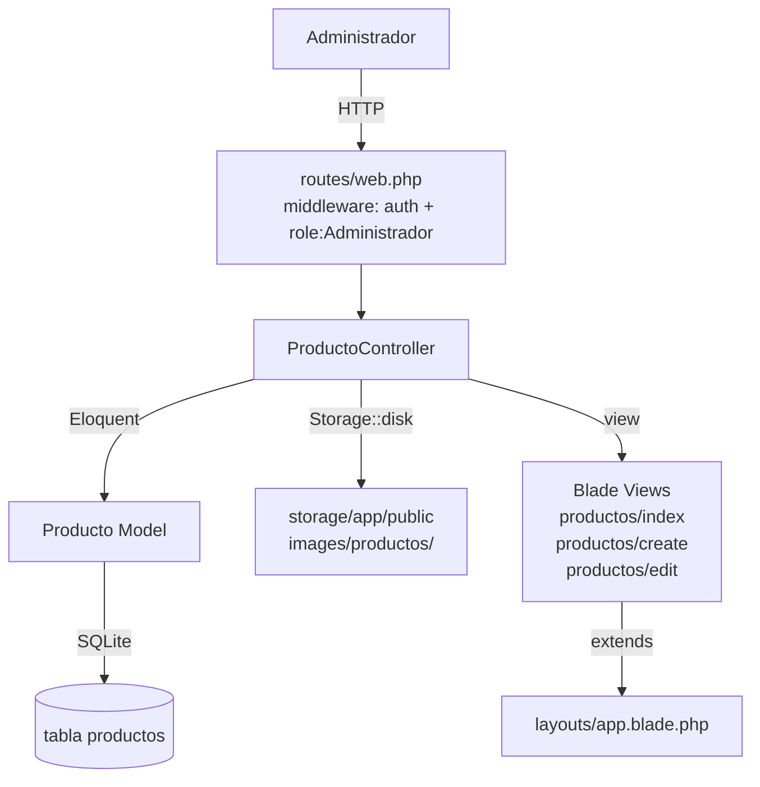

# Design Document — producto-crud

## Overview

Este documento describe el diseño técnico del módulo CRUD de Productos para la aplicación Laravel 11 + Blade + Tailwind CSS. El módulo permite a los administradores listar, crear, editar y eliminar productos, incluyendo gestión de imágenes y activación lógica mediante el campo `activo`.

El diseño sigue exactamente los patrones establecidos por los módulos `trabajadores`, `users` y `roles` ya existentes en la aplicación, garantizando coherencia visual y de código.

### Decisiones de diseño clave

- **Sin ruta `show`**: El resource se registra con `->except(['show'])`, igual que los demás módulos.
- **Almacenamiento de imágenes en disco público**: Se usa `Storage::disk('public')` con la ruta `images/productos/`, accesible vía el storage link de Laravel.
- **Activación lógica con checkbox**: El campo `activo` se gestiona con un checkbox HTML; cuando no se envía, el valor es `null` y se valida como `nullable|boolean`.
- **Preview de imagen con FileReader**: La previsualización en tiempo real en el formulario de edición se implementa con JavaScript vanilla (FileReader API), sin dependencias adicionales.
- **Grupo de navegación independiente**: El módulo de productos tiene su propio grupo desplegable `$productManagementActive` en el layout, separado de `$userManagementActive`.

---

## Architecture

El módulo sigue la arquitectura MVC estándar de Laravel:

```
HTTP Request
    │
    ▼
routes/web.php
(middleware: auth, role:Administrador)
    │
    ▼
ProductoController
(app/Http/Controllers/ProductoController.php)
    │
    ├── index()   → productos.index   (listado paginado)
    ├── create()  → productos.create  (formulario vacío)
    ├── store()   → redirect productos.index
    ├── edit()    → productos.edit    (formulario con datos)
    ├── update()  → redirect productos.index
    └── destroy() → redirect productos.index
    │
    ▼
Producto Model
(app/Models/Producto.php)
    │
    ▼
SQLite — tabla `productos`
    │
    ▼
Storage::disk('public')
(storage/app/public/images/productos/)
```



---

## Components and Interfaces

### 1. Migración de alteración

**Archivo:** `database/migrations/YYYY_MM_DD_HHMMSS_add_activo_foto_to_productos_table.php`

Añade dos columnas a la tabla `productos` existente:

```php
Schema::table('productos', function (Blueprint $table) {
    $table->tinyInteger('activo')->default(1)->after('inventario');
    $table->string('foto')->nullable()->after('activo');
});
```

El método `down()` revierte con `$table->dropColumn(['activo', 'foto'])`.

---

### 2. Modelo Producto

**Archivo:** `app/Models/Producto.php`

Se añaden `activo` y `foto` al array `$fillable` y se registran los casts correspondientes:

```php
protected $fillable = [
    'nombre', 'precio_compra', 'precio_venta',
    'stock', 'inventario', 'activo', 'foto',
];

protected $casts = [
    'precio_compra' => 'decimal:2',
    'precio_venta'  => 'decimal:2',
    'stock'         => 'integer',
    'inventario'    => 'integer',
    'activo'        => 'boolean',
];
```

Las relaciones existentes (`cambioAceites`, `ventas`) no se modifican.

---

### 3. ProductoController

**Archivo:** `app/Http/Controllers/ProductoController.php`

Controlador resource con los métodos `index`, `create`, `store`, `edit`, `update`, `destroy`. Sigue el mismo patrón que `TrabajadorController`.

#### Reglas de validación (compartidas por `store` y `update`)

```php
[
    'nombre'        => ['required', 'string', 'max:150'],
    'precio_compra' => ['required', 'numeric', 'gt:0'],
    'precio_venta'  => ['required', 'numeric', 'gt:0'],
    'stock'         => ['required', 'integer', 'min:0'],
    'inventario'    => ['required', 'integer', 'min:0'],
    'activo'        => ['nullable', 'boolean'],
    'foto'          => ['nullable', 'image', 'mimes:jpg,jpeg,png,webp', 'max:2048'],
]
```

#### Lógica de imagen en `store`

```php
$fotoPath = null;
if ($request->hasFile('foto')) {
    $fotoPath = $request->file('foto')->store('images/productos', 'public');
}
Producto::create([..., 'activo' => $request->boolean('activo', true), 'foto' => $fotoPath]);
```

#### Lógica de imagen en `update`

```php
$data = $validated;
if ($request->hasFile('foto')) {
    if ($producto->foto) {
        Storage::disk('public')->delete($producto->foto);
    }
    $data['foto'] = $request->file('foto')->store('images/productos', 'public');
} else {
    unset($data['foto']); // conservar ruta anterior
}
$data['activo'] = $request->boolean('activo');
$producto->update($data);
```

#### Lógica de imagen en `destroy`

```php
if ($producto->foto) {
    Storage::disk('public')->delete($producto->foto);
}
$producto->delete();
```

---

### 4. Rutas

**Archivo:** `routes/web.php`

Se añade dentro del grupo `middleware(['auth', 'role:Administrador'])` existente:

```php
use App\Http\Controllers\ProductoController;

Route::resource('productos', ProductoController::class)->except(['show']);
```

Esto genera las rutas: `GET /productos`, `GET /productos/create`, `POST /productos`, `GET /productos/{producto}/edit`, `PUT /productos/{producto}`, `DELETE /productos/{producto}`.

---

### 5. Vistas Blade

#### `productos/index.blade.php`

- Extiende `layouts.app`
- Flash messages de éxito/error
- Encabezado con título "Productos" y botón "Crear producto" → `productos.create`
- Estado vacío: mensaje "No hay productos registrados."
- Tabla con columnas: Foto, Nombre, Precio Compra, Precio Venta, Stock, Activo, Acciones
- Miniatura: `foto) }}" ...>` o placeholder SVG
- Badge activo/inactivo con clases `bg-green-100 text-green-800` / `bg-red-100 text-red-800`
- Botones Editar (`bg-gray-100 text-gray-700`) y Eliminar (`bg-red-100 text-red-700`) con `confirm()`
- Paginación: `{{ $productos->links() }}`

#### `productos/create.blade.php`

- Extiende `layouts.app`
- `<form enctype="multipart/form-data" novalidate>`
- Campos: nombre, precio_compra, precio_venta, stock, inventario, activo (checkbox, checked por defecto), foto (file input)
- Errores inline con `border-red-400 bg-red-50` y `text-xs text-red-600`
- Botón "Volver" → `productos.index`

#### `productos/edit.blade.php`

- Extiende `layouts.app`
- `<form enctype="multipart/form-data" novalidate>` con `@method('PUT')`
- Mismos campos que create, precargados con `old('campo', $producto->campo)`
- Sección de imagen:
  - Si `$producto->foto`: muestra imagen actual con leyenda "Imagen actual"
  - Si no: muestra placeholder
  - Al seleccionar archivo nuevo: JavaScript muestra bloque "Nueva imagen" con preview
- Script JavaScript con FileReader para preview en tiempo real (ver sección de Data Models)

#### `layouts/app.blade.php` (modificación)

Se añade la variable `$productManagementActive` y el nuevo grupo desplegable en sidebar y bottom nav:

```php
@php
    $userManagementActive    = request()->routeIs('users.*', 'roles.*', 'trabajadores.*');
    $productManagementActive = request()->routeIs('productos.*');
@endphp
```

El nuevo grupo en el sidebar sigue exactamente la misma estructura HTML/Alpine que el grupo "Gestión de usuarios", con `data-dropdown="product-management"` y `data-dropdown-toggle="product-management"`.

---

### 6. ProductoSeeder (actualización)

**Archivo:** `database/seeders/ProductoSeeder.php`

Se añaden `'activo' => 1` y `'foto' => null` a cada llamada `Producto::create([...])`.

---

## Data Models

### Tabla `productos` (estado final)

| Columna        | Tipo              | Nullable | Default | Notas                              |
|----------------|-------------------|----------|---------|------------------------------------|
| id             | bigint unsigned   | NO       | —       | PK, auto-increment                 |
| nombre         | varchar(150)      | NO       | —       |                                    |
| precio_compra  | decimal(10,2)     | NO       | —       |                                    |
| precio_venta   | decimal(10,2)     | NO       | —       |                                    |
| stock          | integer           | NO       | 0       |                                    |
| inventario     | integer           | NO       | 0       |                                    |
| activo         | tinyint           | NO       | 1       | Nuevo campo                        |
| foto           | varchar(255)      | YES      | NULL    | Nuevo campo — ruta relativa en public disk |
| created_at     | timestamp         | YES      | NULL    |                                    |
| updated_at     | timestamp         | YES      | NULL    |                                    |

### Ruta de almacenamiento de imágenes

```
storage/app/public/images/productos/{hash}.{ext}
                    ↕ symlink (php artisan storage:link)
public/storage/images/productos/{hash}.{ext}
```

La ruta guardada en BD es la relativa al disco público, p.ej. `images/productos/abc123.jpg`. Para renderizar en Blade: `asset('storage/' . $producto->foto)`.

### JavaScript — Preview en tiempo real (edit.blade.php)

```javascript
document.getElementById('foto').addEventListener('change', function (e) {
    const file = e.target.files[0];
    if (!file) return;

    const reader = new FileReader();
    reader.onload = function (event) {
        // Mostrar bloque "Nueva imagen"
        document.getElementById('preview-nueva').src = event.target.result;
        document.getElementById('bloque-nueva').classList.remove('hidden');
    };
    reader.readAsDataURL(file);
});
```

El bloque "Imagen actual" se renderiza en Blade (server-side) y permanece visible si `$producto->foto` no es nulo. El bloque "Nueva imagen" está oculto por defecto (`hidden`) y se muestra al seleccionar un archivo.

---

## Correctness Properties

*Una propiedad es una característica o comportamiento que debe cumplirse en todas las ejecuciones válidas del sistema — esencialmente, una declaración formal sobre lo que el sistema debe hacer. Las propiedades sirven como puente entre las especificaciones legibles por humanos y las garantías de corrección verificables automáticamente.*

### Property 1: Preservación de datos en migración

*Para cualquier* conjunto de registros existentes en la tabla `productos`, ejecutar la migración de alteración debe dejar intactos todos los registros originales (mismo count, mismos valores en columnas preexistentes).

**Validates: Requirements 1.3**

---

### Property 2: Seeder asigna activo=1 y foto=null en todos los registros

*Para cualquier* ejecución del `ProductoSeeder`, todos los registros creados deben tener `activo = 1` y `foto = null`.

**Validates: Requirements 2.1, 2.2**

---

### Property 3: Paginación de 15 en 15

*Para cualquier* número N de productos en la base de datos (N > 0), la respuesta de `GET /productos` debe contener exactamente `min(N, 15)` filas de producto en la primera página.

**Validates: Requirements 3.1**

---

### Property 4: Renderizado de miniatura o placeholder según campo foto

*Para cualquier* producto, si `foto` no es nulo el listado debe renderizar un elemento `` con la ruta correcta; si `foto` es nulo debe renderizar el placeholder visual en su lugar.

**Validates: Requirements 3.3**

---

### Property 5: Badge refleja estado activo del producto

*Para cualquier* producto, el badge en el listado debe mostrar "Activo" con clases verdes cuando `activo = 1`, y "Inactivo" con clases rojas cuando `activo = 0`.

**Validates: Requirements 3.4**

---

### Property 6: Creación persiste datos válidos y redirige con flash

*Para cualquier* conjunto de datos válidos enviados a `POST /productos`, el sistema debe crear un registro en la base de datos con exactamente esos valores y redirigir a `productos.index` con el flash de éxito.

**Validates: Requirements 4.2**

---

### Property 7: Validación rechaza datos inválidos en creación y edición

*Para cualquier* petición a `POST /productos` o `PUT /productos/{producto}` que contenga al menos un campo con valor inválido (nombre vacío, precio ≤ 0, stock negativo, imagen de tipo no permitido, etc.), el sistema debe rechazar la petición, redirigir al formulario y mostrar los mensajes de error correspondientes conservando los valores introducidos.

**Validates: Requirements 4.3, 4.4, 4.5, 4.6, 4.7, 4.8, 4.9, 4.13, 5.3, 5.9**

---

### Property 8: Almacenamiento de imagen en creación

*Para cualquier* imagen válida subida en `POST /productos`, el archivo debe existir en `storage/app/public/images/productos/` y la ruta relativa debe estar guardada en el campo `foto` del registro creado.

**Validates: Requirements 4.10**

---

### Property 9: Formulario de edición precarga datos del producto

*Para cualquier* producto existente, `GET /productos/{producto}/edit` debe renderizar el formulario con los valores actuales del producto en cada campo.

**Validates: Requirements 5.1**

---

### Property 10: Actualización persiste datos válidos y redirige con flash

*Para cualquier* producto existente y cualquier conjunto de datos válidos enviados a `PUT /productos/{producto}`, el sistema debe actualizar el registro en la base de datos con los nuevos valores y redirigir a `productos.index` con el flash de éxito.

**Validates: Requirements 5.2**

---

### Property 11: Conservación de imagen anterior cuando no se sube nueva

*Para cualquier* producto con campo `foto` no nulo, si `PUT /productos/{producto}` no incluye un nuevo archivo de imagen, el campo `foto` del registro debe permanecer con el mismo valor que tenía antes de la actualización.

**Validates: Requirements 5.4**

---

### Property 12: Reemplazo de imagen en edición

*Para cualquier* producto con imagen existente y cualquier imagen nueva válida subida en `PUT /productos/{producto}`, el sistema debe: guardar el nuevo archivo en disco, actualizar el campo `foto` con la nueva ruta, y eliminar el archivo anterior del sistema de archivos.

**Validates: Requirements 5.5**

---

### Property 13: Eliminación de registro y archivo de imagen

*Para cualquier* producto con campo `foto` no nulo, `DELETE /productos/{producto}` debe eliminar el archivo del disco público y eliminar el registro de la base de datos.

**Validates: Requirements 6.1, 6.2**

---

### Property 14: Control de acceso — autenticación

*Para cualquier* ruta del módulo de productos (`GET /productos`, `GET /productos/create`, `POST /productos`, `GET /productos/{id}/edit`, `PUT /productos/{id}`, `DELETE /productos/{id}`), una petición sin sesión autenticada debe recibir una redirección a `/login`.

**Validates: Requirements 7.2**

---

### Property 15: Control de acceso — autorización por rol

*Para cualquier* ruta del módulo de productos, una petición de un usuario autenticado sin el rol `Administrador` debe recibir una respuesta de acceso denegado (403).

**Validates: Requirements 7.3**

---

### Property 16: Estado activo del sidebar según ruta actual

*Para cualquier* ruta del módulo `productos.*`, el grupo "Gestión de productos" en el sidebar debe estar expandido (sin clase `hidden`) y el enlace "Productos" debe tener las clases de resaltado `bg-gray-100 text-gray-900 font-semibold`. Para rutas fuera de `productos.*`, el grupo debe estar colapsado.

**Validates: Requirements 8.3, 8.4**

---

## Error Handling

### Errores de validación

El controlador usa `$request->validate([...])`, que en caso de fallo lanza `ValidationException`. Laravel redirige automáticamente al formulario anterior con los errores en `$errors` y los valores anteriores en `old()`. Las vistas muestran los errores inline junto a cada campo con las clases `border-red-400 bg-red-50` en el input y `text-xs text-red-600` en el mensaje.

### Errores de archivo / Storage

Si `Storage::disk('public')->delete()` falla (archivo no encontrado), Laravel no lanza excepción por defecto — devuelve `false`. El controlador no necesita manejo especial; el registro se elimina igualmente. Para mayor robustez, se puede envolver en `if ($producto->foto && Storage::disk('public')->exists($producto->foto))` antes de llamar a `delete()`.

### Producto no encontrado (404)

Route Model Binding lanza automáticamente `ModelNotFoundException` → respuesta 404 si el `{producto}` no existe en la BD.

### Flash messages

Todas las operaciones exitosas redirigen con `->with('success', '...')`. Los errores de negocio (si se añaden en el futuro, p.ej. producto con ventas asociadas) redirigen con `->with('error', '...')`. Las vistas muestran ambos tipos con los estilos correspondientes.

### Storage link no configurado

Si `php artisan storage:link` no se ha ejecutado, las imágenes no serán accesibles vía `public/storage`. Esto es un requisito de despliegue, no un error de código. Se documenta en el README del proyecto.

---

## Testing Strategy

### Enfoque dual

Se combinan tests de ejemplo (feature tests HTTP) con tests de propiedades (property-based tests) para cobertura completa.

### Librería de property-based testing

Se usará **[Pest PHP](https://pestphp.com/)** con el plugin **[pest-plugin-faker](https://github.com/pestphp/pest-plugin-faker)** para generación de datos aleatorios, y **[eris/eris](https://github.com/giorgiosironi/eris)** o directamente generadores manuales con `fake()` de Laravel para los property tests. Dado que el proyecto ya usa PHPUnit/Pest, se añadirá el paquete `pestphp/pest` si no está instalado.

Cada property test se ejecuta con un mínimo de **100 iteraciones** usando un bucle `repeat(100, fn() => ...)` o el helper `dataset` de Pest con datos generados.

### Tests de propiedades (Property-Based Tests)

Cada test referencia su propiedad del documento de diseño con el tag:
`// Feature: producto-crud, Property N: <texto>`

| Propiedad | Descripción | Tipo de test |
|-----------|-------------|--------------|
| P1 | Preservación de datos en migración | Feature test con datos aleatorios |
| P2 | Seeder asigna activo=1 y foto=null | Feature test con verificación de todos los registros |
| P3 | Paginación de 15 en 15 | Feature test con N aleatorio > 15 |
| P4 | Miniatura o placeholder según foto | Feature test con productos aleatorios con/sin foto |
| P5 | Badge refleja estado activo | Feature test con productos activo=0 y activo=1 |
| P6 | Creación persiste datos válidos | Feature test con datos válidos aleatorios |
| P7 | Validación rechaza datos inválidos | Feature test con valores inválidos generados |
| P8 | Almacenamiento de imagen en creación | Feature test con Storage::fake() |
| P9 | Formulario de edición precarga datos | Feature test con producto aleatorio |
| P10 | Actualización persiste datos válidos | Feature test con datos nuevos aleatorios |
| P11 | Conservación de imagen anterior | Feature test con Storage::fake() |
| P12 | Reemplazo de imagen en edición | Feature test con Storage::fake() |
| P13 | Eliminación de registro y archivo | Feature test con Storage::fake() |
| P14 | Control de acceso — autenticación | Feature test para cada ruta del módulo |
| P15 | Control de acceso — autorización | Feature test con usuario sin rol Administrador |
| P16 | Estado activo del sidebar | Feature test verificando HTML del layout |

### Tests de ejemplo (Example-Based Tests)

| Criterio | Descripción |
|----------|-------------|
| 3.2 | Columnas del listado presentes en HTML |
| 3.5 | Botón "Crear producto" presente |
| 3.6 | Estado vacío muestra mensaje correcto |
| 4.1 | GET /productos/create devuelve 200 |
| 4.12 | Checkbox activo marcado por defecto en create |
| 4.14 | Form tiene enctype y novalidate |
| 5.7 | Script JS de preview presente en edit |
| 5.8 | Placeholder cuando foto es null en edit |
| 6.3 | Eliminación sin foto no lanza error |
| 6.4 | Botón eliminar con confirm() presente |
| 8.1 | Grupo "Gestión de productos" en sidebar |
| 8.2 | Grupo "Gestión de productos" en bottom nav |
| 8.5 | Grupo "Gestión de usuarios" no contiene "Productos" |
| 9.x | Clases CSS correctas en vistas |

### Tests de smoke

| Criterio | Descripción |
|----------|-------------|
| 1.1, 1.2 | Columnas activo y foto existen tras migración |
| 1.4 | Columnas eliminadas tras rollback |
| 2.3 | Seeder no lanza excepciones |
| 7.1 | Rutas del módulo registradas correctamente |

### Configuración de Storage en tests

Todos los tests que involucran archivos usan `Storage::fake('public')` para evitar escrituras reales en disco y garantizar aislamiento entre tests.

### Configuración de roles en tests

Los tests de acceso usan `$user->assignRole('Administrador')` (Spatie) y `actingAs($user)` de Laravel para simular el contexto de autenticación.
