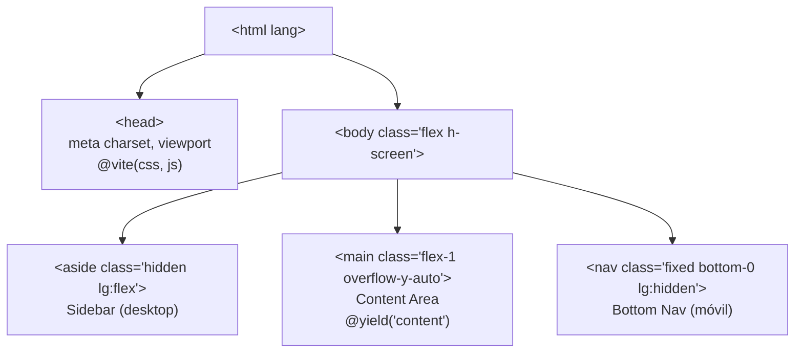
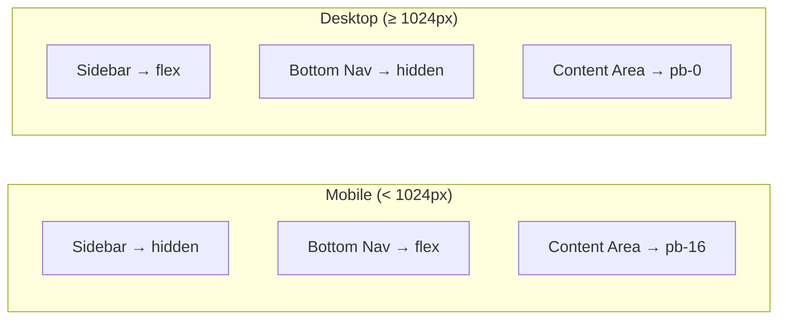

# Design Document

## Overview

El layout responsivo es la plantilla Blade principal (`resources/views/layouts/app.blade.php`) que envuelve todas las vistas de la aplicación. Su responsabilidad es:

1. Cargar los assets compilados (CSS/JS) mediante la directiva `@vite` de Laravel, sin CDN.
2. Renderizar un **Sidebar** de navegación lateral en pantallas de escritorio (≥ 1024 px).
3. Reemplazar ese Sidebar por una **Bottom Nav** fija en la parte inferior en pantallas móviles (< 1024 px).
4. Exponer un **Content Area** que ocupa el espacio restante y donde las vistas hijas inyectan su contenido mediante `@yield('content')`.

La integración de Tailwind CSS v4 ya está operativa en el proyecto: `vite.config.js` registra `@tailwindcss/vite`, y `resources/css/app.css` contiene `@import 'tailwindcss'` con las directivas `@source` necesarias. No se requiere ningún cambio en la configuración de Vite ni en el CSS base.

---

## Architecture

El sistema sigue la arquitectura de plantillas de Laravel (Blade inheritance):

```
resources/views/layouts/app.blade.php   ← plantilla maestra
resources/views/<módulo>/index.blade.php ← vista hija
    @extends('layouts.app')
    @section('content') ... @endsection
```

### Diagrama de estructura del layout



### Diagrama de visibilidad por breakpoint



---

## Components and Interfaces

### 1. `<html>` root

| Atributo | Valor |
|---|---|
| `lang` | `{{ str_replace('_', '-', app()->getLocale()) }}` |

### 2. `<head>`

| Elemento | Propósito |
|---|---|
| `<meta charset="utf-8">` | Codificación de caracteres |
| `<meta name="viewport" content="width=device-width, initial-scale=1">` | Escalado correcto en móvil |
| `<title>` | Nombre de la aplicación via `config('app.name')` |
| `@vite(['resources/css/app.css', 'resources/js/app.js'])` | Carga de assets compilados |

### 3. Sidebar (`<aside>`)

- **Visibilidad**: `hidden lg:flex` — oculto en móvil, visible en desktop.
- **Posición**: columna izquierda del flex container del `<body>`.
- **Ancho**: fijo, p.ej. `w-64` (256 px).
- **Contenido**: elemento `<nav aria-label="Navegación principal">` con los enlaces de navegación.
- **Enlace activo**: detectado con el helper `request()->routeIs()` de Laravel; aplica clases de estilo diferenciadas.

### 4. Content Area (`<main>`)

- **Clases**: `flex-1 overflow-y-auto pb-16 lg:pb-0`
  - `flex-1` — ocupa todo el espacio horizontal restante en desktop.
  - `overflow-y-auto` — scroll vertical independiente.
  - `pb-16 lg:pb-0` — padding inferior en móvil para no quedar oculto bajo el Bottom Nav.
- **Slot Blade**: `@yield('content')`.

### 5. Bottom Nav (`<nav>`)

- **Visibilidad**: `lg:hidden` — oculto en desktop, visible en móvil.
- **Posición**: `fixed bottom-0 left-0 right-0` (ancho completo, fijo al fondo).
- **Atributo ARIA**: `aria-label="Navegación móvil"`.
- **Contenido**: los mismos enlaces que el Sidebar (paridad funcional).
- **Enlace activo**: misma lógica que el Sidebar.

### 6. Enlace de navegación activo

La detección del enlace activo se realiza en Blade con:

```php
request()->routeIs('dashboard') ? 'bg-gray-200 font-semibold' : 'hover:bg-gray-100'
```

Esto aplica a ambos componentes (Sidebar y Bottom Nav) para garantizar consistencia visual.

---

## Data Models

Este feature no introduce modelos de datos nuevos. Los únicos "datos" que maneja el layout son:

| Dato | Origen | Uso |
|---|---|---|
| Locale de la app | `app()->getLocale()` | Atributo `lang` del `<html>` |
| Nombre de la app | `config('app.name')` | `<title>` |
| Ruta activa | `request()->routeIs(...)` | Estilo del enlace activo |
| Contenido de la vista hija | `@yield('content')` | Renderizado en el Content Area |

Los enlaces de navegación son estáticos en el layout (hardcoded en Blade). Si en el futuro se requiere navegación dinámica basada en roles/permisos, se puede extraer a un componente Blade o a un array en el `AppServiceProvider`, pero eso está fuera del alcance de este feature.

---

## Correctness Properties

*A property is a characteristic or behavior that should hold true across all valid executions of a system — essentially, a formal statement about what the system should do. Properties serve as the bridge between human-readable specifications and machine-verifiable correctness guarantees.*

### Property 1: Tailwind se carga exclusivamente via @vite, sin CDN

*Para cualquier* respuesta HTML generada por el layout, el HTML resultante NO debe contener ninguna etiqueta `<link>` o `<script>` apuntando a un CDN externo de Tailwind, y SÍ debe contener la referencia al asset compilado por Vite.

**Validates: Requirements 1.1**

### Property 2: Sidebar oculto y Bottom Nav visible en móvil

*Para cualquier* ancho de ventana menor a 1024 px, el elemento `<aside>` del Sidebar debe tener la clase `hidden` (o equivalente que lo oculte), y el elemento `<nav>` del Bottom Nav debe ser visible.

**Validates: Requirements 2.5, 3.1, 3.5**

### Property 3: Sidebar visible y Bottom Nav oculto en desktop

*Para cualquier* ancho de ventana mayor o igual a 1024 px, el elemento `<aside>` del Sidebar debe ser visible, y el elemento `<nav>` del Bottom Nav debe tener la clase `lg:hidden`.

**Validates: Requirements 2.1, 2.2, 3.1**

### Property 4: Paridad funcional de enlaces entre Sidebar y Bottom Nav

*Para cualquier* conjunto de enlaces de navegación definidos en el layout, el Sidebar y el Bottom Nav deben contener exactamente los mismos destinos (`href`) de navegación.

**Validates: Requirements 3.3**

### Property 5: Content Area expone el slot @yield('content')

*Para cualquier* vista hija que extienda el layout con `@extends('layouts.app')` y defina `@section('content')`, el HTML renderizado debe contener el contenido de esa sección dentro del `<main>`, sin modificar la estructura del layout.

**Validates: Requirements 4.1, 4.4**

### Property 6: Atributos ARIA presentes en ambos navs

*Para cualquier* respuesta HTML generada por el layout, el `<nav>` del Sidebar debe tener `aria-label="Navegación principal"` y el `<nav>` del Bottom Nav debe tener `aria-label="Navegación móvil"`.

**Validates: Requirements 5.1, 5.2**

### Property 7: Enlace activo diferenciado en ambos navs

*Para cualquier* ruta activa, el enlace correspondiente en el Sidebar y en el Bottom Nav debe tener aplicadas clases de estilo diferenciadas respecto a los enlaces inactivos.

**Validates: Requirements 5.5**

---

## Error Handling

| Escenario | Comportamiento esperado |
|---|---|
| Assets de Vite no compilados (sin `public/build/manifest.json`) | Laravel lanza una excepción en desarrollo; en producción se debe ejecutar `npm run build` antes del despliegue. No se provee fallback de CDN. |
| Vista hija no define `@section('content')` | Blade renderiza el layout con el Content Area vacío; no produce error. |
| Ruta activa no coincide con ningún enlace | Ningún enlace recibe el estilo activo; comportamiento silencioso y correcto. |
| Locale no configurado | `app()->getLocale()` devuelve `'en'` por defecto; el atributo `lang` siempre estará presente. |

---

## Testing Strategy

Este feature es principalmente de **renderizado de plantillas Blade** y **configuración de assets**. La mayor parte de la lógica es declarativa (clases CSS de Tailwind, directivas Blade), por lo que la estrategia de testing se centra en tests de ejemplo y de integración.

### Tests de ejemplo (PHPUnit / Feature Tests)

Se recomienda crear `tests/Feature/LayoutTest.php` con los siguientes casos:

1. **El layout renderiza sin errores**: una vista que extiende `layouts.app` devuelve HTTP 200.
2. **El slot `@yield('content')` inyecta el contenido correcto**: el HTML de respuesta contiene el texto de la sección `content`.
3. **El atributo `lang` está presente**: el HTML contiene `<html lang="`.
4. **El meta viewport está presente**: el HTML contiene `name="viewport"`.
5. **Los atributos ARIA están presentes**: el HTML contiene `aria-label="Navegación principal"` y `aria-label="Navegación móvil"`.
6. **No hay referencias a CDN de Tailwind**: el HTML no contiene `cdn.tailwindcss.com` ni `unpkg.com/tailwindcss`.
7. **El enlace activo tiene clases diferenciadas**: para una ruta dada, el enlace activo contiene las clases de estilo activo.

### Tests de integración (build)

- Ejecutar `npm run build` y verificar que `public/build/manifest.json` existe y referencia `resources/css/app.css`.
- Verificar que el CSS compilado no contiene referencias a CDN.

### Por qué no se aplica Property-Based Testing (PBT)

Este feature consiste en:
- **Renderizado de plantillas Blade**: la lógica es declarativa, no una función pura con espacio de entrada amplio.
- **Configuración de Vite/Tailwind**: es una verificación de setup (smoke test), no una propiedad universal sobre inputs variables.
- **Clases CSS responsivas**: la visibilidad del Sidebar/Bottom Nav depende de media queries del navegador, no de lógica de código testeable con PBT.

Los tests de ejemplo con PHPUnit cubren de forma completa y eficiente todos los criterios de aceptación. PBT no aportaría valor adicional en este contexto.
