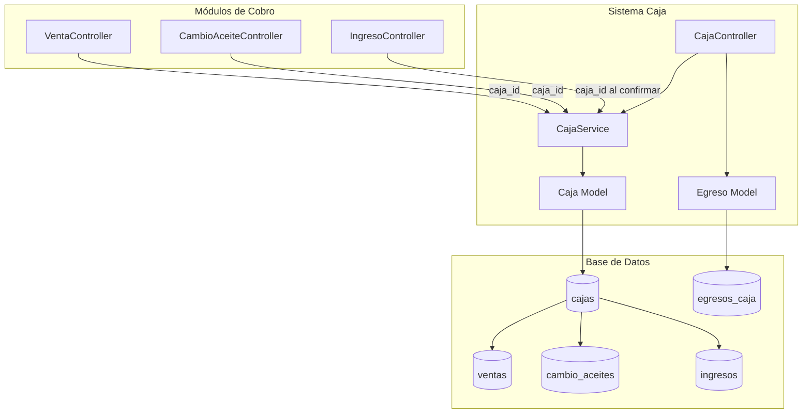
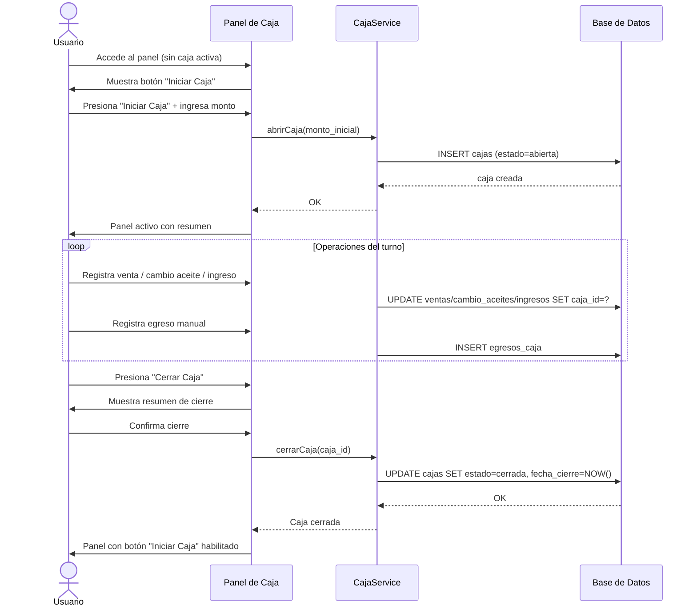
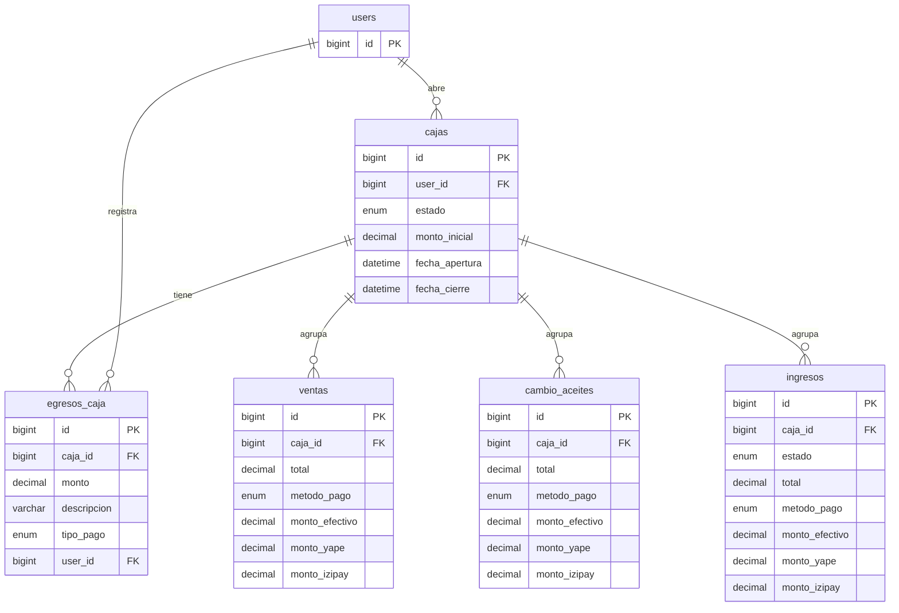

# Diseño Técnico — Sistema de Caja

## Visión General

El Sistema de Caja es un módulo nuevo que se integra a la aplicación Laravel existente. Su función es gestionar el flujo de efectivo diario mediante sesiones de caja (apertura → operación → cierre), consolidando automáticamente los ingresos generados por los tres módulos de cobro existentes: Ventas, Cambio de Aceite e Ingresos Vehiculares.

El diseño sigue los patrones ya establecidos en el proyecto: controladores de recursos Laravel, Blade + Tailwind CSS para las vistas, transacciones de base de datos para operaciones críticas, y validación en el servidor.

---

## Arquitectura

El módulo se construye como una capa transversal sobre los tres módulos de cobro existentes. No modifica la lógica interna de esos módulos más allá de añadir una FK `caja_id` a sus tablas y un middleware/guard de validación en sus controladores.



### Flujo de una sesión de caja



---

## Componentes e Interfaces

### CajaController

Controlador principal del módulo. Gestiona el panel, apertura, cierre e historial.

| Método | Ruta | Descripción |
|--------|------|-------------|
| `index()` | `GET /caja` | Panel de caja activa (o estado sin caja) |
| `abrir()` | `POST /caja/abrir` | Apertura de caja con monto inicial |
| `cerrar()` | `POST /caja/cerrar` | Cierre de la caja activa |
| `registrarEgreso()` | `POST /caja/egresos` | Registro de egreso manual |
| `historial()` | `GET /caja/historial` | Lista de cajas cerradas (solo Administrador) |
| `detalle()` | `GET /caja/{caja}` | Detalle de una caja cerrada (solo Administrador) |

### EgresoCajaController

Controlador auxiliar para egresos. Alternativamente, los egresos pueden manejarse directamente en `CajaController::registrarEgreso()` sin un controlador separado, dado que los egresos no tienen operaciones CRUD completas.

### CajaService

Clase de servicio que encapsula la lógica de negocio crítica, separándola del controlador para facilitar las pruebas unitarias.

```php
class CajaService
{
    public function getCajaActiva(): ?Caja;
    public function abrirCaja(float $montoInicial, int $userId): Caja;
    public function cerrarCaja(Caja $caja): Caja;
    public function registrarEgreso(Caja $caja, array $data): EgresoCaja;
    public function asociarTransaccion(string $tipo, int $transaccionId, Caja $caja): void;
    public function calcularResumen(Caja $caja): array;
}
```

### Middleware / Guard de Caja Activa

Un método helper en `CajaService` (o un middleware dedicado) que verifica si existe una caja activa antes de permitir el guardado en los módulos de cobro. Se invoca desde los métodos `store()` y `procesarConfirmacion()` de los controladores existentes.

```php
// En VentaController::store(), CambioAceiteController::store(), IngresoController::procesarConfirmacion()
$caja = $this->cajaService->getCajaActiva();
if (!$caja) {
    return back()->with('error_caja', true); // Activa el modal en la vista
}
```

---

## Modelos de Datos

### Nueva tabla: `cajas`

```sql
CREATE TABLE cajas (
    id              BIGINT UNSIGNED AUTO_INCREMENT PRIMARY KEY,
    user_id         BIGINT UNSIGNED NOT NULL,
    estado          ENUM('abierta', 'cerrada') NOT NULL DEFAULT 'abierta',
    monto_inicial   DECIMAL(10,2) NOT NULL,
    fecha_apertura  DATETIME NOT NULL,
    fecha_cierre    DATETIME NULL,
    created_at      TIMESTAMP NULL,
    updated_at      TIMESTAMP NULL,

    FOREIGN KEY (user_id) REFERENCES users(id) ON DELETE RESTRICT,
    INDEX idx_estado (estado)
);
```

**Restricción de unicidad:** Se garantiza que solo exista una caja con `estado = 'abierta'` mediante una validación en `CajaService::abrirCaja()` (consulta antes de insertar, dentro de una transacción con lock). No se usa un índice único parcial porque SQLite (usado en desarrollo) no lo soporta de forma nativa.

### Nueva tabla: `egresos_caja`

```sql
CREATE TABLE egresos_caja (
    id          BIGINT UNSIGNED AUTO_INCREMENT PRIMARY KEY,
    caja_id     BIGINT UNSIGNED NOT NULL,
    monto       DECIMAL(10,2) NOT NULL,
    descripcion VARCHAR(500) NOT NULL,
    tipo_pago   ENUM('efectivo', 'yape') NOT NULL,
    user_id     BIGINT UNSIGNED NOT NULL,
    created_at  TIMESTAMP NULL,
    updated_at  TIMESTAMP NULL,

    FOREIGN KEY (caja_id) REFERENCES cajas(id) ON DELETE RESTRICT,
    FOREIGN KEY (user_id) REFERENCES users(id) ON DELETE RESTRICT
);
```

### Modificaciones a tablas existentes

Se añade la columna `caja_id` (nullable, FK a `cajas`) a las tres tablas de cobro:

```sql
ALTER TABLE ventas         ADD COLUMN caja_id BIGINT UNSIGNED NULL REFERENCES cajas(id) ON DELETE SET NULL;
ALTER TABLE cambio_aceites ADD COLUMN caja_id BIGINT UNSIGNED NULL REFERENCES cajas(id) ON DELETE SET NULL;
ALTER TABLE ingresos       ADD COLUMN caja_id BIGINT UNSIGNED NULL REFERENCES cajas(id) ON DELETE SET NULL;
```

La columna es nullable para preservar los registros históricos existentes que no tienen caja asociada.

### Modelo Caja

```php
class Caja extends Model
{
    protected $fillable = [
        'user_id', 'estado', 'monto_inicial', 'fecha_apertura', 'fecha_cierre',
    ];

    protected $casts = [
        'monto_inicial' => 'decimal:2',
        'fecha_apertura' => 'datetime',
        'fecha_cierre'   => 'datetime',
    ];

    public function user(): BelongsTo { ... }
    public function egresos(): HasMany { ... }

    // Ingresos desde los tres módulos
    public function ventas(): HasMany { ... }
    public function cambioAceites(): HasMany { ... }
    public function ingresos(): HasMany { ... }  // Ingresos Vehiculares confirmados

    // Scopes
    public function scopeAbierta($query) { return $query->where('estado', 'abierta'); }
    public function scopeCerrada($query) { return $query->where('estado', 'cerrada'); }
}
```

### Modelo EgresoCaja

```php
class EgresoCaja extends Model
{
    protected $table = 'egresos_caja';

    protected $fillable = [
        'caja_id', 'monto', 'descripcion', 'tipo_pago', 'user_id',
    ];

    protected $casts = [
        'monto' => 'decimal:2',
    ];

    public function caja(): BelongsTo { ... }
    public function user(): BelongsTo { ... }
}
```

### Diagrama de relaciones



---

## Lógica de Cálculo de Resumen

El resumen de la caja se calcula en `CajaService::calcularResumen()`:

```
total_ingresos = SUM(ventas.total WHERE caja_id = ?)
               + SUM(cambio_aceites.total WHERE caja_id = ?)
               + SUM(ingresos.total WHERE caja_id = ? AND estado = 'confirmado')

total_egresos  = SUM(egresos_caja.monto WHERE caja_id = ?)

balance_final  = monto_inicial + total_ingresos - total_egresos
```

### Distribución por modo de pago

Para cada transacción, los montos se distribuyen así:

- `metodo_pago = 'efectivo'` → `monto_efectivo_atribuido = total`
- `metodo_pago = 'yape'`     → `monto_yape_atribuido = total`
- `metodo_pago = 'izipay'`   → `monto_izipay_atribuido = total`
- `metodo_pago = 'mixto'`    → se usan los campos `monto_efectivo`, `monto_yape`, `monto_izipay` directamente

---

## Vistas Blade

| Vista | Ruta | Descripción |
|-------|------|-------------|
| `caja/panel.blade.php` | `/caja` | Panel principal con resumen y listados |
| `caja/historial.blade.php` | `/caja/historial` | Lista de cajas cerradas |
| `caja/detalle.blade.php` | `/caja/{caja}` | Detalle de una caja cerrada |

Los modales (apertura, egreso, cierre) se implementan como componentes inline en `panel.blade.php`, controlados con Alpine.js o JavaScript vanilla (consistente con el resto del proyecto que usa JS vanilla).

### Enlace en el Sidebar

Se añade un enlace directo "Caja" en `layouts/app.blade.php`, visible para todos los usuarios autenticados, entre el enlace de Dashboard y el grupo "Gestión de Ventas":

```php
@php
    $cajaActive = request()->routeIs('caja.*');
@endphp

<a href="{{ route('caja.index') }}"
   class="flex items-center gap-3 px-3 py-2 rounded-lg text-sm font-medium transition-colors
          {{ $cajaActive ? 'bg-gray-100 text-gray-900 font-semibold' : 'text-gray-600 hover:bg-gray-100 hover:text-gray-900' }}">
    {{-- Ícono de caja registradora --}}
    <svg class="w-5 h-5" ...></svg>
    Caja
</a>
```

---

## Rutas

```php
Route::middleware('auth')->prefix('caja')->name('caja.')->group(function () {
    Route::get('/',          [CajaController::class, 'index'])->name('index');
    Route::post('/abrir',    [CajaController::class, 'abrir'])->name('abrir');
    Route::post('/cerrar',   [CajaController::class, 'cerrar'])->name('cerrar');
    Route::post('/egresos',  [CajaController::class, 'registrarEgreso'])->name('egresos.store');

    // Solo Administrador
    Route::middleware('role:Administrador')->group(function () {
        Route::get('/historial',  [CajaController::class, 'historial'])->name('historial');
        Route::get('/{caja}',     [CajaController::class, 'detalle'])->name('detalle');
    });
});
```

---

## Propiedades de Corrección

*Una propiedad es una característica o comportamiento que debe mantenerse verdadero en todas las ejecuciones válidas del sistema — esencialmente, una declaración formal sobre lo que el sistema debe hacer. Las propiedades sirven como puente entre las especificaciones legibles por humanos y las garantías de corrección verificables por máquinas.*

### Propiedad 1: Validación del monto inicial

*Para cualquier* valor de `monto_inicial` enviado al endpoint de apertura de caja, si el valor es menor o igual a cero, la apertura debe ser rechazada y no debe crearse ningún registro en la tabla `cajas`; si el valor es mayor a cero, la apertura debe ser aceptada.

**Valida: Requisito 2.3**

---

### Propiedad 2: Unicidad de caja abierta

*Para cualquier* secuencia de intentos de apertura de caja, el número de registros en la tabla `cajas` con `estado = 'abierta'` nunca debe superar 1.

**Valida: Requisito 2.6**

---

### Propiedad 3: Cálculo correcto del total de ingresos

*Para cualquier* conjunto de transacciones (ventas, cambios de aceite, ingresos vehiculares confirmados) asociadas a una caja activa, el `total_ingresos` calculado por el sistema debe ser igual a la suma aritmética de los campos `total` de todas esas transacciones.

**Valida: Requisitos 3.2, 8.2**

---

### Propiedad 4: Cálculo correcto del total de egresos

*Para cualquier* conjunto de egresos manuales asociados a una caja activa, el `total_egresos` calculado por el sistema debe ser igual a la suma aritmética de los campos `monto` de todos esos egresos.

**Valida: Requisito 3.3**

---

### Propiedad 5: Fórmula del balance neto

*Para cualquier* caja con cualquier combinación de `monto_inicial`, transacciones de ingreso y egresos manuales, el `balance_final` mostrado debe ser igual a `monto_inicial + total_ingresos − total_egresos`.

**Valida: Requisito 3.4**

---

### Propiedad 6: Distribución correcta de montos por modo de pago

*Para cualquier* transacción con `metodo_pago` en `{efectivo, yape, izipay}`, el monto atribuido a ese modo de pago en el resumen de caja debe ser igual al campo `total` de la transacción. *Para cualquier* transacción con `metodo_pago = 'mixto'`, la suma de `monto_efectivo + monto_yape + monto_izipay` debe ser igual al `total` de la transacción, y cada parcial debe atribuirse a su modo de pago correspondiente.

**Valida: Requisitos 4.3, 4.4, 4.5**

---

### Propiedad 7: Validación de egresos manuales

*Para cualquier* intento de registrar un egreso, si el `monto` es menor o igual a cero, o la `descripcion` está vacía o compuesta solo de espacios en blanco, o el `tipo_pago` no es `efectivo` ni `yape`, el egreso debe ser rechazado y el `total_egresos` de la caja no debe cambiar.

**Valida: Requisitos 5.3, 5.4, 5.5**

---

### Propiedad 8: Actualización del total de egresos al registrar un egreso

*Para cualquier* egreso válido registrado en una caja activa, el `total_egresos` de esa caja debe incrementarse en exactamente el `monto` del egreso registrado.

**Valida: Requisito 5.6**

---

### Propiedad 9: Bloqueo de transacciones sin caja activa

*Para cualquier* intento de guardar un registro en Ventas, Cambio de Aceite o Ingresos Vehiculares cuando no existe una caja con `estado = 'abierta'`, el sistema debe rechazar la operación y el conteo de registros en la tabla correspondiente no debe aumentar.

**Valida: Requisitos 6.1, 6.3**

---

### Propiedad 10: Asociación automática de transacciones a la caja activa

*Para cualquier* transacción guardada exitosamente en Ventas o Cambio de Aceite cuando existe una caja activa, el campo `caja_id` de ese registro debe ser igual al `id` de la caja activa. *Para cualquier* Ingreso Vehicular que pasa de `pendiente` a `confirmado` cuando existe una caja activa, el campo `caja_id` debe ser igual al `id` de la caja activa en el momento de la confirmación.

**Valida: Requisitos 8.1, 8.3**

---

### Propiedad 11: Estado correcto tras el cierre de caja

*Para cualquier* caja con `estado = 'abierta'`, después de ejecutar el cierre, el registro en la base de datos debe tener `estado = 'cerrada'` y `fecha_cierre` con un valor no nulo.

**Valida: Requisito 7.4**

---

### Propiedad 12: Bloqueo de operaciones en caja cerrada

*Para cualquier* intento de registrar un egreso o asociar una transacción a una caja con `estado = 'cerrada'`, el sistema debe rechazar la operación.

**Valida: Requisito 7.6**

---

### Propiedad 13: Persistencia y ordenamiento del historial

*Para cualquier* conjunto de cajas cerradas con distintas `fecha_cierre`, la lista devuelta por el historial debe contener todas esas cajas y estar ordenada de forma descendente por `fecha_cierre`.

**Valida: Requisitos 9.1, 9.2**

---

### Propiedad 14: Completitud del resumen de caja cerrada

*Para cualquier* caja cerrada, el detalle mostrado debe incluir: `fecha_apertura`, `fecha_cierre`, `monto_inicial`, `total_ingresos`, `total_egresos` y `balance_final`, todos con valores correctos.

**Valida: Requisitos 7.3, 9.3**

---

## Manejo de Errores

| Escenario | Comportamiento |
|-----------|---------------|
| Intento de apertura con caja ya abierta | `back()->with('error', ...)` — no se crea registro |
| Monto inicial ≤ 0 | Validación Laravel, error de formulario |
| Intento de cobro sin caja activa | `back()->with('error_caja', true)` — activa modal en la vista |
| Egreso con datos inválidos | Validación Laravel, error de formulario |
| Cierre de caja ya cerrada | Redirección con mensaje informativo |
| Error de base de datos en apertura/cierre | `DB::transaction` con rollback automático, mensaje de error genérico |
| Acceso al historial sin rol Administrador | Middleware `role:Administrador` devuelve 403 |

### Concurrencia

La restricción de una sola caja abierta se implementa con un lock pesimista dentro de la transacción de apertura:

```php
DB::transaction(function () use ($montoInicial, $userId) {
    // Lock para evitar race conditions en aperturas simultáneas
    $cajaExistente = Caja::where('estado', 'abierta')->lockForUpdate()->first();
    if ($cajaExistente) {
        throw new \RuntimeException('Ya existe una caja abierta.');
    }
    return Caja::create([...]);
});
```

---

## Estrategia de Pruebas

### Pruebas unitarias (PHPUnit)

Se utilizan pruebas de ejemplo para verificar comportamientos específicos:

- Panel muestra el estado correcto según si hay caja abierta o no
- Botones habilitados/deshabilitados según el estado de la caja
- Enlace "Caja" presente en el sidebar para usuarios autenticados
- Modal de apertura, egreso y cierre se renderizan correctamente
- Redirección al panel de caja desde el modal de "caja requerida"
- Acceso al historial denegado para usuarios sin rol Administrador

### Pruebas de propiedades (PBT con Pest + `edalzell/pest-plugin-arch` o similar)

Se utiliza [**Pest PHP**](https://pestphp.com/) como framework de pruebas (ya es el estándar moderno en el ecosistema Laravel). Para las pruebas de propiedades se usa [**Infection PHP**](https://infection.github.io/) o se implementan generadores manuales con `fake()` de Faker dentro de bucles de 100+ iteraciones, dado que el ecosistema PHP no tiene una librería PBT tan madura como QuickCheck.

Cada propiedad se implementa como un test Pest que ejecuta mínimo 100 iteraciones con datos generados aleatoriamente:

```php
// Ejemplo: Propiedad 3 — Cálculo correcto del total de ingresos
it('calcula correctamente el total de ingresos para cualquier conjunto de transacciones', function () {
    // Feature: sistema-caja, Property 3: total_ingresos equals sum of transaction totals
    $caja = Caja::factory()->abierta()->create();

    repeat(100, function () use ($caja) {
        $numVentas = rand(0, 5);
        $numCambios = rand(0, 5);
        $numIngresos = rand(0, 5);

        $ventas = Venta::factory($numVentas)->create(['caja_id' => $caja->id]);
        $cambios = CambioAceite::factory($numCambios)->create(['caja_id' => $caja->id]);
        $ingresos = Ingreso::factory($numIngresos)->confirmado()->create(['caja_id' => $caja->id]);

        $esperado = $ventas->sum('total') + $cambios->sum('total') + $ingresos->sum('total');
        $calculado = app(CajaService::class)->calcularResumen($caja)['total_ingresos'];

        expect($calculado)->toEqual($esperado);
    });
});
```

**Configuración mínima:** 100 iteraciones por prueba de propiedad.

**Etiqueta de referencia:** Cada test incluye un comentario con el formato:
`// Feature: sistema-caja, Property {N}: {texto de la propiedad}`

### Pruebas de integración HTTP

Se usan pruebas de feature de Laravel para verificar los endpoints completos:

- `POST /caja/abrir` con monto válido → 302 redirect, caja creada en DB
- `POST /caja/abrir` con caja ya abierta → error, sin nuevo registro
- `POST /caja/egresos` con datos válidos → egreso guardado
- `POST /ventas` sin caja activa → error, venta no guardada
- `POST /ventas` con caja activa → venta guardada con `caja_id` correcto
- `GET /caja/historial` como Administrador → 200
- `GET /caja/historial` como usuario sin rol → 403
