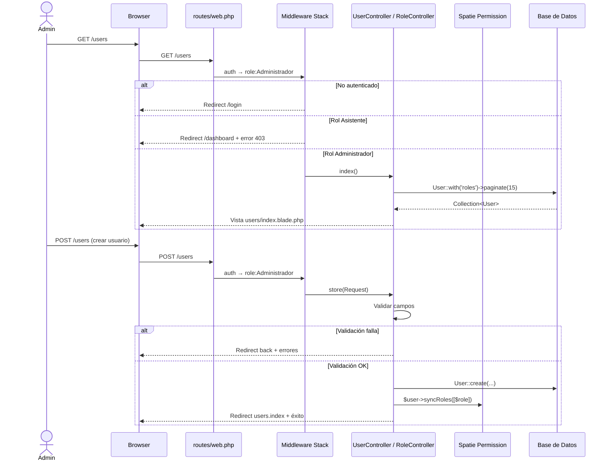
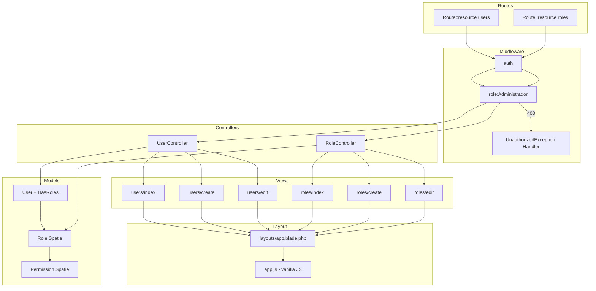
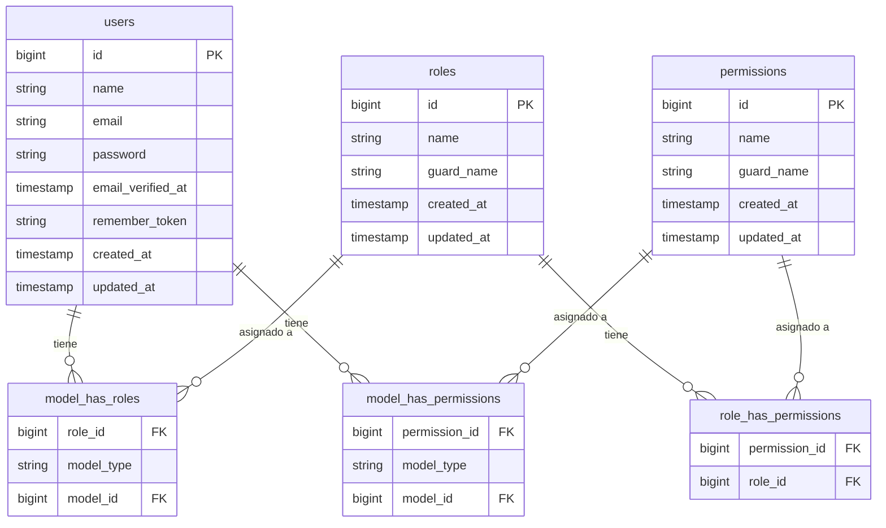

# Diseño Técnico: Gestión de Usuarios

## Visión General

Este documento describe el diseño técnico del módulo de Gestión de Usuarios para el sistema de gestión de taller construido sobre Laravel 12. El módulo permite a los administradores realizar operaciones CRUD completas sobre usuarios y roles, integrándose con Spatie Laravel Permission v6 (ya instalado y migrado).

El acceso al módulo está restringido exclusivamente al rol `Administrador` mediante los middlewares `auth` y `role:Administrador` de Spatie. La navegación hacia el módulo se expone en el sidebar existente (desktop) mediante un dropdown hacia abajo, y en el bottom nav (móvil) mediante un dropup hacia arriba, ambos implementados con JavaScript vanilla sin dependencias externas.

El módulo añade dos controladores resource (`UserController`, `RoleController`), ocho vistas Blade nuevas, y modifica tres archivos existentes: `routes/web.php`, `resources/views/layouts/app.blade.php`, `resources/js/app.js`, y `bootstrap/app.php`.

---

## Arquitectura

El módulo sigue el patrón MVC estándar de Laravel con controladores resource. El flujo de una solicitud típica es:



### Diagrama de componentes



### Decisiones de diseño

- **Controladores resource estándar**: Se usan `Route::resource` para aprovechar las convenciones de Laravel (7 métodos, nombres de ruta automáticos `users.*`, `roles.*`). No se implementan rutas adicionales fuera del resource.
- **JavaScript vanilla para dropdown/dropup**: El requisito prohíbe jQuery y CDN externos. Alpine.js no está instalado. Se implementa con JS vanilla en `app.js` usando `data-*` attributes para identificar los toggles, evitando IDs hardcodeados.
- **`syncRoles()` en lugar de `assignRole()`**: `syncRoles()` garantiza que el usuario tenga exactamente el rol seleccionado, eliminando roles previos. Esto simplifica la lógica de edición.
- **Handler de `UnauthorizedException` en `bootstrap/app.php`**: Laravel 12 centraliza la configuración de excepciones en `bootstrap/app.php`. Se registra un handler para `Spatie\Permission\Exceptions\UnauthorizedException` que redirige al dashboard con un mensaje flash de error.
- **Contraseña opcional en edición**: Si el campo `password` llega vacío en `update()`, se omite de los datos a actualizar. Se usa `nullable` + `sometimes` en las reglas de validación.
- **Paginación con `paginate(15)`**: Consistente con el requisito 4.3. La vista usa `$users->links()` para renderizar los controles de paginación de Tailwind (configurado en `AppServiceProvider`).
- **Estado activo del dropdown persistente**: Se detecta con `request()->routeIs('users.*', 'roles.*')` en Blade. Si la condición es verdadera, el dropdown se renderiza abierto desde el servidor (sin esperar al JS), garantizando que el estado activo sea visible incluso sin JS.

---

## Componentes e Interfaces

### 1. `UserController`

**Ubicación:** `app/Http/Controllers/UserController.php`

Controlador resource con los 6 métodos utilizados (se omite `show` por no estar en los requisitos):

```php
class UserController extends Controller
{
    public function index(): View                              // GET  /users
    public function create(): View                            // GET  /users/create
    public function store(Request $request): RedirectResponse // POST /users
    public function edit(User $user): View                    // GET  /users/{user}/edit
    public function update(Request $request, User $user): RedirectResponse // PUT /users/{user}
    public function destroy(User $user): RedirectResponse     // DELETE /users/{user}
}
```

**Reglas de validación — `store()`:**

| Campo                  | Reglas                                                        |
|------------------------|---------------------------------------------------------------|
| `name`                 | `required`, `string`, `max:255`                               |
| `email`                | `required`, `string`, `email`, `max:255`, `unique:users`      |
| `password`             | `required`, `string`, `min:8`, `confirmed`                    |
| `password_confirmation`| (implícito por `confirmed`)                                   |
| `role`                 | `required`, `string`, `exists:roles,name`                     |

**Reglas de validación — `update()`:**

| Campo                  | Reglas                                                                          |
|------------------------|---------------------------------------------------------------------------------|
| `name`                 | `required`, `string`, `max:255`                                                 |
| `email`                | `required`, `string`, `email`, `max:255`, `unique:users,email,{$user->id}`      |
| `password`             | `nullable`, `sometimes`, `string`, `min:8`, `confirmed`                         |
| `password_confirmation`| (implícito por `confirmed`)                                                     |
| `role`                 | `required`, `string`, `exists:roles,name`                                       |

**Lógica de `destroy()`:**
```php
if ($user->id === auth()->id()) {
    return redirect()->route('users.index')
        ->with('error', 'No puedes eliminar tu propio usuario.');
}
$user->delete();
return redirect()->route('users.index')->with('success', 'Usuario eliminado correctamente.');
```

---

### 2. `RoleController`

**Ubicación:** `app/Http/Controllers/RoleController.php`

```php
class RoleController extends Controller
{
    public function index(): View                              // GET  /roles
    public function create(): View                            // GET  /roles/create
    public function store(Request $request): RedirectResponse // POST /roles
    public function edit(Role $role): View                    // GET  /roles/{role}/edit
    public function update(Request $request, Role $role): RedirectResponse // PUT /roles/{role}
    public function destroy(Role $role): RedirectResponse     // DELETE /roles/{role}
}
```

**Reglas de validación — `store()`:**

| Campo         | Reglas                                                  |
|---------------|---------------------------------------------------------|
| `name`        | `required`, `string`, `max:255`, `unique:roles,name`    |
| `permissions` | `nullable`, `array`                                     |
| `permissions.*`| `string`, `exists:permissions,name`                   |

**Reglas de validación — `update()`:**

| Campo         | Reglas                                                                        |
|---------------|-------------------------------------------------------------------------------|
| `name`        | `required`, `string`, `max:255`, `unique:roles,name,{$role->id}`              |
| `permissions` | `nullable`, `array`                                                           |
| `permissions.*`| `string`, `exists:permissions,name`                                          |

**Lógica de `destroy()`:**
```php
if ($role->users()->count() > 0) {
    return redirect()->route('roles.index')
        ->with('error', 'No se puede eliminar el rol porque tiene usuarios asignados.');
}
$role->delete();
return redirect()->route('roles.index')->with('success', 'Rol eliminado correctamente.');
```

---

### 3. Modificación de `routes/web.php`

Se añade el grupo de rutas resource protegido:

```php
use App\Http\Controllers\UserController;
use App\Http\Controllers\RoleController;

Route::middleware(['auth', 'role:Administrador'])->group(function () {
    Route::resource('users', UserController::class)->except(['show']);
    Route::resource('roles', RoleController::class)->except(['show']);
});
```

Rutas generadas:

| Método HTTP | URI                  | Nombre de ruta   | Acción del controlador |
|-------------|----------------------|------------------|------------------------|
| GET         | `/users`             | `users.index`    | `index`                |
| GET         | `/users/create`      | `users.create`   | `create`               |
| POST        | `/users`             | `users.store`    | `store`                |
| GET         | `/users/{user}/edit` | `users.edit`     | `edit`                 |
| PUT/PATCH   | `/users/{user}`      | `users.update`   | `update`               |
| DELETE      | `/users/{user}`      | `users.destroy`  | `destroy`              |
| GET         | `/roles`             | `roles.index`    | `index`                |
| GET         | `/roles/create`      | `roles.create`   | `create`               |
| POST        | `/roles`             | `roles.store`    | `store`                |
| GET         | `/roles/{role}/edit` | `roles.edit`     | `edit`                 |
| PUT/PATCH   | `/roles/{role}`      | `roles.update`   | `update`               |
| DELETE      | `/roles/{role}`      | `roles.destroy`  | `destroy`              |

---

### 4. Modificación de `bootstrap/app.php`

Se registra el handler para `UnauthorizedException` de Spatie:

```php
use Spatie\Permission\Exceptions\UnauthorizedException;

->withExceptions(function (Exceptions $exceptions): void {
    $exceptions->render(function (UnauthorizedException $e, $request) {
        return redirect()->route('dashboard')
            ->with('error', 'No tienes permisos para acceder a esta sección.');
    });
})
```

---

### 5. Modificación de `resources/views/layouts/app.blade.php`

Se añade el botón "Gestión de usuarios" con dropdown (sidebar desktop) y dropup (bottom nav móvil), visible solo para usuarios con rol `Administrador`.

**Lógica de estado activo (Blade):**
```php
@php
    $userManagementActive = request()->routeIs('users.*', 'roles.*');
@endphp
```

**Estructura del dropdown en sidebar:**
```html
@can('role:Administrador')  {{-- o @if(auth()->user()?->hasRole('Administrador')) --}}
<div data-dropdown="user-management">
    <button data-dropdown-toggle="user-management" ...>
        <!-- ícono usuarios -->
        Gestión de usuarios
        <!-- chevron SVG con clase rotate-180 si activo -->
    </button>
    <div data-dropdown-menu="user-management"
         class="{{ $userManagementActive ? '' : 'hidden' }}">
        <a href="{{ route('users.index') }}">Usuarios</a>
        <a href="{{ route('roles.index') }}">Roles</a>
    </div>
</div>
@endif
```

**Estructura del dropup en bottom nav:**
```html
@if(auth()->user()?->hasRole('Administrador'))
<div data-dropdown="user-management-mobile" class="relative">
    <button data-dropdown-toggle="user-management-mobile" ...>
        <!-- ícono usuarios -->
        Gestión de usuarios
        <!-- chevron SVG -->
    </button>
    <div data-dropdown-menu="user-management-mobile"
         class="absolute bottom-16 left-1/2 -translate-x-1/2 bg-white border border-gray-200 rounded-lg shadow-lg
                {{ $userManagementActive ? '' : 'hidden' }}">
        <a href="{{ route('users.index') }}">Usuarios</a>
        <a href="{{ route('roles.index') }}">Roles</a>
    </div>
</div>
@endif
```

---

### 6. Modificación de `resources/js/app.js`

Se implementa el toggle de dropdown/dropup con JavaScript vanilla:

```javascript
import './bootstrap';

// Toggle para dropdowns y dropups de navegación
document.addEventListener('DOMContentLoaded', () => {
    document.querySelectorAll('[data-dropdown-toggle]').forEach(button => {
        button.addEventListener('click', () => {
            const key = button.dataset.dropdownToggle;
            const menu = document.querySelector(`[data-dropdown-menu="${key}"]`);
            const chevron = button.querySelector('[data-chevron]');

            if (!menu) return;

            const isOpen = !menu.classList.contains('hidden');
            menu.classList.toggle('hidden', isOpen);
            chevron?.classList.toggle('rotate-180', !isOpen);
        });
    });

    // Cerrar dropdowns al hacer clic fuera
    document.addEventListener('click', (e) => {
        document.querySelectorAll('[data-dropdown]').forEach(container => {
            if (!container.contains(e.target)) {
                const key = container.dataset.dropdown;
                const menu = document.querySelector(`[data-dropdown-menu="${key}"]`);
                const chevron = container.querySelector('[data-chevron]');
                // Solo cerrar si no está en estado activo (ruta activa)
                if (menu && !menu.dataset.persistent) {
                    menu.classList.add('hidden');
                    chevron?.classList.remove('rotate-180');
                }
            }
        });
    });
});
```

**Nota sobre estado activo persistente**: Cuando `$userManagementActive` es `true`, el menú se renderiza sin la clase `hidden` desde el servidor. El JS no lo cierra al hacer clic fuera porque el atributo `data-persistent` estará presente en el menú cuando la ruta es activa.

---

### 7. Vistas Blade

| Vista | Ruta | Descripción |
|-------|------|-------------|
| `users/index` | `resources/views/users/index.blade.php` | Tabla paginada de usuarios |
| `users/create` | `resources/views/users/create.blade.php` | Formulario de creación de usuario |
| `users/edit` | `resources/views/users/edit.blade.php` | Formulario de edición de usuario |
| `roles/index` | `resources/views/roles/index.blade.php` | Tabla de roles con permisos |
| `roles/create` | `resources/views/roles/create.blade.php` | Formulario de creación de rol |
| `roles/edit` | `resources/views/roles/edit.blade.php` | Formulario de edición de rol |

Todas las vistas extienden `layouts.app` con `@extends('layouts.app')` y definen su contenido en `@section('content')`.

**Estructura común de vistas de formulario:**
- Mensajes flash de éxito/error al inicio del contenido
- Errores de validación junto a cada campo (`@error('campo')`)
- Token CSRF con `@csrf`
- Directiva `@method('PUT')` o `@method('DELETE')` donde corresponda
- Atributos `aria-label` en botones de acción
- Botón de confirmación para eliminación: `onclick="return confirm('¿Estás seguro?')"`

---

## Modelos de Datos

### Tablas existentes utilizadas

El módulo no crea nuevas tablas. Utiliza las tablas ya migradas:



### Modelo `User` (sin cambios)

El modelo ya tiene el trait `HasRoles` de Spatie. Los métodos relevantes que se usan en el módulo:

| Método Spatie | Uso en el módulo |
|---------------|------------------|
| `$user->syncRoles([$roleName])` | Asignar/actualizar rol en `store()` y `update()` |
| `$user->getRoleNames()` | Mostrar rol en la vista `users/index` |
| `$user->hasRole('Administrador')` | Verificar rol en el layout para mostrar/ocultar navegación |

### Modelo `Role` (Spatie)

Se usa directamente `Spatie\Permission\Models\Role`. Los métodos relevantes:

| Método Spatie | Uso en el módulo |
|---------------|------------------|
| `Role::with('permissions')->get()` | Listado de roles con permisos en `roles.index` |
| `Role::create(['name' => ..., 'guard_name' => 'web'])` | Creación de rol en `store()` |
| `$role->syncPermissions($permissions)` | Asignar/actualizar permisos en `store()` y `update()` |
| `$role->users()->count()` | Verificar usuarios asignados antes de eliminar |

### Datos de roles existentes (AuthSeeder)

| Rol | guard_name | Acceso al módulo |
|-----|------------|------------------|
| `Administrador` | `web` | Completo |
| `Asistente` | `web` | Denegado (redirige al dashboard) |

---

## Propiedades de Corrección

*Una propiedad es una característica o comportamiento que debe mantenerse verdadero en todas las ejecuciones válidas de un sistema — esencialmente, una declaración formal sobre lo que el sistema debe hacer. Las propiedades sirven como puente entre las especificaciones legibles por humanos y las garantías de corrección verificables por máquina.*

**Reflexión sobre redundancia antes de escribir las propiedades:**

Del prework se identifican los siguientes grupos de propiedades candidatas:
- Propiedades de acceso (1.1, 1.2, 1.3): son distintas (Asistente vs no autenticado vs Administrador), se mantienen separadas.
- Propiedades de validación de usuario (5.4, 5.5, 5.6, 5.8, 5.10): cada una cubre un aspecto diferente de la validación. Sin embargo, 5.5 y 5.6 en creación son análogas a 6.6 y 6.7 en edición — se pueden combinar en propiedades que cubran ambos contextos.
- Propiedades de CRUD de usuarios (5.3, 6.4, 7.1): cubren operaciones distintas (crear, actualizar, eliminar), se mantienen separadas.
- Propiedades de CRUD de roles (9.3, 9.5, 9.6, 10.2, 10.3, 11.1, 11.3): análogas a las de usuarios pero para roles.
- Propiedades de formularios (5.1, 6.1, 6.2, 6.3, 10.1): cubren el pre-relleno y disponibilidad de datos en formularios.
- Propiedades de paginación (4.2, 4.3): distintas (contenido vs cantidad), se mantienen.

Consolidaciones aplicadas:
- Las propiedades de validación de contraseña en creación (5.5, 5.6) y edición (6.6, 6.7) se combinan en una sola propiedad de validación de contraseña.
- Las propiedades de unicidad de email en creación (5.4) y edición (6.5) se combinan.
- Las propiedades de unicidad de nombre de rol en creación (9.5) y edición (10.3) se combinan.
- Las propiedades de guard_name (9.6) y creación de rol (9.3) se combinan.

---

### Propiedad 1: Acceso denegado a usuarios sin rol Administrador

*Para cualquier* ruta del módulo de Gestión de Usuarios (`users.*`, `roles.*`), un usuario autenticado con rol `Asistente` que intente acceder SHALL ser redirigido al dashboard con un mensaje de error, sin que se ejecute ninguna lógica del controlador.

**Valida: Requisitos 1.1, 1.4**

---

### Propiedad 2: Acceso no autenticado redirige a login

*Para cualquier* ruta del módulo de Gestión de Usuarios, una solicitud HTTP realizada sin sesión autenticada activa SHALL recibir una redirección HTTP 302 hacia la ruta `login`.

**Valida: Requisitos 1.2, 1.4**

---

### Propiedad 3: Listado de usuarios incluye todos los registros con sus roles

*Para cualquier* conjunto de N usuarios en la base de datos (N ≤ 15), la respuesta de `GET /users` SHALL contener el nombre, email y rol de cada uno de esos N usuarios en el HTML renderizado.

**Valida: Requisitos 4.1, 4.2**

---

### Propiedad 4: Paginación limita a 15 registros por página

*Para cualquier* cantidad N > 15 de usuarios en la base de datos, la primera página de `GET /users` SHALL mostrar exactamente 15 registros y SHALL incluir controles de paginación.

**Valida: Requisito 4.3**

---

### Propiedad 5: Creación de usuario con datos válidos persiste en base de datos

*Para cualquier* combinación válida de nombre, email único, contraseña (≥ 8 caracteres) y rol existente, el `POST /users` SHALL crear el usuario en la base de datos con el rol asignado y redirigir a `users.index` con mensaje de éxito.

**Valida: Requisitos 5.3**

---

### Propiedad 6: Unicidad de email se aplica en creación y edición

*Para cualquier* email que ya exista en la tabla `users`, intentar crear o editar un usuario diferente con ese mismo email SHALL retornar al formulario con el error de validación "El correo electrónico ya está en uso."

**Valida: Requisitos 5.4, 6.5**

---

### Propiedad 7: Validación de contraseña se aplica en creación y edición

*Para cualquier* contraseña de longitud entre 1 y 7 caracteres, o para cualquier par de contraseña y confirmación que no sean idénticas, el sistema SHALL rechazar el formulario y retornar los errores de validación correspondientes. Esta propiedad aplica tanto en creación como en edición (cuando el campo contraseña no está vacío).

**Valida: Requisitos 5.5, 5.6, 6.6, 6.7**

---

### Propiedad 8: Las contraseñas nunca se almacenan en texto plano

*Para cualquier* contraseña enviada en el formulario de creación o edición de usuario, el valor almacenado en la columna `password` de la tabla `users` SHALL ser diferente al texto plano original y SHALL ser verificable con `Hash::check()`.

**Valida: Requisito 5.10**

---

### Propiedad 9: Formulario de edición pre-rellena datos del usuario

*Para cualquier* usuario existente en la base de datos, el HTML de `GET /users/{user}/edit` SHALL contener el nombre y email actuales del usuario en los campos correspondientes del formulario.

**Valida: Requisitos 6.1, 6.2**

---

### Propiedad 10: Edición sin contraseña preserva la contraseña original

*Para cualquier* usuario existente, si se envía `PUT /users/{user}` con el campo `password` vacío, la contraseña almacenada en la base de datos SHALL permanecer sin cambios, y el usuario SHALL poder autenticarse con su contraseña original.

**Valida: Requisito 6.3**

---

### Propiedad 11: Protección contra auto-eliminación de usuario

*Para cualquier* usuario autenticado con rol `Administrador`, intentar enviar `DELETE /users/{user}` donde `{user}` es el propio usuario autenticado SHALL ser rechazado con redirección a `users.index` y mensaje de error, sin eliminar el usuario de la base de datos.

**Valida: Requisito 7.3**

---

### Propiedad 12: Eliminación de usuario lo remueve de la base de datos

*Para cualquier* usuario existente que no sea el usuario autenticado actualmente, `DELETE /users/{user}` SHALL eliminar el usuario de la tabla `users` y redirigir a `users.index` con mensaje de éxito.

**Valida: Requisito 7.1**

---

### Propiedad 13: Creación de rol con datos válidos usa guard_name 'web'

*Para cualquier* nombre de rol único y conjunto de permisos válidos, el `POST /roles` SHALL crear el rol en la base de datos con `guard_name = 'web'`, asignarle los permisos seleccionados, y redirigir a `roles.index` con mensaje de éxito.

**Valida: Requisitos 9.3, 9.6**

---

### Propiedad 14: Unicidad de nombre de rol se aplica en creación y edición

*Para cualquier* nombre de rol que ya exista en la tabla `roles`, intentar crear o editar un rol diferente con ese mismo nombre SHALL retornar al formulario con el error de validación "El nombre del rol ya está en uso."

**Valida: Requisitos 9.5, 10.3**

---

### Propiedad 15: Formulario de edición de rol pre-marca los permisos asignados

*Para cualquier* rol existente con N permisos asignados, el HTML de `GET /roles/{role}/edit` SHALL contener exactamente esos N permisos marcados como seleccionados (checked) en los checkboxes del formulario.

**Valida: Requisito 10.1**

---

### Propiedad 16: Protección contra eliminación de rol con usuarios asignados

*Para cualquier* rol que tenga al menos un usuario asignado, `DELETE /roles/{role}` SHALL ser rechazado con redirección a `roles.index` y mensaje de error, sin eliminar el rol de la base de datos.

**Valida: Requisito 11.3**

---

### Propiedad 17: Eliminación de rol sin usuarios lo remueve de la base de datos

*Para cualquier* rol existente que no tenga usuarios asignados, `DELETE /roles/{role}` SHALL eliminar el rol de la tabla `roles` y redirigir a `roles.index` con mensaje de éxito.

**Valida: Requisito 11.1**

---

## Manejo de Errores

### Errores de validación de formularios

| Escenario | Campo | Mensaje |
|-----------|-------|---------|
| Nombre vacío | `name` | "El campo nombre es obligatorio." |
| Email vacío o formato inválido | `email` | "El campo correo electrónico es obligatorio." / "El campo correo electrónico debe ser una dirección válida." |
| Email duplicado | `email` | "El correo electrónico ya está en uso." |
| Contraseña < 8 chars | `password` | "El campo contraseña debe tener al menos 8 caracteres." |
| Contraseña no coincide | `password` | "El campo contraseña de confirmación no coincide." |
| Rol no seleccionado | `role` | "El campo rol es obligatorio." |
| Nombre de rol vacío | `name` | "El campo nombre es obligatorio." |
| Nombre de rol duplicado | `name` | "El nombre del rol ya está en uso." |

Los errores se retornan con `redirect()->back()->withErrors($validator)->withInput()`. El campo `password` se excluye del `withInput()` por seguridad.

### Errores de acceso y autorización

| Escenario | Comportamiento |
|-----------|----------------|
| Usuario no autenticado accede al módulo | Middleware `auth` redirige a `route('login')` |
| Usuario con rol `Asistente` accede al módulo | Handler de `UnauthorizedException` redirige a `route('dashboard')` con mensaje flash `error` |
| ID de usuario inexistente en `edit`/`update`/`destroy` | Laravel route model binding retorna HTTP 404 automáticamente |
| ID de rol inexistente en `edit`/`update`/`destroy` | Laravel route model binding retorna HTTP 404 automáticamente |
| Admin intenta eliminarse a sí mismo | Redirect a `users.index` con mensaje flash `error` |
| Rol con usuarios intenta eliminarse | Redirect a `roles.index` con mensaje flash `error` |

### Mensajes flash

Las vistas deben mostrar los mensajes flash al inicio del `@section('content')`:

```blade
@if(session('success'))
    <div role="alert" class="...">{{ session('success') }}</div>
@endif
@if(session('error'))
    <div role="alert" class="...">{{ session('error') }}</div>
@endif
```

### Seguridad

- **CSRF**: Todos los formularios incluyen `@csrf`. Laravel rechaza solicitudes POST/PUT/DELETE sin token válido con error 419.
- **Route Model Binding**: Laravel resuelve automáticamente `User $user` y `Role $role` desde la URL, retornando 404 si no existen.
- **Mass Assignment**: `UserController` usa `User::create(['name', 'email', 'password'])` con los campos del `$fillable` del modelo. No se pasa el array completo del request.
- **Contraseña en logs**: El campo `password` está en `$hidden` del modelo User y se excluye del `withInput()` en redirects.
- **Inyección de roles**: El campo `role` se valida con `exists:roles,name` antes de pasarlo a `syncRoles()`, evitando asignar roles arbitrarios.

---

## Estrategia de Pruebas

### Enfoque dual

Se utilizan dos tipos de pruebas complementarias:

1. **Pruebas de ejemplo** (PHPUnit / Laravel Feature Tests): verifican comportamientos específicos, estructura HTML, y casos límite.
2. **Pruebas basadas en propiedades** (PBT): verifican propiedades universales sobre rangos de entradas generadas aleatoriamente.

Para PHP/Laravel se recomienda **[eris/eris](https://github.com/giorgiosironi/eris)** como librería de property-based testing. Cada prueba de propiedad debe ejecutarse con un mínimo de **100 iteraciones**.

### Pruebas de ejemplo (Feature Tests)

Ubicación: `tests/Feature/UserManagement/`

| Test | Criterio validado |
|------|-------------------|
| `GET /users` con Asistente redirige al dashboard | 1.1 |
| `GET /users` sin autenticación redirige a login | 1.2 |
| `GET /users` con Administrador retorna 200 | 1.3 |
| Layout muestra botón "Gestión de usuarios" para Administrador | 1.6, 2.1 |
| Layout oculta botón "Gestión de usuarios" para Asistente | 1.5 |
| `GET /users` con 0 usuarios muestra mensaje de lista vacía | 4.4 |
| Vista `users/index` contiene botón "Crear usuario" | 4.5 |
| Formulario `users/create` contiene todos los campos requeridos | 5.2 |
| Formulario `users/create` contiene todos los roles disponibles | 5.1 |
| `POST /users` sin nombre retorna error de validación | 5.7 |
| `POST /users` sin rol retorna error de validación | 5.9 |
| `GET /users/{user}/edit` con ID inexistente retorna 404 | 6.8 |
| `DELETE /users/{user}` con ID inexistente retorna 404 | 7.2 |
| Botón eliminar usuario tiene confirmación JS | 7.4 |
| `GET /roles` con 0 roles muestra mensaje de lista vacía | 8.3 |
| Vista `roles/index` contiene botón "Crear rol" | 8.4 |
| Formulario `roles/create` contiene campo nombre y checkboxes | 9.2 |
| `POST /roles` sin nombre retorna error de validación | 9.4 |
| `GET /roles/{role}/edit` con ID inexistente retorna 404 | 10.5 |
| `DELETE /roles/{role}` con ID inexistente retorna 404 | 11.2 |
| Botón eliminar rol tiene confirmación JS | 11.4 |
| Vistas usan `@csrf` y `@method` correctamente | 12.6, 12.7 |
| Botones de acción tienen atributos `aria-label` | 12.5 |

### Pruebas basadas en propiedades (Property Tests)

Ubicación: `tests/Feature/UserManagement/` (con sufijo `PropertyTest`)

Cada prueba referencia su propiedad de diseño con el tag:
`Feature: user-management, Property {N}: {texto de la propiedad}`

| Prueba de propiedad | Propiedad | Iteraciones mínimas |
|---------------------|-----------|---------------------|
| Para cualquier ruta del módulo, usuario Asistente es redirigido al dashboard | Propiedad 1 | 100 |
| Para cualquier ruta del módulo, solicitud sin autenticación redirige a login | Propiedad 2 | 100 |
| Para cualquier N ≤ 15 usuarios, todos aparecen en la vista index con nombre, email y rol | Propiedad 3 | 100 |
| Para cualquier N > 15 usuarios, la primera página muestra exactamente 15 | Propiedad 4 | 50 |
| Para cualquier datos válidos de usuario, store() crea el usuario con el rol correcto | Propiedad 5 | 100 |
| Para cualquier email duplicado, la validación retorna el error correcto en creación y edición | Propiedad 6 | 100 |
| Para cualquier contraseña inválida (corta o no coincidente), la validación la rechaza | Propiedad 7 | 100 |
| Para cualquier contraseña, el valor almacenado en BD no es texto plano | Propiedad 8 | 100 |
| Para cualquier usuario existente, el formulario de edición pre-rellena sus datos | Propiedad 9 | 100 |
| Para cualquier usuario, editar sin contraseña preserva la contraseña original | Propiedad 10 | 100 |
| Para cualquier usuario autenticado, intentar eliminarse a sí mismo es rechazado | Propiedad 11 | 100 |
| Para cualquier usuario que no sea el autenticado, DELETE lo elimina de la BD | Propiedad 12 | 100 |
| Para cualquier nombre de rol único, store() crea el rol con guard_name='web' | Propiedad 13 | 100 |
| Para cualquier nombre de rol duplicado, la validación retorna el error correcto | Propiedad 14 | 100 |
| Para cualquier rol con N permisos, el formulario de edición marca exactamente esos N permisos | Propiedad 15 | 100 |
| Para cualquier rol con usuarios asignados, DELETE es rechazado | Propiedad 16 | 100 |
| Para cualquier rol sin usuarios asignados, DELETE lo elimina de la BD | Propiedad 17 | 100 |

### Pruebas de humo (Smoke Tests)

| Test | Criterio validado |
|------|-------------------|
| Las rutas `users.*` tienen los middlewares `auth` y `role:Administrador` | 1.4 |
| Las rutas `roles.*` tienen los middlewares `auth` y `role:Administrador` | 1.4 |
| El handler de `UnauthorizedException` está registrado en `bootstrap/app.php` | 1.1 |

### Cobertura de casos límite

Los generadores de las pruebas de propiedad deben incluir:
- Nombres con caracteres especiales, unicode, longitudes extremas (1 char, 255 chars)
- Emails con formatos válidos variados (`user+tag@domain.co.uk`, subdominios)
- Contraseñas con caracteres especiales, espacios, unicode
- Strings que no son emails: sin `@`, múltiples `@`, solo espacios
- Contraseñas de longitud exactamente 7 (inválida) y exactamente 8 (válida)
- Roles con 0 permisos, 1 permiso, y múltiples permisos
- Usuarios con 0 roles asignados (edge case de Spatie)
- N = 0, 1, 14, 15, 16, 100 usuarios para pruebas de paginación
