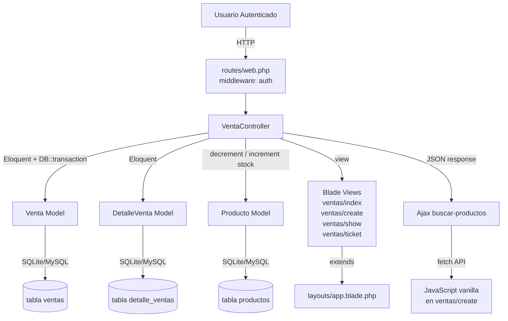
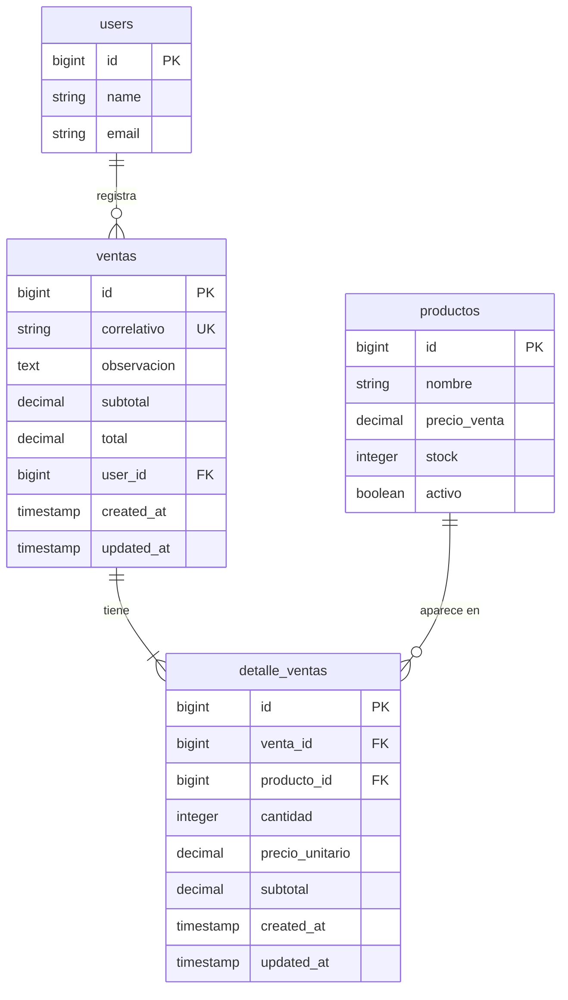

# Design Document — ventas-module

## Overview

Este documento describe el diseño técnico del módulo completo de **Ventas** para la aplicación Laravel 11 + Blade + Tailwind CSS. El módulo permite registrar ventas asociando uno o varios productos mediante un formulario interactivo con búsqueda dinámica Ajax, aplicación de descuentos, reducción automática de stock al confirmar la venta, visualización del detalle de cada venta y generación de un ticket/nota de venta imprimible.

El módulo involucra dos entidades principales: `ventas` (cabecera) y `detalle_ventas` (líneas de producto). La relación entre `ventas` y `productos` es N:N a través de `detalle_ventas`. El diseño visual y los patrones de código siguen exactamente los módulos `productos`, `trabajadores` y `usuarios` ya existentes en la aplicación.

### Decisiones de diseño clave

- **Reemplazo de `cliente_id` por `user_id`**: La migración existente usa `cliente_id` y `fecha`; debe reemplazarse completamente para usar `user_id` (FK a `users`) y `timestamps` estándar de Laravel. Esto simplifica el modelo al vincular la venta directamente al usuario autenticado.
- **Correlativo generado en el controlador**: El formato `VTA-XXXX` se genera en `VentaController::store()` tomando `max(id) + 1` para garantizar unicidad incluso ante eliminaciones previas.
- **Transacción única para store y destroy**: Toda la lógica de persistencia (venta + detalles + stock) se envuelve en `DB::transaction()` para garantizar atomicidad.
- **Endpoint Ajax separado**: La búsqueda de productos usa una ruta dedicada `GET /ventas/buscar-productos` que devuelve JSON, registrada **antes** del resource para evitar conflictos con Route Model Binding.
- **JavaScript vanilla**: La interactividad del formulario (búsqueda, tabla de detalle, cálculo de totales) se implementa con JavaScript vanilla sin dependencias adicionales, siguiendo el patrón del módulo de productos.
- **Acceso sin restricción de rol**: A diferencia de los módulos de administración, el módulo de ventas está disponible para cualquier usuario autenticado (solo middleware `auth`).
- **`producto_id` con `onDelete('restrict')` en `detalle_ventas`**: Se cambia el `cascade` existente en la migración actual a `restrict` para evitar eliminar productos con ventas asociadas, preservando la integridad del historial.

---

## Architecture

El módulo sigue la arquitectura MVC estándar de Laravel con un endpoint Ajax adicional:

```
HTTP Request
    │
    ▼
routes/web.php
(middleware: auth)
    │
    ├── GET  /ventas                    → VentaController@index
    ├── GET  /ventas/create             → VentaController@create
    ├── POST /ventas                    → VentaController@store
    ├── GET  /ventas/buscar-productos   → VentaController@buscarProductos  [Ajax JSON]
    ├── GET  /ventas/{venta}            → VentaController@show
    ├── GET  /ventas/{venta}/ticket     → VentaController@ticket
    └── DELETE /ventas/{venta}          → VentaController@destroy
    │
    ▼
VentaController
(app/Http/Controllers/VentaController.php)
    │
    ├── Venta Model  ──────────────────► tabla ventas
    ├── DetalleVenta Model ────────────► tabla detalle_ventas
    └── Producto Model ────────────────► tabla productos (stock)
```



---

## Components and Interfaces

### 1. Migración — tabla `ventas` (reemplazo)

**Archivo:** `database/migrations/2024_01_01_000011_create_ventas_table.php`

La migración existente debe reemplazarse completamente. Elimina `cliente_id` y `fecha`, añade `correlativo`, `observacion`, `subtotal` y usa `user_id` con `timestamps` estándar:

```php
Schema::create('ventas', function (Blueprint $table) {
    $table->id();
    $table->string('correlativo')->unique();
    $table->text('observacion')->nullable();
    $table->decimal('subtotal', 10, 2)->default(0);
    $table->decimal('total', 10, 2)->default(0);
    $table->foreignId('user_id')->constrained('users')->onDelete('restrict');
    $table->timestamps();
});
```

El método `down()` ejecuta `Schema::dropIfExists('ventas')`.

---

### 2. Migración — tabla `detalle_ventas` (corrección)

**Archivo:** `database/migrations/2024_01_01_000012_create_detalle_ventas_table.php`

La migración existente tiene `producto_id` con `onDelete('cascade')` — debe cambiarse a `onDelete('restrict')`. También elimina el índice único compuesto `(venta_id, producto_id)` ya que un mismo producto puede aparecer en múltiples ventas (aunque no duplicado en la misma venta, esto se controla en el JS del formulario):

```php
Schema::create('detalle_ventas', function (Blueprint $table) {
    $table->id();
    $table->foreignId('venta_id')->constrained('ventas')->onDelete('cascade');
    $table->foreignId('producto_id')->constrained('productos')->onDelete('restrict');
    $table->integer('cantidad')->default(1);
    $table->decimal('precio_unitario', 10, 2);
    $table->decimal('subtotal', 10, 2);
    $table->timestamps();
});
```

El método `down()` ejecuta `Schema::dropIfExists('detalle_ventas')`.

---

### 3. Modelo Venta

**Archivo:** `app/Models/Venta.php`

Reemplaza completamente el modelo existente (que usa `cliente_id` y `fecha`):

```php
namespace App\Models;

use Illuminate\Database\Eloquent\Model;
use Illuminate\Database\Eloquent\Relations\BelongsTo;
use Illuminate\Database\Eloquent\Relations\BelongsToMany;
use Illuminate\Database\Eloquent\Relations\HasMany;

class Venta extends Model
{
    protected $fillable = [
        'correlativo',
        'observacion',
        'subtotal',
        'total',
        'user_id',
    ];

    protected $casts = [
        'subtotal' => 'decimal:2',
        'total'    => 'decimal:2',
    ];

    public function user(): BelongsTo
    {
        return $this->belongsTo(User::class);
    }

    public function detalles(): HasMany
    {
        return $this->hasMany(DetalleVenta::class);
    }

    public function productos(): BelongsToMany
    {
        return $this->belongsToMany(Producto::class, 'detalle_ventas')
                    ->withPivot('cantidad', 'precio_unitario', 'subtotal')
                    ->withTimestamps();
    }
}
```

---

### 4. Modelo DetalleVenta

**Archivo:** `app/Models/DetalleVenta.php`

El modelo existente ya tiene la estructura correcta. Solo se verifica que los `$fillable` y `$casts` sean los requeridos (ya están correctos según el archivo actual):

```php
protected $fillable = [
    'venta_id', 'producto_id', 'cantidad', 'precio_unitario', 'subtotal',
];

protected $casts = [
    'cantidad'        => 'integer',
    'precio_unitario' => 'decimal:2',
    'subtotal'        => 'decimal:2',
];
```

Las relaciones `belongsTo(Venta::class)` y `belongsTo(Producto::class)` ya existen y son correctas.

---

### 5. VentaController

**Archivo:** `app/Http/Controllers/VentaController.php`

#### 5.1 `index()`

```php
public function index(): View
{
    $ventas = Venta::with('user')
                   ->latest()
                   ->paginate(15);

    return view('ventas.index', compact('ventas'));
}
```

#### 5.2 `create()`

```php
public function create(): View
{
    return view('ventas.create');
}
```

#### 5.3 `buscarProductos(Request $request)`

Ruta Ajax. Debe registrarse **antes** del resource en `routes/web.php`:

```php
public function buscarProductos(Request $request): JsonResponse
{
    $q = $request->get('q', '');

    $productos = Producto::where('activo', true)
        ->where('nombre', 'like', '%' . $q . '%')
        ->select('id', 'nombre', 'precio_venta', 'stock')
        ->limit(10)
        ->get();

    return response()->json($productos);
}
```

#### 5.4 `store(Request $request)`

```php
public function store(Request $request): RedirectResponse
{
    // Validación
    $request->validate([
        'observacion'              => ['nullable', 'string', 'max:500'],
        'subtotal'                 => ['required', 'numeric', 'min:0'],
        'total'                    => ['required', 'numeric', 'gt:0'],
        'productos'                => ['required', 'array', 'min:1'],
        'productos.*.producto_id'  => ['required', 'integer', 'exists:productos,id'],
        'productos.*.cantidad'     => ['required', 'integer', 'min:1'],
        'productos.*.precio_unitario' => ['required', 'numeric', 'gt:0'],
        'productos.*.subtotal'     => ['required', 'numeric', 'min:0'],
    ], [
        'productos.required' => 'Debe agregar al menos un producto a la venta.',
        'productos.min'      => 'Debe agregar al menos un producto a la venta.',
    ]);

    DB::transaction(function () use ($request) {
        // Generar correlativo
        $nextId     = (Venta::max('id') ?? 0) + 1;
        $correlativo = 'VTA-' . str_pad($nextId, 4, '0', STR_PAD_LEFT);

        // Crear cabecera
        $venta = Venta::create([
            'correlativo' => $correlativo,
            'observacion' => $request->observacion,
            'subtotal'    => $request->subtotal,
            'total'       => $request->total,
            'user_id'     => auth()->id(),
        ]);

        // Crear detalles y reducir stock
        foreach ($request->productos as $item) {
            DetalleVenta::create([
                'venta_id'        => $venta->id,
                'producto_id'     => $item['producto_id'],
                'cantidad'        => $item['cantidad'],
                'precio_unitario' => $item['precio_unitario'],
                'subtotal'        => $item['subtotal'],
            ]);

            Producto::where('id', $item['producto_id'])
                    ->decrement('stock', $item['cantidad']);
        }
    });

    return redirect()->route('ventas.show', $venta)
        ->with('success', 'Venta registrada correctamente.');
}
```

> **Nota sobre el correlativo**: Se usa `max('id') + 1` en lugar del `id` autoincremental post-insert para poder calcular el correlativo antes de crear el registro. Dado que la columna `correlativo` tiene índice único, si hay una condición de carrera en entornos de alta concurrencia se lanzará una excepción de integridad que la transacción capturará. Para este contexto (aplicación de escritorio/local) es suficiente.

#### 5.5 `show(Venta $venta)`

```php
public function show(Venta $venta): View
{
    $venta->load('user', 'detalles.producto');
    return view('ventas.show', compact('venta'));
}
```

#### 5.6 `ticket(Venta $venta)`

```php
public function ticket(Venta $venta): View
{
    $venta->load('user', 'detalles.producto');
    return view('ventas.ticket', compact('venta'));
}
```

#### 5.7 `destroy(Venta $venta)`

```php
public function destroy(Venta $venta): RedirectResponse
{
    try {
        DB::transaction(function () use ($venta) {
            // Restaurar stock antes de eliminar
            foreach ($venta->detalles as $detalle) {
                Producto::where('id', $detalle->producto_id)
                        ->increment('stock', $detalle->cantidad);
            }
            $venta->delete(); // cascade elimina detalle_ventas
        });

        return redirect()->route('ventas.index')
            ->with('success', 'Venta eliminada y stock restaurado correctamente.');

    } catch (\Throwable $e) {
        return redirect()->route('ventas.index')
            ->with('error', 'No se pudo eliminar la venta. Intente nuevamente.');
    }
}
```

---

### 6. Rutas

**Archivo:** `routes/web.php`

Se añade un grupo `middleware('auth')` independiente (sin restricción de rol). La ruta Ajax debe registrarse **antes** del resource para que `/ventas/buscar-productos` no sea interpretada como `{venta} = buscar-productos`:

```php
use App\Http\Controllers\VentaController;

Route::middleware('auth')->group(function () {
    // Ruta Ajax — debe ir ANTES del resource
    Route::get('/ventas/buscar-productos', [VentaController::class, 'buscarProductos'])
         ->name('ventas.buscar-productos');

    Route::resource('ventas', VentaController::class)
         ->only(['index', 'create', 'store', 'show', 'destroy']);

    Route::get('/ventas/{venta}/ticket', [VentaController::class, 'ticket'])
         ->name('ventas.ticket');
});
```

Rutas generadas:

| Método | URI | Nombre | Acción |
|--------|-----|--------|--------|
| GET | `/ventas` | `ventas.index` | `index` |
| GET | `/ventas/create` | `ventas.create` | `create` |
| POST | `/ventas` | `ventas.store` | `store` |
| GET | `/ventas/buscar-productos` | `ventas.buscar-productos` | `buscarProductos` |
| GET | `/ventas/{venta}` | `ventas.show` | `show` |
| GET | `/ventas/{venta}/ticket` | `ventas.ticket` | `ticket` |
| DELETE | `/ventas/{venta}` | `ventas.destroy` | `destroy` |

---

### 7. Vistas Blade

#### 7.1 `ventas/index.blade.php`

- Extiende `layouts.app`
- Flash messages de éxito/error (mismas clases que productos/trabajadores)
- Encabezado: título "Ventas" + botón "Nueva venta" → `ventas.create` (clases `bg-blue-600 text-white`)
- Estado vacío: "No hay ventas registradas."
- Tabla con columnas: Correlativo, Fecha (`created_at->format('d/m/Y')`), Usuario (`$venta->user->name`), Subtotal, Total, Acciones
- Botón "Ver detalle": `bg-gray-100 text-gray-700` → `ventas.show`
- Botón "Ticket": `bg-blue-100 text-blue-700` → `ventas.ticket`
- Botón "Eliminar": `bg-red-100 text-red-700` con `confirm()` → `DELETE ventas.destroy`
- Paginación: `{{ $ventas->links() }}`

#### 7.2 `ventas/create.blade.php`

- Extiende `layouts.app`
- Encabezado: "Nueva venta" + botón "Volver" → `ventas.index`
- Contenedor: `bg-white rounded-lg border border-gray-200 p-6`
- **Sección búsqueda de productos**: campo de texto con `id="buscar-producto"`, resultados en `div#resultados-busqueda`
- **Tabla de detalle**: `table#tabla-detalle` con columnas Producto, Cantidad, Precio Unit., Subtotal, Eliminar
- **Sección totales**: subtotal (readonly), toggle descuento por porcentaje, campo porcentaje (oculto por defecto), campo total (editable)
- **Campo observación**: textarea opcional
- **Botón "Registrar venta"**: `bg-blue-600 text-white`
- Inputs hidden para enviar los datos de la tabla al servidor: `productos[i][producto_id]`, `productos[i][cantidad]`, `productos[i][precio_unitario]`, `productos[i][subtotal]`, más `subtotal` y `total`
- Errores de validación con `border-red-400 bg-red-50` y `text-xs text-red-600`

#### 7.3 `ventas/show.blade.php`

- Extiende `layouts.app`
- Encabezado: correlativo de la venta + botón "Volver al listado" → `ventas.index`
- Tarjeta de datos: correlativo, fecha (`d/m/Y`), usuario, observación (si existe)
- Tabla de productos: Nombre, Cantidad, Precio unitario, Subtotal por línea
- Sección totales: subtotal, descuento (si `total != subtotal`), total
- Botón "Generar ticket" → `ventas.ticket`

#### 7.4 `ventas/ticket.blade.php`

- Extiende `layouts.app` (o layout mínimo para impresión)
- Ancho máximo 400px centrado
- Encabezado: nombre del negocio (`config('app.name')`)
- Datos: correlativo, fecha y hora (`d/m/Y H:i`), usuario
- Tabla de productos: Nombre, Cant., P.Unit., Subtotal
- Totales: subtotal, descuento (si aplica), total
- Observación (si existe)
- Botón "Imprimir" → `window.print()`
- `@media print`: oculta nav, sidebar, botón imprimir; muestra solo el ticket

---

### 8. JavaScript del formulario de creación

**Implementación vanilla JS** embebida en `ventas/create.blade.php` dentro de `<script>`:

```javascript
// Estado en memoria
let items = []; // [{producto_id, nombre, cantidad, precio_unitario, subtotal}]

// Búsqueda Ajax con debounce
const inputBuscar = document.getElementById('buscar-producto');
let debounceTimer;

inputBuscar.addEventListener('input', function () {
    clearTimeout(debounceTimer);
    const q = this.value.trim();
    if (q.length < 2) {
        ocultarResultados();
        return;
    }
    debounceTimer = setTimeout(() => buscarProductos(q), 300);
});

async function buscarProductos(q) {
    const res  = await fetch(`/ventas/buscar-productos?q=${encodeURIComponent(q)}`);
    const data = await res.json();
    mostrarResultados(data);
}

function mostrarResultados(productos) { /* renderiza lista desplegable */ }
function ocultarResultados()          { /* oculta la lista */ }

// Agregar producto a la tabla
function agregarProducto(producto) {
    const existente = items.find(i => i.producto_id === producto.id);
    if (existente) {
        existente.cantidad++;
        existente.subtotal = +(existente.cantidad * existente.precio_unitario).toFixed(2);
    } else {
        items.push({
            producto_id:     producto.id,
            nombre:          producto.nombre,
            cantidad:        1,
            precio_unitario: +parseFloat(producto.precio_venta).toFixed(2),
            subtotal:        +parseFloat(producto.precio_venta).toFixed(2),
        });
    }
    renderTabla();
    recalcularTotales();
    ocultarResultados();
    inputBuscar.value = '';
}

// Renderizar tabla de detalle
function renderTabla() { /* genera filas con inputs de cantidad y botón eliminar */ }

// Recalcular subtotal y total
function recalcularTotales() {
    const subtotal = items.reduce((acc, i) => acc + i.subtotal, 0);
    document.getElementById('subtotal').value = subtotal.toFixed(2);

    const usarPorcentaje = document.getElementById('toggle-descuento').checked;
    if (usarPorcentaje) {
        const pct   = Math.min(parseFloat(document.getElementById('porcentaje').value) || 0, 100);
        const total = +(subtotal * (1 - pct / 100)).toFixed(2);
        document.getElementById('total').value = total.toFixed(2);
    } else {
        document.getElementById('total').value = subtotal.toFixed(2);
    }

    sincronizarHiddens();
}

// Sincronizar inputs hidden antes del submit
function sincronizarHiddens() { /* genera inputs hidden productos[i][...] */ }

// Toggle descuento por porcentaje
document.getElementById('toggle-descuento').addEventListener('change', function () {
    document.getElementById('campo-porcentaje').classList.toggle('hidden', !this.checked);
    recalcularTotales();
});

// Validación de porcentaje
document.getElementById('porcentaje').addEventListener('input', function () {
    if (parseFloat(this.value) > 100) {
        this.value = 100;
        mostrarErrorPorcentaje('El porcentaje no puede superar 100.');
    } else {
        ocultarErrorPorcentaje();
    }
    recalcularTotales();
});
```

---

### 9. Integración en el layout

**Archivo:** `resources/views/layouts/app.blade.php`

Se añade la variable `$ventasActive` en el bloque `@php`:

```php
@php
    $userManagementActive    = request()->routeIs('users.*', 'roles.*', 'trabajadores.*');
    $productManagementActive = request()->routeIs('productos.*');
    $ventasActive            = request()->routeIs('ventas.*');
@endphp
```

Se añade un enlace directo "Ventas" en el sidebar (sin grupo desplegable, ya que es un solo enlace):

```html
<!-- Sidebar desktop -->
<a href="{{ route('ventas.index') }}"
   class="flex items-center gap-3 px-3 py-2 rounded-lg text-sm font-medium transition-colors
          {{ $ventasActive ? 'bg-gray-100 text-gray-900 font-semibold' : 'text-gray-600 hover:bg-gray-100 hover:text-gray-900' }}">
    <svg class="w-5 h-5" fill="none" stroke="currentColor" viewBox="0 0 24 24">
        <path stroke-linecap="round" stroke-linejoin="round" stroke-width="2"
              d="M3 3h2l.4 2M7 13h10l4-8H5.4M7 13L5.4 5M7 13l-2.293 2.293c-.63.63-.184 1.707.707 1.707H17m0 0a2 2 0 100 4 2 2 0 000-4zm-8 2a2 2 0 11-4 0 2 2 0 014 0z"/>
    </svg>
    Ventas
</a>
```

El mismo enlace se añade en el bottom nav móvil con el icono y texto "Ventas", con clase activa `text-blue-600` cuando `$ventasActive` es verdadero.

> **Decisión de diseño**: Se usa un enlace directo (sin grupo desplegable) porque el módulo de ventas tiene una sola sección de entrada. Esto simplifica la navegación y es coherente con el enlace de Dashboard.

---

## Data Models

### Tabla `ventas` (estado final)

| Columna      | Tipo            | Nullable | Default | Notas                                      |
|--------------|-----------------|----------|---------|--------------------------------------------|
| id           | bigint unsigned | NO       | —       | PK, auto-increment                         |
| correlativo  | varchar(255)    | NO       | —       | Único, formato VTA-XXXX                    |
| observacion  | text            | YES      | NULL    | Notas opcionales de la venta               |
| subtotal     | decimal(10,2)   | NO       | 0.00    | Suma de subtotales de líneas               |
| total        | decimal(10,2)   | NO       | 0.00    | Total final (puede incluir descuento)      |
| user_id      | bigint unsigned | NO       | —       | FK → users.id, onDelete('restrict')        |
| created_at   | timestamp       | YES      | NULL    | Fecha/hora de la venta                     |
| updated_at   | timestamp       | YES      | NULL    |                                            |

### Tabla `detalle_ventas` (estado final)

| Columna         | Tipo            | Nullable | Default | Notas                                   |
|-----------------|-----------------|----------|---------|-----------------------------------------|
| id              | bigint unsigned | NO       | —       | PK, auto-increment                      |
| venta_id        | bigint unsigned | NO       | —       | FK → ventas.id, onDelete('cascade')     |
| producto_id     | bigint unsigned | NO       | —       | FK → productos.id, onDelete('restrict') |
| cantidad        | integer         | NO       | 1       | Unidades vendidas                       |
| precio_unitario | decimal(10,2)   | NO       | —       | Precio al momento de la venta           |
| subtotal        | decimal(10,2)   | NO       | —       | cantidad × precio_unitario              |
| created_at      | timestamp       | YES      | NULL    |                                         |
| updated_at      | timestamp       | YES      | NULL    |                                         |

### Diagrama de relaciones



### Flujo de datos — store

```
POST /ventas
  │
  ├── Validar request (productos[], subtotal, total, observacion)
  │
  ├── DB::transaction()
  │     ├── Calcular correlativo: 'VTA-' . str_pad(max(id)+1, 4, '0', STR_PAD_LEFT)
  │     ├── Venta::create([correlativo, observacion, subtotal, total, user_id])
  │     └── foreach productos as item:
  │           ├── DetalleVenta::create([venta_id, producto_id, cantidad, precio_unitario, subtotal])
  │           └── Producto::where(id)->decrement('stock', cantidad)
  │
  └── redirect ventas.show → Flash "Venta registrada correctamente."
```

### Flujo de datos — destroy

```
DELETE /ventas/{venta}
  │
  ├── Route Model Binding → Venta::findOrFail($id)
  │
  ├── DB::transaction()
  │     ├── foreach venta->detalles as detalle:
  │     │     └── Producto::where(id)->increment('stock', detalle->cantidad)
  │     └── venta->delete()  [cascade elimina detalle_ventas]
  │
  └── redirect ventas.index → Flash "Venta eliminada y stock restaurado correctamente."
```

### Estructura del payload del formulario de creación

El formulario envía los datos de la tabla de detalle como arrays PHP:

```
POST /ventas
  observacion        = "Texto opcional"
  subtotal           = "150.00"
  total              = "135.00"
  productos[0][producto_id]      = "3"
  productos[0][cantidad]         = "2"
  productos[0][precio_unitario]  = "50.00"
  productos[0][subtotal]         = "100.00"
  productos[1][producto_id]      = "7"
  productos[1][cantidad]         = "1"
  productos[1][precio_unitario]  = "50.00"
  productos[1][subtotal]         = "50.00"
```

---

## Correctness Properties

*Una propiedad es una característica o comportamiento que debe cumplirse en todas las ejecuciones válidas del sistema — esencialmente, una declaración formal sobre lo que el sistema debe hacer. Las propiedades sirven como puente entre las especificaciones legibles por humanos y las garantías de corrección verificables automáticamente.*

### Reflexión de propiedades (eliminación de redundancias)

Antes de listar las propiedades finales, se identifican y consolidan las redundancias del prework:

- **9.3 y 12.1** son idénticas (reducción de stock). Se consolidan en **Property 4**.
- **9.4 y 12.2** son idénticas (transaccionalidad del store). Se consolidan en **Property 5**.
- **3.3, 3.4, 3.5, 4.3, 4.4** son propiedades de relaciones de modelos. Se consolidan en **Property 1** (relaciones de Venta) y **Property 2** (relaciones de DetalleVenta).
- **5.1, 5.2, 5.3** son aspectos del mismo comportamiento de generación de correlativo. Se consolidan en **Property 3**.
- **9.1 y 9.2** son aspectos de la misma operación de persistencia. Se consolidan en **Property 4** junto con la reducción de stock.
- **16.1 y 16.2** son la contraparte de destroy. Se consolidan en **Property 6**.
- **13.1, 13.2, 13.3** son el mismo comportamiento de control de acceso. Se consolidan en **Property 7**.
- **7.3** (búsqueda Ajax) es una property independiente → **Property 8**.
- **6.1** (paginación) es una property independiente → **Property 9**.
- **10.2-10.7 y 11.1-11.8** (contenido de vistas) se consolidan en **Property 10**.
- **12.3** (inventario no modificado) es una property independiente → **Property 11**.
- **8.5** (cálculo de descuento) es una property independiente → **Property 12**.

---

### Property 1: Relaciones del modelo Venta

*Para cualquier* Venta creada con un `user_id` válido y N registros de `DetalleVenta` asociados, la relación `venta->user` debe devolver el User correcto, `venta->detalles->count()` debe ser N, y `venta->productos` debe contener los productos asociados con los pivotes `cantidad`, `precio_unitario` y `subtotal`.

**Validates: Requirements 3.3, 3.4, 3.5**

---

### Property 2: Relaciones del modelo DetalleVenta

*Para cualquier* DetalleVenta creado con un `venta_id` y `producto_id` válidos, `detalle->venta` debe devolver la Venta asociada y `detalle->producto` debe devolver el Producto asociado.

**Validates: Requirements 4.3, 4.4**

---

### Property 3: Generación de correlativo secuencial y único

*Para cualquier* número N de ventas existentes en la base de datos, el correlativo de la siguiente venta creada debe tener el formato `VTA-XXXX` donde XXXX es `(max(id) + 1)` con cero-relleno a 4 dígitos, y debe ser único en la tabla.

**Validates: Requirements 5.1, 5.2, 5.3**

---

### Property 4: Persistencia transaccional de venta, detalles y reducción de stock

*Para cualquier* conjunto válido de datos de venta con N productos, al ejecutar `POST /ventas`: (a) debe crearse exactamente 1 registro en `ventas`, (b) deben crearse exactamente N registros en `detalle_ventas`, y (c) el `stock` de cada producto involucrado debe decrementarse exactamente en la cantidad registrada en su línea de detalle. Si cualquier operación falla, ninguna de las tres debe persistir.

**Validates: Requirements 9.1, 9.2, 9.3, 9.4, 12.1, 12.2**

---

### Property 5: Validación rechaza ventas sin productos o con datos inválidos

*Para cualquier* petición a `POST /ventas` que no incluya productos, o que incluya `total <= 0`, o que incluya alguna `cantidad < 1`, el sistema debe rechazar la petición, redirigir al formulario y mostrar el mensaje de error correspondiente sin crear ningún registro en la base de datos.

**Validates: Requirements 9.6, 9.7, 9.8**

---

### Property 6: Eliminación transaccional con restauración de stock

*Para cualquier* Venta con N líneas de detalle, al ejecutar `DELETE /ventas/{venta}`: (a) el `stock` de cada producto involucrado debe incrementarse exactamente en la cantidad registrada en su línea de detalle, y (b) la Venta y sus DetalleVenta deben eliminarse. Si cualquier operación falla, ni el stock ni la Venta deben modificarse.

**Validates: Requirements 16.1, 16.2, 16.5**

---

### Property 7: Control de acceso — autenticación requerida

*Para cualquier* ruta del módulo de ventas (`GET /ventas`, `GET /ventas/create`, `POST /ventas`, `GET /ventas/{id}`, `GET /ventas/{id}/ticket`, `DELETE /ventas/{id}`, `GET /ventas/buscar-productos`), una petición sin sesión autenticada debe recibir una redirección a `/login`.

**Validates: Requirements 13.1, 13.2, 13.3**

---

### Property 8: Búsqueda Ajax devuelve solo productos activos que coinciden con el término

*Para cualquier* término de búsqueda `q` y cualquier conjunto de productos en la base de datos (activos e inactivos), `GET /ventas/buscar-productos?q={q}` debe devolver únicamente productos con `activo = true` cuyo nombre contenga `q` (insensible a mayúsculas), con los campos `id`, `nombre`, `precio_venta` y `stock`, limitado a 10 resultados.

**Validates: Requirements 7.3**

---

### Property 9: Paginación de 15 en 15 ordenada por fecha descendente

*Para cualquier* número N de ventas en la base de datos (N > 0), `GET /ventas` debe devolver exactamente `min(N, 15)` ventas en la primera página, ordenadas por `created_at` descendente.

**Validates: Requirements 6.1, 6.5**

---

### Property 10: Las vistas show y ticket muestran todos los datos de la venta

*Para cualquier* Venta con datos (correlativo, usuario, detalles de productos, subtotal, total), las vistas `ventas.show` y `ventas.ticket` deben contener el correlativo, el nombre del usuario, cada producto con su cantidad y precio, el subtotal y el total. Cuando `total != subtotal`, ambas vistas deben mostrar el descuento aplicado.

**Validates: Requirements 10.2, 10.3, 10.4, 10.5, 11.2, 11.3, 11.4, 11.5**

---

### Property 11: El campo `inventario` del producto no se modifica al vender

*Para cualquier* Venta registrada correctamente, el campo `inventario` de cada Producto involucrado debe tener el mismo valor antes y después de la operación de store.

**Validates: Requirements 12.3**

---

### Property 12: Cálculo de descuento por porcentaje

*Para cualquier* subtotal S y porcentaje P entre 0 y 100, el total calculado debe ser `S × (1 - P / 100)` redondeado a 2 decimales.

**Validates: Requirements 8.5, 8.6, 8.7**

---

## Error Handling

### Errores de validación del formulario

`$request->validate()` lanza `ValidationException` en caso de fallo. Laravel redirige automáticamente al formulario con los errores en `$errors` y los valores anteriores en `old()`. Las vistas muestran errores inline con `border-red-400 bg-red-50` en el campo y `text-xs text-red-600` en el mensaje.

El caso especial "sin productos" se maneja con la regla `'productos' => ['required', 'array', 'min:1']` y un mensaje personalizado.

### Errores de transacción (store y destroy)

`DB::transaction()` revierte automáticamente si se lanza cualquier excepción dentro del closure. En `store`, la excepción se propaga y Laravel la convierte en una respuesta de error 500 (o se puede capturar para mostrar un flash de error). En `destroy`, se captura con `try/catch(\Throwable)` para mostrar el flash de error al usuario.

### Producto no encontrado (404)

Route Model Binding lanza `ModelNotFoundException` → respuesta 404 si `{venta}` no existe.

### Conflicto de correlativo (race condition)

Si dos peticiones simultáneas calculan el mismo `max(id) + 1`, la segunda fallará con una excepción de integridad (violación del índice único en `correlativo`). La transacción se revierte y el usuario recibe un error 500. Para el contexto de uso (aplicación de escritorio/local con un solo usuario concurrente) esto es aceptable.

### Flash messages

| Situación | Tipo | Mensaje |
|-----------|------|---------|
| Venta registrada | success | "Venta registrada correctamente." |
| Venta eliminada | success | "Venta eliminada y stock restaurado correctamente." |
| Error al eliminar | error | "No se pudo eliminar la venta. Intente nuevamente." |
| Sin productos | error (validación) | "Debe agregar al menos un producto a la venta." |

---

## Testing Strategy

### Enfoque dual

Se combinan tests de ejemplo (feature tests HTTP con PHPUnit/Pest) con tests de propiedades (property-based tests) para cobertura completa.

### Librería de property-based testing

Se usará **[Pest PHP](https://pestphp.com/)** con generación de datos aleatorios mediante `fake()` de Laravel (Faker). Cada property test se ejecuta con un mínimo de **100 iteraciones** usando un bucle `repeat(100, fn() => ...)` o datasets generados dinámicamente.

Cada property test incluye un comentario de tag:
`// Feature: ventas-module, Property N: <texto>`

### Tests de propiedades (Property-Based Tests)

| Propiedad | Descripción | Estrategia |
|-----------|-------------|------------|
| P1 | Relaciones del modelo Venta | Feature test: crear User + Venta + N DetalleVenta, verificar relaciones |
| P2 | Relaciones del modelo DetalleVenta | Feature test: crear Venta + Producto + DetalleVenta, verificar relaciones inversas |
| P3 | Generación de correlativo secuencial | Feature test: crear N ventas, verificar formato y unicidad de cada correlativo |
| P4 | Persistencia transaccional (store) | Feature test con Storage::fake y DB::transaction mock para fallo simulado |
| P5 | Validación rechaza datos inválidos | Feature test: enviar variantes inválidas (sin productos, total=0, cantidad=0) |
| P6 | Eliminación transaccional con restauración de stock | Feature test: crear venta, eliminar, verificar stock restaurado |
| P7 | Control de acceso — autenticación | Feature test: petición sin auth a cada ruta → 302 a /login |
| P8 | Búsqueda Ajax filtra correctamente | Feature test: crear productos activos/inactivos, buscar por término, verificar JSON |
| P9 | Paginación de 15 en 15 | Feature test: crear N ventas aleatorio, verificar count en primera página |
| P10 | Vistas show y ticket muestran datos | Feature test: crear venta con detalles, verificar HTML de show y ticket |
| P11 | Inventario no modificado al vender | Feature test: verificar campo inventario antes y después del store |
| P12 | Cálculo de descuento por porcentaje | Unit test: función de cálculo con subtotal y porcentaje aleatorios |

### Tests de ejemplo (Example-Based Tests)

| Criterio | Descripción |
|----------|-------------|
| 6.2 | Columnas del listado presentes en HTML |
| 6.3 | Botón "Nueva venta" presente en index |
| 6.4 | Estado vacío muestra mensaje correcto |
| 6.6-6.8 | Botones Ver detalle, Ticket, Eliminar presentes por fila |
| 7.1 | GET /ventas/create devuelve 200 |
| 9.5 | Redirección a ventas.show con flash tras store exitoso |
| 10.1 | GET /ventas/{venta} devuelve 200 |
| 10.6 | Botón "Generar ticket" presente en show |
| 10.7 | Botón "Volver al listado" presente en show |
| 11.1 | GET /ventas/{venta}/ticket devuelve 200 |
| 11.6 | Botón "Imprimir" presente en ticket |
| 14.1 | Enlace "Ventas" presente en sidebar |
| 14.2 | Enlace "Ventas" presente en bottom nav |
| 14.4 | Enlace "Ventas" resaltado cuando ruta es ventas.* |
| 15.x | Clases CSS correctas en vistas (flash, errores, botones) |
| 16.3 | Redirección a ventas.index con flash tras destroy exitoso |
| 16.4 | Flash de error cuando destroy falla |

### Tests de smoke

| Criterio | Descripción |
|----------|-------------|
| 1.1-1.3 | Columnas de ventas existen tras migración (correlativo, subtotal, total, user_id) |
| 1.4 | Tabla ventas eliminada tras rollback |
| 2.1-2.3 | Columnas de detalle_ventas existen tras migración |
| 2.4 | Tabla detalle_ventas eliminada tras rollback |
| 2.2 | Cascade: eliminar venta elimina sus detalle_ventas |
| 13.1 | Rutas del módulo registradas correctamente |

### Configuración de tests

- **Autenticación**: `actingAs(User::factory()->create())` para tests que requieren sesión.
- **Base de datos**: `RefreshDatabase` trait para aislamiento entre tests.
- **Transacciones**: Los tests de fallo transaccional usan `DB::shouldReceive()` o excepciones lanzadas manualmente dentro del closure.
